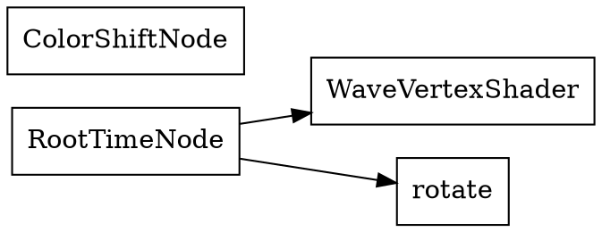

# Architecture de BBFx

> Document d'analyse de l'architecture interne du moteur BBFx (BonneBalleFX), établi en 2026 à partir de l'intégralité du code source du snapshot `2006.06.10 (Gron)`.

---

## Table des matieres

**Architecture originale (2006)**
1. [Vue d'ensemble](#1-vue-densemble)
2. [Module Core — Le moteur C++](#2-module-core--le-moteur-c)
3. [Module Input — Dispositifs d'entree](#3-module-input--dispositifs-dentrée)
4. [Module FX — Effets graphiques](#4-module-fx--effets-graphiques)
5. [Bindings SWIG](#5-bindings-swig)
6. [Couche Lua applicative](#6-couche-lua-applicative)
7. [Flux d'execution](#7-flux-dexécution)
8. [Patterns de conception](#8-patterns-de-conception)
9. [Gestion memoire et cycle de vie](#9-gestion-mémoire-et-cycle-de-vie)

**BBFx Revival — v2.x (2026)**
10. [Vue d'ensemble v2](#10-vue-densemble-v2)
11. [Changements majeurs v1 → v2](#11-changements-majeurs-v1--v2)
12. [Build System v2](#12-build-system-v2)
13. [Flux d'execution v2](#13-flux-dexécution-v2)
14. [FX Pipeline (v2.2)](#14-fx-pipeline-v22)
15. [Composition Engine & Live Pipeline (v2.3)](#15-composition-engine--live-pipeline-v23)
16. [Video Pipeline (v2.4)](#16-video-pipeline-v24)
17. [Animator Avance (v2.5)](#17-animator-avancé-v25)
18. [Shell & Scripting (v2.6)](#18-shell--scripting-v26)
19. [Audio Reactif (v2.7)](#19-audio-réactif-v27)
20. [GPU & Shaders (v2.8)](#20-gpu--shaders-v28)
21. [Production Pipeline (v2.9)](#21-production-pipeline-v29)

**BBFx Revival — v3.x (2026)**
22. [BBFx Studio (v3.0)](#22-bbfx-studio-v30)
23. [BBFx Studio++ (v3.1)](#23-bbfx-studio-v31)
24. [BBFx Studio Content (v3.2)](#24-bbfx-studio-content-v32)
25. [BBFx Studio Interactive Viewport (v3.2.1)](#25-bbfx-studio-interactive-viewport-v321)

---

## 1. Vue d'ensemble

BBFx est organisé en trois couches distinctes :

```
┌──────────────────────────────────────────────────────────────────┐
│  COUCHE APPLICATIVE (Lua)                                        │
│  Scripts de scène, animations, configuration, tests              │
│  bbfx.lua · config.lua · lua/engine.lua · lua/animator.lua …    │
├──────────────────────────────────────────────────────────────────┤
│  COUCHE BINDING (SWIG C++ ↔ Lua)                                │
│  swig/bbfx.i  →  libbbfx_wrap.so                                │
│  ogrelua/swig/Ogre.i  →  libOgreLua.so                          │
├──────────────────────────────────────────────────────────────────┤
│  COUCHE MOTEUR (C++)              bbfx namespace                 │
│  ┌──────────┐ ┌──────────┐ ┌────────────┐ ┌───────────────┐    │
│  │  Engine  │ │ Animator │ │InputManager│ │  FX modules   │    │
│  │  (OGRE)  │ │  (DAG)   │ │  (OIS/jsw) │ │ (Perlin, …)  │    │
│  └──────────┘ └──────────┘ └────────────┘ └───────────────┘    │
├──────────────────────────────────────────────────────────────────┤
│  DÉPENDANCES EXTERNES                                            │
│  OGRE 1.2 · OIS · libjsw · Boost.Graph · pthread · X11/OpenGL  │
└──────────────────────────────────────────────────────────────────┘
```

Chaque couche ne communique qu'avec la couche immédiatement adjacente. Les scripts Lua ne font jamais d'appels système directs — tout passe par les bindings SWIG.

---

## 2. Module Core — Le moteur C++

### 2.1 Engine (`core/Engine.h/cpp`)

**Rôle :** Singleton contrôlant la boucle de rendu OGRE.

```cpp
namespace bbfx {
  class Engine {
  public:
    Engine(unsigned long lua_State);   // reçoit le lua_State pour callbacks
    static Engine* instance();
    void startRendering();             // bloquant : lance la boucle principale
    void stopRendering();              // signal d'arrêt (volatile bool)
  };
}
```

La boucle principale (côté `Engine.cpp`) suit le schéma suivant à chaque frame :
1. `mInputManager->capture()` — lecture des événements d'entrée
2. `mAnimator->renderOneFrame()` — propagation du graphe d'animation
3. `mRoot->renderOneFrame()` — rendu OGRE d'une frame
4. Pump des messages de la plateforme X11/Win32

**Construction :** L'`Engine` est construit depuis Lua via `engine.singleton(swig.state())`. Le `lua_State` est passé pour permettre à l'Engine de rappeler dans Lua si nécessaire.

**Destruction :** `engine.destroy()` est appelé explicitement en fin de script pour garantir la libération ordonnée des ressources OGRE avant que le GC Lua ne libère les objets C++.

---

### 2.2 Animator et AnimationGraph (`core/Animator.h/cpp`)

**Rôle :** Cœur du moteur d'animation. Maintient un DAG de ports de valeurs et propage les mises à jour chaque frame.

#### Structures de données internes

```cpp
// Graphe Boost : sommets = AnimationPort*, arêtes = connexions
typedef adjacency_list<vecS, vecS, directedS> Graph;
typedef graph_traits<Graph>::vertex_descriptor Vertex;

// Bi-directional mapping Port ↔ Vertex
typedef map<AnimationPort*, Vertex> VertexMap;
typedef map<Vertex, AnimationPort*> PortMap;
```

#### Opérations sur le graphe

```cpp
void add(AnimationPort* port);         // ajoute un sommet
void remove(AnimationPort* port);      // retire le sommet et ses arêtes
void link(AnimationPort* s, AnimationPort* t);   // ajoute une arête s→t
void unlink(AnimationPort* s, AnimationPort* t); // retire l'arête s→t
void schedule(const Operation& op, TimeStamp t); // planifie une mutation future
```

#### Boucle de frame (`renderOneFrame`)

```
renderOneFrame()
  ├─ executePendingPreOps()    // traite mPreOpQueue (priority_queue<timestamp>)
  ├─ [sources s'auto-mettent à jour via notifyUpdate()]
  ├─ propagateFreshValues()    // BFS depuis les ports fraîchement mis à jour
  │     pour chaque port frais dans mPortQueue :
  │       → actualise la valeur du port destination
  │       → enqueue les sorties du nœud destination
  └─ executePendingPostOps()   // traite mPostOpQueue (deque, post-propagation)
```

#### Planification temporelle

Les opérations différées utilisent une `priority_queue` triée par timestamp `float` :

```cpp
typedef Event<Operation, TimeStamp>    OperationEvent;
typedef priority_queue<OperationEvent> PreOpQueue;   // futurs
typedef deque<Operation>               PostOpQueue;  // post-frame courant
```

Un `Operation` est soit un `link` soit un `unlink` entre deux ports. La planification permet de synchroniser des transitions d'animation à des points temporels précis.

---

### 2.3 AnimationNode et AnimationPort (`core/AnimationNode.h/cpp`, `core/AnimationPort.h/cpp`)

**AnimationPort** est l'unité élémentaire de valeur dans le graphe :

```cpp
class AnimationPort {
  const string& getName() const;
  const string& getFullName() const;      // "NomNoeud.nomPort"
  const Ogre::AnyNumeric& getValue() const;
  void setValue(const Ogre::AnyNumeric& value);
};
```

`Ogre::AnyNumeric` est un variant type OGRE permettant de transporter `float`, `Vector2`, `Vector3`, `Vector4`, `Quaternion`, `ColourValue` et `Matrix4` dans un même type.

**AnimationNode** est le conteneur logique :

```cpp
class AnimationNode {
  const string& getName() const;
  typedef std::map<string, AnimationPort*> Ports;
  const Ports& getInputs() const;
  const Ports& getOutputs() const;
  void setListener(AnimationNodeListener* listener);
  virtual void update() = 0;    // appelé lors de la propagation
};
```

La notification de mise à jour monte via `AnimationNodeListener::notifyUpdate(node)` → `Animator::notifyUpdate()` → enqueue des sorties du nœud dans `mPortQueue`.

---

### 2.4 PrimitiveNodes (`core/PrimitiveNodes.h/cpp`)

| Classe | Rôle | Ports |
|---|---|---|
| `RootTimeNode` | Source de temps système (Ogre::Timer) | OUT: `time` (delta), `totalTime` |
| `AnimationStateNode` | Pilote un état d'animation OGRE (skeletal) | IN: `time` |
| `AccumulatorNode` | Intègre un delta : `out += in` | IN: `delta`, OUT: `value` |
| `LuaAnimationNode` | Exécute une fonction Lua comme nœud | IN/OUT: dynamiques |
| `AnimableValuePort` | Wraps `Ogre::AnimableValuePtr` | (port lui-même) |
| `AnimableObjectNode` | Expose tous les `AnimableValue` d'un `AnimableObject` | OUT: un par propriété |
| `ControllerValueNode` | Wraps `Ogre::ControllerValueRealPtr` | IN: `value` |
| `ControllerFunctionNode` | Wraps `Ogre::ControllerFunctionRealPtr` | IN: `input`, OUT: `output` |

**LuaAnimationNode** est particulièrement important : il permet de définir un nœud de traitement entièrement en Lua, avec des ports d'entrée/sortie dynamiques créés à l'exécution :

```lua
-- Exemple : nœud sinus
local node = bbfx.LuaAnimationNode("sinus", function(self)
  local t = self:getInputs()["t"]:getValue()
  self:getOutputs()["y"]:setValue(math.sin(t * 2 * math.pi))
end)
node:addInput("t")
node:addOutput("y")
```

---

### 2.5 Lua VM (`core/Lua.h/cpp`)

**Rôle :** Wrapper autour du `lua_State` avec gestion des erreurs et du thread-safety.

```cpp
class Lua {
  lua_State* mState;
  Mutex mMutex;                    // PTHREAD_MUTEX_RECURSIVE_NP
  void load(const string& file);   // charge et exécute un fichier Lua
};
```

**SwigUserdata** : classe interne permettant de créer des `userdata` Lua typés SWIG depuis C++ (utilisé pour passer des pointeurs C++ à Lua avec les métadonnées de type correctes).

**LuaFunction** : encapsule une référence à une fonction Lua (via `luaL_ref`) pour pouvoir l'appeler depuis C++ à n'importe quel moment.

**Thread-safety :** Le mutex récursif protège tous les accès à l'état Lua. La récursivité est nécessaire car certains callbacks Lua peuvent rappeler dans C++ qui rappelle dans Lua.

---

## 3. Module Input — Dispositifs d'entrée

### 3.1 InputManager (`input/InputManager.h/cpp`)

Singleton qui initialise OIS avec la fenêtre OGRE :

```cpp
class InputManager {
  InputManager(Ogre::RenderWindow* renderWindow);
  void addDevice(InputDevice* device);
  const map<string, InputDevice*>& getDevices() const;
};
```

La construction extrait le handle de fenêtre X11 depuis OGRE :
```cpp
OIS::ParamList pl;
renderWindow->getCustomAttribute("WINDOW", &windowHnd);
pl.insert({"WINDOW", to_string(windowHnd)});
// Options X11 : "x11_mouse_grab", "x11_keyboard_grab", etc.
mInputSystem = OIS::InputManager::createInputSystem(pl);
```

### 3.2 InputDevice (`input/InputDevice.h/cpp`)

Base commune à tous les dispositifs. **Hérite d'`AnimationNode`**, ce qui permet de connecter directement les axes/boutons dans le graphe d'animation :

```cpp
class InputDevice : public AnimationNode {
  virtual void setDeviceListener(lua_Function f);  // callback Lua sur événement
  virtual void capture() = 0;  // lit l'état courant
};
```

### 3.3 Keyboard (`input/Keyboard.h/cpp`)

Implémente `OIS::KeyListener`. À chaque événement :
- Appelle `mDeviceListener(key_code, is_pressed)` — fonction Lua enregistrée
- Utilisé dans `input.lua` pour écouter Échap → `Engine:stopRendering()`

### 3.4 Mouse (`input/Mouse.h/cpp`)

Implémente `OIS::MouseListener`. Expose 3 ports normalisés :

```
dx = event.state.X.rel / viewport_width
dy = event.state.Y.rel / viewport_height
dz = event.state.Z.rel / 120.0   (molette)
```

Ces ports sont mis à jour dans le graphe d'animation à chaque `mouseMoved`.

### 3.5 Joystick (`input/Joystick.h/cpp`)

Utilise **libjsw** (Linux `/dev/js*`). Expose un port par axe (`axis1`, `axis2`, …).

```cpp
static lua_Object detect(const string& calibration);  // retourne table Lua
static InputDevice* create(const string& device,
                           const string& calibration,
                           const string& name);
```

La calibration est chargée depuis des fichiers de configuration (`joystick.044f_b303`, `joystick.045e_0028`) qui mappent les ID hardware → noms d'axes et gammes de valeurs.

---

## 4. Module FX — Effets graphiques

### 4.1 SoftwareVertexShader (base)

Classe abstraite héritant de `Ogre::FrameListener`. Lors de l'initialisation :
1. Clone le mesh cible (`_prepareClonedMesh()`)
2. Réorganise les vertex buffers pour avoir **un buffer par sémantique** (position, normal, UV séparés) via `_reorganizeVertexBuffers()`
3. Crée des buffers dynamiques pour permettre la modification CPU frame par frame

### 4.2 PerlinVertexShader

Déformation de maillage CPU temps-réel via bruit de Perlin 3D :

```cpp
// Paramètres exposés
float displacement;    // amplitude du déplacement
float density;         // fréquence spatiale du bruit
float timeDensity;     // évolution temporelle

// Pipeline par frame (FrameListener::frameStarted) :
_clearNormals()        // remet les normales à zéro
_applyNoise()          // déplace chaque vertex de noise3(x,y,z,t) * displacement
                       // et accumule les contributions aux normales
_normalizeNormals()    // normalise les normales finales
```

Le bruit de Perlin classique (`Perlin.h`) utilise une table de permutation de 512 entrées et une interpolation de 5e ordre (`fade(t) = 6t⁵ - 15t⁴ + 10t³`).

### 4.3 TextureBlitter

Manipulation directe de textures GPU :
- Crée une texture `512×512 X8R8G8B8` de type `TU_DYNAMIC_WRITE_ONLY_DISCARDABLE`
- Verrouille le `PixelBuffer` de la texture chaque frame
- Permet d'écrire pixel par pixel via `PixelUtil`

---

## 5. Bindings SWIG

### 5.1 Interface principale (`swig/bbfx.i`)

Le fichier `bbfx.i` est l'**interface publique complète du moteur vers Lua**. Il :

1. Inclut les typemaps standard (`std_string.i`, `std_vector.i`, `std_map.i`)
2. Instancie des templates STL pour Lua :
   ```swig
   %template(Devices) map<string, bbfx::InputDevice*>;
   %template(Ports)   map<string, bbfx::AnimationPort*>;
   ```
3. Déclare un bloc `%exception` global qui intercepte toutes les exceptions C++ et les re-propage comme erreurs Lua :
   ```swig
   %exception {
     try { $action }
     catch (const Ogre::Exception& e) {
       lua_pushstring(L, e.getFullDescription().c_str()); SWIG_fail; }
     catch (const bbfx::Exception& e) { ... }
     catch (const std::exception& e)  { ... }
     catch (...) { lua_pushstring(L, "unhandled exception !"); SWIG_fail; }
   }
   ```
4. Déclare les classes C++ avec `%nodefaultctor`/`%nodefaultdtor` pour les classes abstraites

### 5.2 Typemaps (`swig/typemaps.i`)

Gestion du type `lua_Function` (fonction Lua passée à C++) :
```swig
%typemap(in, checkfn="lua_isfunction") lua_Function {
  $1 = $input;
}
```

### 5.3 swig.lua — Réflexion côté Lua

`swig.lua` est le moteur de réflexion qui fait vivre les objets SWIG du côté Lua :

- **`__spec`** : métadonnée SWIG attachée à chaque module, décrivant les classes, méthodes statiques, héritage
- **`swig.bootup(module)`** : lit `__spec` et installe les métatables correctes
- **`userdata__index`** : résout les accès sur les objets C++ (`obj.method`, `obj.property`)
- **`class__index`** : résout les accès statiques (`Class.staticMethod`)
- **Héritage** : résolution en chaîne via `directbases` — si une méthode n'est pas trouvée sur la classe courante, remonte aux classes parentes
- **`swig.setpeer(userdata, table)`** : associe une table Lua à un userdata C++, permettant d'ajouter des méthodes Lua aux objets C++ (pattern "refine")
- **Garbage collection** : `userdata__gc` libère les pointeurs C++ marqués `own`

### 5.4 OgreLua (`ogrelua/swig/`)

Projet SWIG séparé qui expose ~200 types OGRE à Lua. Organisé en fichiers `.i` par domaine :

| Domaine | Fichiers .i représentatifs |
|---|---|
| Mathématiques | `Vector2.i`, `Vector3.i`, `Vector4.i`, `Quaternion.i`, `Matrix3.i`, `Matrix4.i` |
| Scène | `SceneManager.i`, `SceneNode.i`, `MovableObject.i` |
| Objets | `Entity.i`, `Light.i`, `Camera.i`, `BillboardSet.i` |
| Animation | `Animation.i`, `AnimationState.i`, `AnimationTrack.i` |
| Matériaux | `Material.i`, `Pass.i`, `TextureUnitState.i` |
| Rendu | `RenderWindow.i`, `RenderTarget.i`, `RenderSystem.i` |
| Géométrie | `Mesh.i`, `SubMesh.i`, `VertexData.i`, `IndexData.i` |
| Divers | `AnyNumeric.i`, `ColourValue.i`, `StringVector.i` |

---

## 6. Couche Lua applicative

### 6.1 engine.lua

Module Lua wrappant le cycle de vie de l'`Engine` C++ :

```lua
-- Initialisation
local e = bbfx.Engine(swig.state())  -- lua_State passé via SWIG
engine.singleton(e)

-- Modules fils initialisés lors du bootup engine
require "animator"   -- Animator C++ + extensions Lua
require "input"      -- InputManager + devices
```

Expose `engine.singleton()` (accès global), `engine.destroy()` (destruction explicite).

### 6.2 animator.lua

Surcharge et enrichit le binding `bbfx.Animator` avec des factories Lua :

```lua
-- Factory de LuaAnimationNode
function animator.node(name, inputs, outputs, update_fn)
  local node = bbfx.LuaAnimationNode(name, update_fn)
  for _, port in ipairs(inputs)  do node:addInput(port)  end
  for _, port in ipairs(outputs) do node:addOutput(port) end
  return node
end

-- Vues pré-construites
animator.CameraMan    -- contrôle caméra OrbitCamera OGRE
animator.FreeCamera   -- caméra libre avec joystick
animator.SphereTrack  -- déplacement sphérique autour d'un point
animator.TransTrav    -- transition/traversée entre points
```

Inclut un `TestSuite` complet avec tests d'opérations immédiates et planifiées.

### 6.3 input.lua

Détecte et configure les dispositifs :
```lua
-- Keyboard
local kb = bbfx.Keyboard.create()
kb:setDeviceListener(function(key, pressed)
  if key == OIS.KC_ESCAPE and pressed then
    engine.singleton():stopRendering()
  end
end)

-- Mouse — ports dx/dy/dz directement branchables
local mouse = bbfx.Mouse.create(renderWindow)

-- Joystick (commenté dans la version archivée)
-- local js = bbfx.Joystick.create("/dev/js0", calibFile, "gamepad")
```

### 6.4 scenespec.lua — DSL de scène

Permet de déclarer une scène OGRE de façon déclarative :

```lua
local scene = declaration {
  light = makeLight { type = "point", position = {0,100,0} },
  player = makeEntity { mesh = "robot.mesh",
    node = { position = {0,0,0}, scale = {1,1,1} }
  }
}
```

Utilise `env.lua` pour maintenir une pile de contextes de déclaration et résoudre les références croisées.

### 6.5 Bibliothèques de base (lua/lib/)

#### oo.lua — Héritage prototypal

```lua
local MyClass = Class.new(ParentClass)
function MyClass:myMethod() ... end
local obj = MyClass:instance({ field = value })
assert(MyClass:isInstance(obj))
```

#### patterns.lua — Patterns réutilisables

**`patterns.singleton`** : transforme un module en singleton avec `create()`, `singleton()`, `destroy()` et des hooks pre/post.

**`patterns.propertyAdapter`** : convertit les paires `getFoo()`/`setFoo()` d'un metatable SWIG en propriétés Lua accessibles directement (`obj.foo` au lieu de `obj:getFoo()`).

**`patterns.refine`** : ajoute une peer table Lua à un userdata SWIG, permettant d'étendre un objet C++ avec des méthodes Lua pures.

#### idioms.lua — Idiomes fonctionnels

```lua
curry(f, a, b)          -- application partielle : retourne f(a, b, ...)
memoize(f, "v")         -- mise en cache avec table à valeurs faibles
protect(f)              -- transforme les exceptions en valeurs (nil, msg)
newtry(finalizer)       -- pattern try/finally avec remontée d'exception
List.map(t, f)          -- map fonctionnel sur table séquentielle
List.filter(t, pred)    -- filtre fonctionnel
Table.inject(t, proto)  -- mixin d'une table dans une autre
UID()                   -- génère un identifiant unique (entier croissant)
dumpClass(cls)          -- introspection : affiche méthodes et propriétés
```

---

## 7. Flux d'exécution

### Démarrage complet

```
lua bbfx.lua
  │
  ├─ require "config"          → charge chemins, OGRE config (RenderSystem, plugins…)
  ├─ require "engine"          → bbfx.Engine(lua_State) créé et singleton
  │                              → OGRE initialisé (Root, RenderWindow, SceneManager)
  │                              → Animator singleton créé
  │                              → InputManager créé avec la RenderWindow
  │
  ├─ require "test-scene"      → création de la scène de démo
  │     TestScene:testBase()
  │       ├─ SceneManager:setAmbientLight(...)
  │       ├─ createLight("MainLight")
  │       ├─ createEntity("ogrehead.mesh") → attachée à un SceneNode
  │       ├─ createBillboardSet(...)
  │       └─ Camera + Viewport configurés
  │
  ├─ animator.TestSuite:testLuaAnimationNode()
  │     → crée nœuds Lua + connexions dans le graphe
  │
  ├─ animator.TestSuite:testImmediateOperation()
  │     → teste link/unlink immédiat
  │
  └─ engine.singleton():startRendering()   ← BOUCLE PRINCIPALE (bloquant)
        │
        │  ← Frame loop ─────────────────────────────────────────────
        ├─ inputManager.capture()
        │     Keyboard → events → Lua callbacks
        │     Mouse    → dx/dy/dz → ports dans graph
        │     Joystick → axes    → ports dans graph
        │
        ├─ animator.renderOneFrame()
        │     executePendingPreOps()
        │     propagateFreshValues() : BFS sur le DAG
        │       RootTimeNode → actualise time/totalTime
        │       LuaAnimationNode → appelle la fonction Lua update()
        │       AnimationStateNode → avance l'animation OGRE
        │     executePendingPostOps()
        │
        └─ ogreRoot.renderOneFrame()
              → rendu OpenGL de la scène
              → swap buffers X11
```

### Arrêt

```
ESC pressé
  → Keyboard listener Lua → engine.singleton():stopRendering()
  → Engine::mStopQueued = true
  → exit de startRendering()
  → engine.destroy()
  → destructeurs C++ : Engine → Animator → InputManager → OGRE cleanup
  → tabulaRasa() Lua → GC de tous les packages et globals
```

---

## 8. Patterns de conception

### Singleton C++ avec accès Lua

Tous les singletons C++ (`Engine`, `Animator`) utilisent le pattern classique :
```cpp
static Engine* sInstance = nullptr;
Engine* Engine::instance() { return sInstance; }
```

Côté Lua, `patterns.singleton` enveloppe la factory C++ :
```lua
patterns.singleton(engine_module, function(lua_state)
  return bbfx.Engine(lua_state)
end)
-- expose : engine.create(), engine.singleton(), engine.destroy()
```

### Flux de données par composition

Les nœuds sont composables : la sortie d'un nœud peut être l'entrée de plusieurs autres. Le graphe Boost garantit la traversée correcte même en cas de topologies complexes.

### Exception safety

Toutes les fonctions C++ exposées à Lua passent par le bloc `%exception` SWIG → les exceptions C++ ne passent jamais à travers la frontière Lua/C++ sans être converties en erreurs Lua. Du côté Lua, `protect()` et `newtry()` permettent de gérer ces erreurs de façon structurée.

### Peer table pattern (SWIG + Lua)

Pour étendre un objet C++ avec des méthodes Lua :
```lua
local refined = patterns.refine(cppObject, {
  myLuaMethod = function(self) ... end
})
-- refined hérite de toutes les méthodes C++ ET de myLuaMethod
```

Implémenté via `swig.setpeer(userdata, table)` qui stocke la table dans le registre Lua.

---

## 9. Gestion mémoire et cycle de vie

### Ownership des objets C++

SWIG génère un bit `own` pour chaque userdata. Les objets créés via `new` dans C++ et retournés à Lua ont `own=true` → le GC Lua appelera le destructeur C++. Les références (pointeurs retournés par des accesseurs) ont `own=false` → pas de double free.

### Objets OGRE partagés

OGRE utilise `SharedPtr<T>` (équivalent `shared_ptr`). La ligne dans le TRASH/notes (`N.B. SharedPtr indirection already handled by SWIG`) confirme que SWIG gère la copie/destruction des SharedPtr correctement via les typemaps OGRE.

### Risques identifiés

- **Ordre de destruction** : si le GC Lua libère un `AnimationNode` avant que l'`Animator` ne soit détruit, on a un accès mémoire invalide. Le script gère cela en appelant `engine.destroy()` **avant** `tabulaRasa()`.
- **Callbacks Lua depuis C++** : `LuaAnimationNode` stocke une référence `luaL_ref` à la fonction Lua. Si la fonction est collectée par le GC avant la destruction du nœud, l'appel C++ → Lua est invalide. Le contrat est que les nœuds doivent être détruits avant que leurs callbacks ne soient collectés.

---

*Analyse architecturale établie en mars 2026 à partir de l'intégralité du code source de BBFx version 0.2dev (snapshot 2006-06-10).*

---

# Architecture de BBFx v2 (Revival)

> Addendum décrivant l'architecture de BBFx v2.0.0, la réécriture moderne en C++20 du moteur original.

---

## 10. Vue d'ensemble v2

BBFx v2 conserve l'architecture en couches du moteur original mais remplace toutes les dépendances obsolètes :

```
┌──────────────────────────────────────────────────────────────────┐
│  COUCHE APPLICATIVE (Lua 5.4+)                                   │
│  bbfx_minimal.lua · input.lua · sol2_compat.lua · keycodes.lua  │
├──────────────────────────────────────────────────────────────────┤
│  COUCHE BINDING (sol2 — header-only, type-safe)                  │
│  src/bindings/bbfx_bindings.cpp                                  │
│  ogre-lua (bibliothèque séparée, 50+ types OGRE)                │
├──────────────────────────────────────────────────────────────────┤
│  COUCHE MOTEUR (C++20)              bbfx namespace               │
│  ┌──────────┐ ┌──────────┐ ┌────────────┐ ┌───────────────┐    │
│  │  Engine  │ │ Animator │ │InputManager│ │  FX modules   │    │
│  │  (SDL3)  │ │  (DAG)   │ │  (SDL3)    │ │ (Perlin, …)  │    │
│  └──────────┘ └──────────┘ └────────────┘ └───────────────┘    │
├──────────────────────────────────────────────────────────────────┤
│  DÉPENDANCES EXTERNES (via vcpkg)                                │
│  OGRE 14.5 · SDL3 · sol2 · Lua 5.4+ · Boost.Graph 1.90         │
└──────────────────────────────────────────────────────────────────┘
```

---

## 11. Changements majeurs v1 → v2

### 11.1 Dépendances remplacées

| v1 (2006) | v2 (2026) | Raison |
|-----------|-----------|--------|
| OGRE 1.2 | OGRE 14.5.2 | Support D3D11, Vulkan, maintenance active |
| OIS | SDL3 | Cross-platform, hotplug gamepad, maintenance active |
| SWIG + swig.lua | sol2 | Type-safe, header-only, pas de code generation |
| Lua 5.1 | Lua 5.4+ (5.5.0) | Integers, goto, metatables améliorées |
| SCons + Python 2 | CMake 3.20+ + vcpkg | Standard industrie, gestion deps intégrée |
| pthread | std::recursive_mutex | Standard C++, portable Windows/Linux |
| std::auto_ptr | std::unique_ptr | auto_ptr supprimé en C++17 |
| libjsw (Linux /dev/js*) | SDL3 Gamepad API | Cross-platform, hotplug natif |
| X11/Win32 direct | SDL3 Window | Abstraction plateforme unique |

### 11.2 Architecture préservée

Le coeur du moteur est **inchangé conceptuellement** :

- **Animation DAG** : Boost.Graph adjacency_list, BFS propagation, pre/post operation queues
- **AnimationNode / AnimationPort** : même modèle de ports nommés avec `Ogre::AnyNumeric`
- **LuaAnimationNode** : noeud dont `update()` appelle une fonction Lua (sol::function au lieu de luaL_ref)
- **Singleton pattern** : Engine, Animator, InputManager restent des singletons
- **FX modules** : PerlinVertexShader, TextureBlitter, SoftwareVertexShader inchangés

### 11.3 Abstraction plateforme

`src/platform.h` centralise toutes les différences Windows/Linux :

```cpp
#if defined(_WIN32)
  #define BBFX_OGRE_RENDERER "Direct3D11 Rendering Subsystem"
#else
  #define BBFX_OGRE_RENDERER "Vulkan Rendering Subsystem"
#endif
```

Résultat : **zéro `#ifdef` dans le code applicatif** (main.cpp, Engine.cpp, etc.).

### 11.4 Input SDL3

L'InputManager v2 agrège trois managers SDL3 :

- **KeyboardManager** : `SDL_GetKeyboardState`, `isKeyDown(scancode)`, `wasKeyPressed(scancode)`
- **MouseManager** : `SDL_GetMouseState`, `SDL_GetRelativeMouseState`, position + delta + boutons
- **JoystickManager** : `SDL_OpenGamepad`, axes [-1,1], hotplug via `SDL_EVENT_GAMEPAD_ADDED/REMOVED`

Chaque manager est exposé à Lua via sol2. Le script `lua/input.lua` fournit l'API Lua de haut niveau.

### 11.5 ogre-lua (bibliothèque séparée)

Projet indépendant qui expose les types OGRE à Lua :

- `src/math_bindings.cpp` : Vector2, Vector3, Vector4, Quaternion, ColourValue, Radian, Degree
- `src/scene_bindings.cpp` : SceneManager, SceneNode, Entity, Light, Camera, BillboardSet, Root
- `src/animation_bindings.cpp` : AnimationState, AnyNumeric (wrapper), AnimableObject, ControllerValueRealPtr

50 tests headless (math 22, scene 17, animation 11) validant tous les bindings sans GPU.

---

## 12. Build System v2

```
bbfx-revival/
├── CMakeLists.txt          # projet principal
├── CMakePresets.json        # linux-debug/release, windows-debug/release
├── vcpkg.json               # dépendances vcpkg
├── src/
│   ├── main.cpp             # point d'entrée (SDL3 + OGRE init)
│   ├── platform.h           # abstraction plateforme
│   ├── core/                # Engine, Animator, AnimationNode/Port, PrimitiveNodes
│   ├── input/               # KeyboardManager, MouseManager, JoystickManager, InputManager
│   ├── fx/                  # PerlinVertexShader, TextureBlitter, SoftwareVertexShader
│   └── bindings/            # bbfx_bindings.cpp (sol2)
├── lua/                     # scripts Lua applicatifs
├── tests/                   # test_regression, test_longrun, benchmark
└── extern/                  # dépendances locales si nécessaire

ogre-lua/                    # répertoire frère
├── CMakeLists.txt
├── include/ogre_lua/
├── src/
└── tests/
```

Build : `cmake --preset <preset> && cmake --build --preset <preset>`

CI : GitHub Actions (Ubuntu + Windows), vcpkg binary cache.

---

## 13. Flux d'exécution v2

```
bbfx.exe lua/bbfx_minimal.lua
  │
  ├─ main.cpp:
  │   ├─ sol::state lua
  │   ├─ ogre_lua::register_all(lua)     → types OGRE dans Lua
  │   ├─ register_bbfx_bindings(lua)     → types BBFx dans Lua
  │   ├─ SDL_Init + SDL_CreateWindow      → fenêtre SDL3 800×600
  │   ├─ Ogre::Root + plugins + renderer  → OGRE 14.5 init
  │   ├─ RenderWindow (externalWindowHandle from SDL3)
  │   ├─ SceneManager + Camera + Viewport
  │   └─ lua.script_file(argv[1])         → exécute le script Lua
  │
  ├─ bbfx_minimal.lua:
  │   ├─ Engine.instance() → singleton C++
  │   ├─ scene setup (light, camera, nodes)
  │   ├─ LuaAnimationNode → rotation chaque frame
  │   └─ engine:startRendering()          ← boucle principale
  │
  └─ Engine::startRendering():
       while (running) {
         SDL_PollEvent → input + quit
         InputManager::capture()
         Animator::renderOneFrame()
           ├─ executePendingPreOps()
           ├─ propagateFreshValues() (BFS)
           └─ executePendingPostOps()
         Ogre::Root::renderOneFrame()
       }
       cleanup → "Clean exit." → exit 0
```

---

---

## 14. FX Pipeline (v2.2)

### Pattern FX-as-AnimationNode

En v2.2, les effets graphiques (vertex shaders, color shifts) sont intégrés au DAG de l'Animator en tant que nœuds d'animation. Le pattern utilise la **composition** (pas l'héritage multiple) :

```
┌─────────────────────┐     ┌──────────────────────┐
│  AnimationNode      │     │  SoftwareVertexShader │
│  (ports I/O)        │     │  (mesh deformation)   │
│                     │     │                       │
│  PerlinFxNode ──────┼────►│  PerlinVertexShader   │
│  (wrapper)          │     │  (owned, composition) │
└─────────────────────┘     └──────────────────────┘
```

**Lifecycle** :
1. Le constructeur du FxNode crée le shader interne et déclare les ports
2. `update()` est appelé par le DAG à chaque frame (BFS propagation)
3. `update()` lit les ports d'entrée → met à jour les paramètres du shader → appelle `renderOneFrame(dt)` → écrit le port de sortie
4. À la destruction, `~AnimationNode()` appelle `Animator::removeNode(this)` pour nettoyer les arêtes

### FX Nodes disponibles

| Node | Type | Ports d'entrée | Ports de sortie |
|------|------|---------------|-----------------|
| **PerlinFxNode** | Composition (possède PerlinVertexShader) | displacement, density, timeDensity, enable | mesh_dirty |
| **TextureBlitterNode** | Composition (possède TextureBlitter) | r, g, b, a | texture_dirty |
| **WaveVertexShader** | Héritage multiple (SoftwareVertexShader + AnimationNode) | amplitude, frequency, speed, axis | mesh_dirty |
| **ColorShiftNode** | AnimationNode pur | hue_shift, saturation, brightness | — |

### API Lua

```lua
-- Créer un FX node et le connecter au graphe
local wave = bbfx.WaveVertexShader("ogrehead.mesh", "ogrehead_wave")
wave:enable()
wave:getInput("amplitude"):setValue(3.0)

local animator = bbfx.Animator.instance()
local tn = bbfx.RootTimeNode.instance()
animator:addNode(wave)
animator:addPort(tn, "dt", wave, "speed")

-- Exporter le graphe en DOT
animator:exportDOT("graph.dot")
```

### Graphe DOT d'exemple (mode combined)



### Qualité de vie (v2.2)

| Feature | Touche | API Lua |
|---------|--------|---------|
| Stats overlay (FPS) | F3 | `bbfx.StatsOverlay.instance():toggle()` |
| Screenshot | F12 | `engine:screenshot()` |
| Fullscreen toggle | F11 | `engine:toggleFullscreen()` |

---

---

## 15. Composition Engine & Live Pipeline (v2.3)

### Music-Inspired Composition Architecture

Le système de composition récupéré du code de production 2006 est basé sur une **métaphore musicale** :

```
Song (BPM, bar, cycle)
  → Sync (beat/bar/cycle mapping)
    → Sequencer (note on/off scheduling)
      → Chord (state machine: named states)
        → Note (polymorphe: Animation, Object, Effect, Action)
```

### Modules Lua portés

| Module | Rôle | Lignes |
|--------|------|--------|
| `note.lua` | Dispatch polymorphe (on/off) : Animation, Object, Effect, Action | 134 |
| `chord.lua` | State machine : états nommés contenant des note events | 82 |
| `sequencer.lua` | Scheduler beat-based (Lua pur, LuaAnimationNode dans le DAG) | 100 |
| `sync.lua` | Mapping BPM → beat/bar/cycle, event scheduling | 74 |
| `object.lua` | Factory scène : fromMesh/Billboard/Light/Psys/Camera/FloorPlane | 200+ |
| `effect.lua` | Effets de scène : skybox, fog, shadows, ambient | 67 |
| `camera.lua` | Camera setup + SphereTrack orbital | 80 |
| `compositors.lua` | Wrapper CompositorManager : add/remove/toggle | 40 |
| `joystick_mapping.lua` | Joystick SDL3 : bind axes/buttons à des ports AnimationNode | 80 |
| `controller.lua` | MappingNode : linear, smooth, slide (AnimationNode pattern) | 80 |
| `keymap.lua` | Hotkey bindings SDL3 : F-keys → chord states | 50 |
| `threads.lua` | Coroutine scheduler intégré au frame loop | 80 |

### Architecture d'un set VJ jouable

```
┌─ Joystick 1 ──→ joystick_mapping.lua ──→ controller.lua (MappingNode) ─┐
│                                                                          │
│  ┌─ Keyboard ──→ keymap.lua ──→ Chord:send() ──→ Sequencer ──→ Notes ──┤
│  │                                                                       │
│  │  ┌─ RootTimeNode ──→ Sequencer beat tracking ─────────────────────────┤
│  │  │                                                                    │
│  │  │  Note.Object → Object:attach/detach (fromMesh, fromPsys)           │
│  │  │  Note.Effect → Effect.skybox/fog/ambient                           │
│  │  │  Note.Animation → AnimationState enable/disable                    │
│  │  │  Note.Action → arbitrary function call                             │
│  │  │                                                                    │
│  │  │  Compositor.toggle("Bloom") → CompositorManager                    │
│  │  │                                                                    │
│  │  └─ SphereTrack ──→ Camera orbit ──→ Viewport                        │
└──┴──┴────────────────────────────────────────────────────────────────────┘
```

---

---

## 16. Video Pipeline (v2.4)

### Architecture Theora

Le système vidéo porte le code de production 2006 vers C++20/OGRE 14.5 :

```
OggReader (std::ifstream → ogg_sync/stream)
  → TheoraReader (th_decode_* API, seek map)
    → TheoraBlitter (YUV→RGBA, texture upload)
      → TheoraClip (std::jthread decode, frameUpdate dans le DAG)
        → TheoraClipNode (AnimationNode wrapper)
```

### Threading

- Décodage sur `std::jthread` avec `stop_token` pour arrêt propre
- Synchronisation via `std::condition_variable` + `std::mutex`
- Flags via `std::atomic<bool>` (mPlaying, mRunning, mFrameReady)
- Le thread decode produit des frames, le thread render les consomme via `frameUpdate(dt)`

### Lifecycle

1. `TheoraClip(filename)` → crée Reader + Blitter
2. `play()` → lance le jthread de décodage
3. Thread : `readFrame()` → attends signal
4. Render : `frameUpdate(dt)` → blit YUV→texture → signal thread
5. `pause()` / `stop()` → contrôle atomique

### ReversableClip

Possède 2 TheoraReader (forward + reverse). `doReverse()` swap le reader actif.

### TextureCrossfader

Blend entre 2 textures via `LBX_BLEND_MANUAL` sur un Pass OGRE. `crossfade(beta)` contrôle le facteur (0.0 = source, 1.0 = destination).

---

*Architecture v2 documentée en mars 2026. Sections FX Pipeline (v2.2), Composition Engine (v2.3), et Video Pipeline (v2.4) ajoutées. Sébastien Jullien.*

---

## 17. Animator Avance (v2.5)

**17 iterations (I-128 → I-144)**

Le graphe d'animation evolue d'un simple propagateur de valeurs vers un outil de composition :

### Noeuds temporels (Lua)

Tous implementes en Lua pur, pas en C++ — crees via `LuaAnimationNode` avec des closures :

| Noeud | Ports in | Ports out | Comportement |
|-------|----------|-----------|-------------|
| `LFONode` | in, frequency, min, max | out | Oscillateur (sin/tri/square/saw) |
| `RampNode` | in, start, end, duration | out | Rampe lineaire |
| `DelayNode` | in | out | Retarde le signal de N frames |
| `EnvelopeFollowerNode` | in | out | Lissage exponentiel (suit l'enveloppe) |

### SubgraphNode

Encapsule un sous-graphe comme un seul noeud avec une interface de ports nommes. Permet la reutilisation de motifs d'animation.

### Preset System

```lua
Preset:define("PerlinPulse", {nodes, links, defaults})
Preset:instantiate("PerlinPulse")  -- cree le sous-graphe dans le DAG
Preset:save("name")                -- serialise en fichier
Preset:load("name")                -- charge depuis fichier
```

### Style declaratif

```lua
build({
    nodes = { {name="lfo", type="LFONode"}, ... },
    links = { {"time.total", "lfo.in"}, ... }
})
```

### Animation spline Lua

Interpolation Catmull-Rom pure Lua : `Animation:new()`, `addFrames()`, `create()`, `bind()`, `play()`.

---

## 18. Shell & Scripting (v2.6)

**14 iterations (I-145 → I-158)**

BBFx devient un environnement de creation interactif.

### REPL Lua integre

`StdinReader` C++ (`_kbhit()`/`_getch()` Windows, non-bloquant) + `LuaConsoleNode` dans le DAG. Prompt `bbfx>`, evaluation temps reel pendant le rendu.

### Commandes introspection

| Commande | Description |
|----------|-------------|
| `graph()` | Liste noeuds + liens du DAG |
| `ports("name")` | Ports d'un noeud avec valeurs |
| `set("node", "port", val)` | Modifie une valeur |
| `reload()` | Hot-reload des scripts |
| `help()` | Aide |
| `quit()` | Arret |

### Shell TCP distant

`TcpServer` C++ (WinSock2, `std::thread`, `std::mutex` + queue, max 2 clients). Port 33195. Protocole : une ligne = une expression, reponse `--> result` ou `error: msg`.

### Hot Reload

`HotReloader` Lua surveille les timestamps fichiers (~1s). `dofile()` via ErrorHandler. Commandes `watch()`, `unwatch()`, `watchlist()`.

### Infrastructure

- **Logger structure** : `Logger.info/warn/error` → stdout + fichier `bbfx.log`
- **ErrorHandler** : pcall wrapper avec `xpcall` + `debug.traceback`. Le moteur ne crash plus sur une erreur Lua.
- **Animator introspection C++** : `registerNode()`, `getRegisteredNodeNames()`, `getNodeByName()`, `getInputNames()`, `getOutputNames()`

---

## 19. Audio Reactif (v2.7)

**14 iterations (I-159 → I-172)**

Les visuels reagissent a la musique en temps reel.

### Pipeline audio

```
Microphone/Line-in
  → AudioCapture C++ (SDL3_audio, mono 44100Hz float32, ring buffer thread-safe)
    → AudioAnalyzerNode C++ (FFT Radix-2 Cooley-Tukey, Hann, 8 bandes + RMS + peak)
      → BeatDetectorNode C++ (onset detection energie > seuil × moyenne mobile, BPM auto)
        → BandSplitNode Lua (low/mid/high avec smoothing exponentiel)
```

### Noeuds audio (AnimationNode)

| Noeud | Type | Ports out |
|-------|------|-----------|
| `AudioCaptureNode` | C++ | `sample` (raw audio) |
| `AudioAnalyzerNode` | C++ | `rms`, `peak`, `band_0`..`band_7` |
| `BeatDetectorNode` | C++ | `beat` (pulse), `bpm` (estime) |
| `BandSplitNode` | Lua | `low`, `mid`, `high` |

### Integration DAG

Tout noeud audio est un `AnimationNode` — ses ports se connectent a n'importe quel autre noeud du graphe. Exemple : `BeatDetectorNode.beat → PerlinFxNode.displacement` = la deformation pulse au rythme de la musique.

---

## 20. GPU & Shaders (v2.8)

**21 iterations (I-173 → I-193)**

### PerlinGPU

Vertex shader GLSL 330 avec Perlin 3D simplex (algorithme Gustavson). Remplace le `PerlinVertexShader` CPU (10-100x plus rapide). Meme interface (`displacement`, `frequency`, `speed` comme ports).

### ShaderFxNode

```cpp
class ShaderFxNode : public AnimationNode {
    // Charge n'importe quel .glsl
    // Parse "uniform float xxx" → cree des ports DAG automatiquement
    // Pousse les valeurs GPU chaque frame via setGpuProgramParameter()
};
```

Un artiste cree un nouvel effet en ecrivant un `.glsl` + un `.lua` wrapper — sans recompiler le moteur.

### ShaderLoader Lua

```lua
Shader:load("perlin.glsl", {mesh = geosphere, uniforms = {displacement = 0.5}})
```

`ShaderManager` : registre global des shaders charges.

### Video Pipeline v2

Refonte complete du pipeline video Theora :
- OggReader seek precis avec SeekMap cache v2
- TheoraReader robustesse (decoder reset, keyframe skip)
- TheoraClip frame pacing natif
- Outil `theora_reverse` (encodeur natif pour creer des videos inversees)
- ReversableClip : changement de direction en temps reel

---

## 21. Production Pipeline (v2.9)

**12 iterations (I-194 → I-205)**

Du live au contenu exportable.

### Record/Replay

```
Performance live
  → InputRecorder C++ : enregistre clavier/joystick/audio beats
    → .bbfx-session (JSON Lines, flush par event)
      → InputPlayer C++ : rejoue les events aux bons timestamps
```

### Mode offline

`Engine::setOfflineMode(fps)` — dt fixe, rendu a vitesse max sans vsync. Permet l'export a resolution et framerate arbitraires.

### VideoExporter

```cpp
class VideoExporter {
    void captureFrame(Ogre::RenderWindow* rw);
    // Capture PNG frame-by-frame via OGRE writeContentsToFile
    // Numerotation sequentielle : frame_000001.png, frame_000002.png, ...
};
```

Pipeline end-to-end : `perform live → record → replay offline → export PNG → ffmpeg → YouTube`.

### Outils Lua

- `functional.lua` : map/filter/reduce/keys/values
- `remdebug` : integration mobdebug pour debug Lua distant via VS Code

---

## 22. BBFx Studio (v3.0)

### Architecture tri-cible

```
bbfx-core (static lib)     ← moteur complet (core, fx, input, audio, video, record, bindings)
  ├── bbfx (executable)    ← mode headless / REPL (inchangé depuis v2.x)
  └── bbfx-studio (exe)    ← GUI ImGui + OGRE RenderTexture
```

### StudioEngine

`StudioEngine` hérite de `Engine` via un constructeur protégé à deux phases :
1. **Phase 1** : SDL3 init + fenêtre avec `SDL_WINDOW_OPENGL`
2. GL context SDL3 créé entre les deux phases (`SDL_GL_CreateContext`)
3. **Phase 2** : OGRE init avec `currentGLContext=true` (partage le contexte SDL3)

OGRE rend off-screen dans un `RenderTexture` (`TU_RENDERTARGET`). Le GL texture ID est extrait via `getCustomAttribute("GLID")` et passé à `ImGui::Image()`.

### Boucle principale (StudioApp::run)

```
SDL_PollEvent → ImGui_ImplSDL3_ProcessEvent
  → RootTimeNode::update + Animator::renderOneFrame
  → mRenderTarget->update()  (OGRE off-screen)
  → glBindFramebuffer(0)     (restore default FB)
  → ImGui::NewFrame → DockSpace + MenuBar + Panels → ImGui::Render
  → ImGui_ImplOpenGL3_RenderDrawData → SDL_GL_SwapWindow
```

### Panels

| Panel | Fichier | Rôle |
|-------|---------|------|
| ViewportPanel | `panels/ViewportPanel.cpp` | `ImGui::Image()` du RenderTexture + overlay FPS |
| NodeEditorPanel | `panels/NodeEditorPanel.cpp` | imgui-node-editor, sync DAG bidirectionnel |
| InspectorPanel | `panels/InspectorPanel.cpp` | Sliders, dropdowns, Lua editor, delete |
| TimelinePanel | `panels/TimelinePanel.cpp` | Beat markers, playhead, chord blocks, transport |
| PresetBrowserPanel | `panels/PresetBrowserPanel.cpp` | Scan `lua/presets/`, drag, effect rack, bypass |
| PerformanceModePanel | `panels/PerformanceModePanel.cpp` | Fullscreen viewport + triggers + faders |

### Persistance

- `ProjectSerializer` : `.bbfx-project` JSON (nodes + ports + links + timeline + media)
- `ExportDialog` : export PNG frame-by-frame en mode offline
- `imgui.ini` : layout des panels (Dear ImGui natif)
- Auto-save : `.autosave` toutes les 120s

### Dépendances GUI (FetchContent)

- **Dear ImGui** (docking branch) : UI framework
- **imgui-node-editor** (thedmd, develop) : éditeur de graphe
- **nlohmann-json** (vcpkg) : sérialisation projet

*Section v3.0 ajoutee en mars 2026. Sebastien Jullien.*

---

## 23. BBFx Studio++ (v3.1)

### Ajouts architecturaux v3.1

**Separation scene / projet :**
```
demo_studio.lua         ← scene OGRE uniquement (mesh, camera, lumieres)
                           expose _G.headNode pour les noeuds Lua
.bbfx-project           ← DAG complet (noeuds, liens, code Lua, positions, chords)
data/templates/default.bbfx-project  ← template premier lancement
```

Le script Lua cree le "monde 3D". Le fichier projet contient la "composition d'animation". Les deux ne se melangent plus.

**BPM → DAG :**
```
RootTimeNode
  inputs:  bpm (set par Timeline chaque frame)
  outputs: dt, total, beat (= total * bpm/60), beatFrac (0..1 sawtooth)
```

Les noeuds temporels (LFO, rotation, oscillateur) se connectent a `beat` ou `beatFrac` au lieu de `total` pour etre synchronises au BPM.

### Nouveaux modules

| Module | Fichier | Role |
|--------|---------|------|
| NodeTypeRegistry | `studio/NodeTypeRegistry.h/.cpp` | Registre singleton de types de noeuds (19 types, 7 categories), factory extensible |
| CommandManager | `studio/commands/CommandManager.h/.cpp` | Undo/redo Command pattern, stack 100 |
| NodeCommands | `studio/commands/NodeCommands.h/.cpp` | CreateNodeCommand, DeleteNodeCommand |
| LinkCommands | `studio/commands/LinkCommands.h/.cpp` | CreateLinkCommand, DeleteLinkCommand |
| EditCommands | `studio/commands/EditCommands.h/.cpp` | EditPortValueCommand, RenameNodeCommand |
| ChordCommands | `studio/commands/ChordCommands.h/.cpp` | AddChord, DeleteChord, RenameChord, ResizeChord |
| ConsolePanel | `studio/panels/ConsolePanel.h/.cpp` | REPL Lua integre (graph/ports/set/help, Copy All, autocompletion) |
| SettingsManager | `studio/SettingsManager.h/.cpp` | Preferences JSON persistees (%APPDATA%/BBFx/settings.json) |

### Serialisation complete (.bbfx-project v3.1)

Le format JSON inclut desormais :
- `source` : code Lua des LuaAnimationNode (recompile au load)
- `inputNames` / `outputNames` : ports customs preserves
- `position` : coordonnees x,y dans le node editor
- `chords` : blocs timeline (nom, startBeat, endBeat, hue)
- `performance` : assignments triggers, faders, quick access
- Retrocompatibilite v3.0 (champs manquants = valeurs par defaut)

### Arguments CLI

```
bbfx-studio.exe [options] [script.lua]

  --default     Charge le template par defaut (sans modifier les settings)
  --reset       Template + reset layout (supprime imgui.ini + node_editor.json)
  --clear       Factory reset (settings remis a zero sur disque)
  --fullscreen  Lancement en plein ecran
  --build       Rebuild avant lancement (cmake)
  -f            Alias pour --fullscreen
```

### GL State Management

OGRE GL3Plus cache l'etat FBO et viewport. Entre chaque frame, ImGui rend dans le framebuffer 0 avec le viewport de la fenetre. Avant chaque `RenderTexture::update()`, `StudioEngine::updateRenderTarget()` force :
1. `glBindFramebuffer(GL_FRAMEBUFFER, cachedFBO)` — rebind le FBO de la RenderTexture
2. `glViewport(0, 0, width, height)` — reset le viewport a la taille de la texture
3. `cam->setAspectRatio(width/height)` — force le ratio camera

Le FBO ID est decouvert au premier render et cache dans `mCachedFBO`. Il est invalide lors d'un `resizeRenderTexture()`.

### Raccourcis clavier

| Raccourci | Action |
|-----------|--------|
| F1 | About |
| F2 | Toggle Console |
| F3 | Toggle Inspector |
| F4 | Toggle Timeline |
| F5 | Toggle Performance Mode |
| F6 | Toggle Preset Browser |
| F7 | Toggle Node Editor |
| Space | Play / Pause |
| Ctrl+Z/Y | Undo / Redo |
| Ctrl+D | Dupliquer noeud(s) |
| Ctrl+S | Sauvegarder |
| Ctrl+E | Export video |
| Ctrl+N/O | Nouveau / Ouvrir |
| Ctrl+, | Settings |
| Ctrl+1-9 | Sauvegarder bookmark |
| 1-9 | Restaurer bookmark |
| Escape | Quitter (Design) / Retour Design (Performance) |

*Section v3.1 ajoutee en mars 2026. Sebastien Jullien.*

---

## 24. BBFx Studio Content (v3.2)

**155 iterations (I-307 → I-461) — 18 lots (A → R) — 14 epics (EPIC-75 → EPIC-89)**

Le Studio v3.1 etait fonctionnel mais vide. La v3.2 le transforme en outil de creation complet : tous les noeuds s'instancient avec de vrais objets OGRE, les parametres sont types et editables visuellement, 41 presets produisent un effet visible immediatement.

### AnimationNode : extensions structurantes

```cpp
class AnimationNode {
    // ... existant v3.1 ...

    // v3.2 : enable/disable
    bool mEnabled = true;
    bool isEnabled() const;
    virtual void setEnabled(bool en);  // override dans SceneObjectNode/LightNode/ParticleNode
                                       // pour setVisible() sur les objets OGRE

    // v3.2 : cleanup OGRE
    virtual void cleanup();   // detruit Entity, SceneNode, Material, Texture
                              // appele par DeleteNodeCommand::execute() avant delete

    // v3.2 : parametres types
    ParamSpec* mParamSpec = nullptr;
    void setParamSpec(ParamSpec* spec);
    ParamSpec* getParamSpec() const;
};
```

**Impact Animator :** `propagateFreshValues()` skip `update()` si `!targetNode->isEnabled()`. `removeNode()` purge `mPortQueue` des ports du noeud supprime (previent les dangling pointers). `unregisterNode()` ajoute pour retirer un noeud du name map sans toucher au graphe.

### ParamSpec — systeme de parametres declares

```
ParamSpec.h/.cpp (C++)                paramspec.lua (Lua)
  ├── ParamDef (structure)              ├── ParamSpec.float(name, default, {min,max,step,label})
  │   ├── name, label                   ├── ParamSpec.int(name, default, {min,max,label})
  │   ├── type (enum ParamType)         ├── ParamSpec.bool(name, default, {label})
  │   ├── floatVal, minVal, maxVal      ├── ParamSpec.enum(name, default, choices, {label})
  │   ├── intVal, boolVal               ├── ParamSpec.color(name, {r,g,b}, {label})
  │   ├── stringVal                     ├── ParamSpec.vec3(name, {x,y,z}, {label})
  │   ├── colorVal[4], vec3Val[3]       ├── ParamSpec.mesh(name, default, {label})
  │   └── choices (vector<string>)      ├── ParamSpec.texture / .material / .shader
  │                                     ├── ParamSpec.particle / .compositor
  └── ParamSpec (collection)            └── ParamSpec.declare(paramDefs) -> ParamSpec
      ├── addParam(ParamDef)
      ├── getParam(name) -> ParamDef*
      ├── toJson() / fromJson()
      └── getParams() -> vector<ParamDef>&
```

**14 types :** FLOAT, INT, BOOL, STRING, ENUM, COLOR, VEC3, MESH, TEXTURE, MATERIAL, SHADER, PARTICLE, COMPOSITOR.

**Synchronisation :** Modification Inspector widget → `ParamSpec::set()` → port DAG `setValue()`. Modification port DAG (depuis lien) → valeur interne mise a jour au prochain `update()`. Serialisation dans `.bbfx-project` sous la cle `"params"` de chaque noeud.

### 13 nouveaux types de noeuds Studio

Tous dans `src/studio/nodes/` :

| Noeud | Fichier | Objets OGRE | Ports animables | Categorie |
|-------|---------|-------------|-----------------|-----------|
| SceneObjectNode | SceneObjectNode.h/.cpp | Entity + SceneNode | position.xyz, scale.xyz, rotation.xyz, visible | Scene |
| LightNode | LightNode.h/.cpp | Light + SceneNode | power, position.xyz, diffuse.rgb | Scene |
| ParticleNode | ParticleNode.h/.cpp | ParticleSystem + SceneNode | emission_rate, position.xyz, enabled | Scene |
| CameraNode | CameraNode.h/.cpp | Camera + SceneNode | fov, orbit_radius/speed/height | Scene |
| SkyboxNode | SkyboxNode.h/.cpp | Scene::setSkyBox | rotation | Environment |
| FogNode | FogNode.h/.cpp | Scene::setFog | density, start, end | Environment |
| CompositorNode | CompositorNode.h/.cpp | CompositorManager chain | enabled | PostProcess |
| BeatTriggerNode | BeatTriggerNode.h/.cpp | — | trigger, envelope, phase | Signal |
| MathNode | MathNode.h/.cpp | — | a, b → out (15 operations) | Math |
| MixerNode | MixerNode.h/.cpp | — | in_1..N, weight_1..N → out | Math |
| MapperNode | MapperNode.h/.cpp | — | in → out (remapping) | Math |
| TriggerNode | TriggerNode.h/.cpp | — | in, threshold → trigger, gate | Signal |
| SplitterNode | SplitterNode.h/.cpp | — | in → out_1..N | Signal |

**Color map NodeEditor :** Scene=vert, Environment=cyan, Math=orange, Signal=rouge, PostProcess=violet.

**setEnabled() override :** SceneObjectNode, LightNode et ParticleNode overrident `setEnabled()` pour appeler `setVisible()` sur leurs objets OGRE. Un noeud desactive apparait grise avec prefixe `[OFF]` dans le Node Editor.

### Factories OGRE reelles

Les factories du NodeTypeRegistry (v3.1 : retournaient nullptr pour 10 types) creent maintenant les objets OGRE complets :

| Factory | Objets crees | Mesh/Resource par defaut |
|---------|-------------|--------------------------|
| PerlinFxNode | Entity + SceneNode + SoftwareVertexShader (clone mesh) | geosphere4500.mesh |
| WaveVertexShader | Entity + SceneNode + clone mesh + port dt | geosphere4500.mesh |
| ShaderFxNode | Entity + SceneNode + Material + GPU programs GLSL | geosphere4500.mesh + passthrough |
| ColorShiftNode | Material clone + setEmissive/setDiffuse/setAmbient + RTSS | BaseWhiteNoLighting |
| TextureBlitterNode | Texture manuelle 512x512 PF_A8R8G8B8 | — |
| AudioCaptureNode | AudioCapture SDL3 singleton | 44100Hz, 2048 buffer |
| AudioAnalyzerNode | Reference AudioCaptureNode | auto-chain |
| BeatDetectorNode | Reference AudioAnalyzerNode | auto-chain |
| TheoraClipNode | TheoraClip + texture dynamique | dormant si absent |
| AnimationStateNode | Reference Entity AnimationState | ninja.mesh fallback |

### Deferred clone et GL State Guard (Perlin Studio Fix)

Le PerlinFxNode en mode Studio partage le contexte GL avec ImGui. Deux mecanismes evitent la corruption :

1. **Deferred `_prepareClonedMesh()`** : le clone mesh est cree au premier `frameStarted()` OGRE (pas dans le constructeur). A ce moment, le GL state est 100% OGRE-owned.

2. **GL State Guard dans `readBufferRaw()`** : sauvegarde/restauration de `GL_COPY_READ_BUFFER` (0x8F36) et `GL_ARRAY_BUFFER_BINDING` (0x8894) via function pointers charges par `SDL_GL_GetProcAddress`.

Meme pattern applique au WaveVertexShader (entity deferred + `mCloneReady` guard).

### Format preset v2

```lua
return {
    name = "preset_name",
    version = 2,
    category = "Geometry",         -- Geometry|Color|PostProcess|Particle|Camera|Composition
    description = "...",
    tags = {"perlin", "beat"},
    params = ParamSpec.declare({...}),
    build = function(params)
        -- Format A : retourne { type = "NodeType", params = params }
        -- Format B : retourne { nodes = {...}, links = {...}, primary = "..." }
    end
}
```

**Format B multi-noeud :** Le `build()` peut retourner un graphe de noeuds. Le Debugger detecte `built["nodes"]`, cree chaque noeud avec nom prefixe (`presetName_nodeName`), cree les liens via `Animator::link()`, et stocke le groupe dans `sPresetGroups` pour la suppression cascade.

### 41 Presets BBFx Essentials

| Categorie | Nombre | Exemples |
|-----------|--------|----------|
| Geometry | 8 | perlin_pulse, perlin_breath, wave_morph, elastic_bounce |
| Color | 7 | color_shift, rainbow_cycle, flash_strobe |
| PostProcess | 8 | bloom_dream, glitch_fx, mirror_kaleidoscope |
| Particle | 8 | star_field, fireflies, aureola, snowfall |
| Camera | 5 | orbit_slow, shake_beat, dolly_zoom |
| Composition | 5 | audio_reactive_sphere, tunnel_infinite |

### Shaders et Compositors

**27 shaders GLSL 330 :**
- Generateurs : plasma, voronoi, mandelbrot, truchet, flowfield, reaction_diffusion
- Deformation : wave_deform, tunnel, sphere_trace, kaleidoscope, twist
- Post-process : chromatic_aberration, vhs, ascii_art, pixel_sort, datamosh, filmgrain, vignette, posterize, pixelate, edge_detect, invert, barrel
- Vertex : perlin_gpu, wave_gpu

**6 compositors portes Cg → GLSL 330 :** Bloom, B&W (BlackAndWhite), Embossed, Glass, OldTV, DOF.

**13 compositors BBFx crees :** Vignette, FilmGrain, Invert, Posterize, EdgeDetect, Pixelate, Barrel, Kaleidoscope, ChromaticAberration, VHS, HeatDistort, Glitch, ASCII. Tous utilisent `StdQuad_vp.glsl` comme vertex shader commun. Materials definis dans `resources/materials/scripts/bbfx.material`.

### Noeuds dynamiques

Plusieurs noeuds lisent leur configuration depuis le ParamSpec a runtime :

- **CompositorNode** : lit le param `compositor`, switch compositor OGRE a runtime
- **ParticleNode** : lit le param `template`, recree le ParticleSystem si le template change
- **SceneObjectNode** : lit le param `mesh_file`, recree l'Entity si le mesh change
- **LightNode** : lit le type (point/directional/spot) ENUM et la couleur diffuse COLOR
- **ShaderFxNode** : parse les uniforms du fragment shader, lit `vert_shader`/`frag_shader` depuis les params preset

### Panels modifies

| Panel | Modifications v3.2 |
|-------|---------------------|
| InspectorPanel | Generation automatique widgets ParamSpec (14 types), EditParamCommand pour undo/redo |
| PresetBrowserPanel | Categories en accordeons `CollapsingHeader`, cache `mPresetCategories`, drag-drop intelligent |
| NodeEditorPanel | Enable/Disable via context menu, rendu grise + prefixe `[OFF]`, shell node cache |
| PerformanceModePanel | Fix flip UV, viewport resize au retour Design Mode, labels/glow |
| TimelinePanel | Suppression scrollbar verticale (NoScrollbar + NoScrollWithMouse) |
| ViewportPanel | Correction flip UV texture OGRE |

### Demo scene as DAG nodes

`demo_studio.lua` ne cree plus que la camera et l'ambient light (minimum OGRE). L'ogrehead et la lumiere sont des noeuds DAG normaux dans le template par defaut :

```json
// data/templates/default.bbfx-project
{
    "nodes": [
        { "type": "SceneObjectNode", "name": "studio_head", "params": { "mesh_file": "ogrehead.mesh" } },
        { "type": "LightNode", "name": "studio_light" },
        { "type": "LuaAnimationNode", "name": "rotate_head", "source": "..." }
    ]
}
```

Les factories C++ exportent `_sceneNodes["studio_head"]` en Lua global pour que les scripts externes puissent acceder au SceneNode.

### Serialisation v3.2

Le format `.bbfx-project` v3.2 ajoute :
- `"params"` sous chaque noeud : valeurs ParamSpec (JSON)
- Timeline enrichie : tracks, transitions, markers, loop regions, automation
- Retrocompatible v3.1 (champs manquants = ignores)

### CLI

`--default` et `--reset` fusionnes : meme comportement (reset complet). Le Set Editor est cache par defaut (toggle via menu View). Le `node_editor.json` n'est plus utilise — les positions sont gerees par le projet.

### Metriques v3.2

| Indicateur | Valeur |
|---|---|
| Noeuds instanciables Studio | 30+ (vs 7 en v3.1) |
| Types ParamSpec | 14 |
| Presets fonctionnels | 41/41 (100%) |
| Shaders GLSL | 27 |
| Compositors | 19 (6 portes + 13 BBFx) |
| Templates projet | 14 |
| Iterations | 155 (I-307 → I-461) |

*Section v3.2 ajoutee en avril 2026. Sebastien Jullien.*

---

## 25. BBFx Studio Interactive Viewport (v3.2.1)

v3.2.1 "Interactive Viewport" ajoute un sous-systeme viewport complet permettant l'interaction directe avec la scene 3D depuis le Studio : camera libre, selection par clic, gizmo de transformation, grille, toolbar, suppression sure et liaison Mesh→FX.

### Table des matieres (ToC)

25. [BBFx Studio Interactive Viewport (v3.2.1)](#25-bbfx-studio-interactive-viewport-v321)

Ajouter a la ToC principale, section **BBFx Revival — v3.x (2026)** :

```
25. [BBFx Studio Interactive Viewport (v3.2.1)](#25-bbfx-studio-interactive-viewport-v321)
```

### Sous-systeme Viewport (`src/studio/viewport/`)

Nouveau dossier dedie, 5 classes :

| Classe | Fichiers | Role |
|--------|----------|------|
| `ViewportCameraController` | .h/.cpp | Camera orbite (Alt+LMB), pan (Alt+MMB), zoom (scroll), modes Editor/DAGDriven, reset (F) |
| `ViewportPicker` | .h/.cpp | Ray query OGRE (`RaySceneQuery`), selection bidirectionnelle NodeEditor↔Viewport, highlight wireframe orange |
| `ViewportGizmo` | .h/.cpp | Gizmo XYZ (`ManualObject`, fleches + sphere centre), drag axis-constrained, calcul intersection rayon/axe |
| `ViewportGrid` | .h/.cpp | Grille procedurale infinie (`ManualObject`, 200 lignes), axes colores (X=rouge, Z=bleu), plan Y=0 |
| `ViewportToolbar` | .h/.cpp | Barre ImGui en overlay (Select=Q / Translate=W), callback mode change |

### Highlight de selection (wireframe overlay)

Approche **clone Entity** : un second Entity utilisant le meme mesh est cree avec le material `bbfx/selection_highlight` et attache au meme SceneNode. Cela preserve le rendu solide original tout en ajoutant le wireframe par-dessus.

```
Entity original (solid)  ←  SceneNode  →  Entity clone (wireframe overlay)
     mesh.mesh                                   mesh.mesh
     material original                           bbfx/selection_highlight
     render queue: default                       render queue: OVERLAY-1
     query flags: SCENE_QUERY_MASK               query flags: 0 (non pickable)
```

**Material `bbfx/selection_highlight`** : cree programmatiquement (pas de fichier .material). GPU programs GLSL 330 inline via `setSource()` :
- Vertex shader : passthrough `gl_Position = worldViewProj * vertex`
- Fragment shader : couleur fixe `vec4(1.0, 0.5, 0.0, 1.0)` (orange)
- Pass : `PM_WIREFRAME`, depth check on, depth write off, `CULL_NONE`, depth bias 1.0

**Note GL3+** : le renderer OGRE GL3+ ne supporte PAS le fixed-function pipeline (`Fixed function pipeline: no`). Les appels `setLightingEnabled()`, `setSelfIllumination()`, `setDiffuse()` sont ignores par RTSS. Les shaders GLSL explicites sont obligatoires pour controler la couleur.

### Suppression sure (Safe Deletion)

Lot F, EPIC-93. `DeleteNodeCommand` effectue un cleanup complet avant suppression :

1. **Confirmation** : dialogue ImGui "Delete node X?" avec boutons Confirm/Cancel
2. **Deselection** : `ViewportPicker::deselect()` si le noeud est selectionne
3. **Cleanup OGRE** : detach Entity/Light/ParticleSystem du SceneNode, destroy, destroy SceneNode
4. **Cleanup DAG** : unlink tous les ports, retirer de l'Animator
5. **Undo** : stocke l'etat complet du noeud, restauration possible via Ctrl+Z

Types geres : SceneObjectNode (Entity + Mesh), LightNode (Light OGRE), ParticleNode (ParticleSystem), CameraNode (detach/reattach camera).

### Liaison Mesh→FX (EPIC-94)

Lot G. Connexion automatique entre un SceneObjectNode et un PerlinFxNode ou WaveVertexShader :

1. **Detection** : quand un lien est cree entre un SceneObjectNode et un FxNode, le systeme detecte le type
2. **Resolution** : le nom de l'Entity OGRE est extrait du SceneObjectNode (`getEntityName()`)
3. **Injection** : le nom est passe au FxNode qui reconfigure son mesh cible
4. **LinkMeshFxCommand** : commande undo/redo dediee, stocke l'ancien target pour rollback

### Commandes ajoutees

| Commande | Fichier | Role |
|----------|---------|------|
| `MoveNodeCommand` | TransformCommands.h/.cpp | Undo/redo gizmo drag (before/after `Vector3`) |
| `DeleteNodeCommand` | NodeCommands.h/.cpp | Suppression sure avec cleanup OGRE complet |
| `LinkMeshFxCommand` | LinkCommands.h/.cpp | Liaison Mesh→FX avec undo |

### Modifications panels

| Panel | Modifications v3.2.1 |
|-------|----------------------|
| ViewportPanel | Integration CameraController, Picker, Gizmo, Grid, Toolbar; detection hover/input ImGui; selection bidirectionnelle |
| NodeEditorPanel | Callback `onSelectionChanged` → `ViewportPicker::selectByDAGName()` pour highlight dans viewport |
| InspectorPanel | Affiche les infos du noeud selectionne dans le viewport |
| StudioApp | Menu "Use Editor Camera" (toggle Editor↔DAGDriven), raccourci LMB confirm en keyboard mode |

### Integration bidirectionnelle de la selection

```
Clic viewport          NodeEditor clic noeud
      |                         |
ViewportPicker::pick()   NodeEditorPanel::onSelectionChanged()
      |                         |
      v                         v
select(movable)          selectByDAGName(dagName)
      |                         |
      v                         v
applyHighlight()         applyHighlight()
findDAGNodeForEntity()   (pas de callback → evite boucle)
mSelectionCallback()
      |
      v
NodeEditorPanel::selectNode()
```

Le callback n'est PAS fire dans `selectByDAGName()` pour eviter les boucles infinies (NodeEditor → Viewport → NodeEditor → ...).

### Metriques v3.2.1

| Indicateur | Valeur |
|---|---|
| Nouvelles classes C++ | 5 (viewport/) + 1 (TransformCommands) |
| Iterations | 44 (I-413 → I-456) |
| Lots | A (Camera), B (Picking/Selection), C (Gizmo), D (Grille), E (Toolbar), F (Suppression), G (Mesh→FX) |
| Epics | EPIC-88 → EPIC-94 (7 epics) |

*Section v3.2.1 ajoutee en avril 2026. Sebastien Jullien.*
