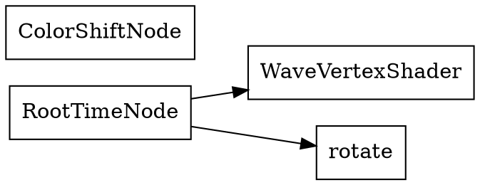

# Architecture de BBFx

> Document d'analyse de l'architecture interne du moteur BBFx (BonneBalleFX), établi en 2026 à partir de l'intégralité du code source du snapshot `2006.06.10 (Gron)`.

---

## Table des matieres

**Architecture originale (2006)**
1. [Vue d'ensemble](#1-vue-densemble)
2. [Module Core — Le moteur C++](#2-module-core--le-moteur-c)
3. [Module Input — Dispositifs d'entree](#3-module-input--dispositifs-dentrée)
4. [Module FX — Effets graphiques](#4-module-fx--effets-graphiques)
5. [Bindings SWIG](#5-bindings-swig)
6. [Couche Lua applicative](#6-couche-lua-applicative)
7. [Flux d'execution](#7-flux-dexécution)
8. [Patterns de conception](#8-patterns-de-conception)
9. [Gestion memoire et cycle de vie](#9-gestion-mémoire-et-cycle-de-vie)

**BBFx Revival — v2.x (2026)**
10. [Vue d'ensemble v2](#10-vue-densemble-v2)
11. [Changements majeurs v1 → v2](#11-changements-majeurs-v1--v2)
12. [Build System v2](#12-build-system-v2)
13. [Flux d'execution v2](#13-flux-dexécution-v2)
14. [FX Pipeline (v2.2)](#14-fx-pipeline-v22)
15. [Composition Engine & Live Pipeline (v2.3)](#15-composition-engine--live-pipeline-v23)
16. [Video Pipeline (v2.4)](#16-video-pipeline-v24)
17. [Animator Avance (v2.5)](#17-animator-avancé-v25)
18. [Shell & Scripting (v2.6)](#18-shell--scripting-v26)
19. [Audio Reactif (v2.7)](#19-audio-réactif-v27)
20. [GPU & Shaders (v2.8)](#20-gpu--shaders-v28)
21. [Production Pipeline (v2.9)](#21-production-pipeline-v29)

**BBFx Revival — v3.x (2026)**
22. [BBFx Studio (v3.0)](#22-bbfx-studio-v30)
23. [BBFx Studio++ (v3.1)](#23-bbfx-studio-v31)
24. [BBFx Studio Content (v3.2)](#24-bbfx-studio-content-v32)
25. [BBFx Studio Interactive Viewport (v3.2.1)](#25-bbfx-studio-interactive-viewport-v321)

**Sections compactes (v3.2.2 → v3.5.1)**
- [v3.2.2 — Multi-Object Scene](#v322--multi-object-scene)
- [v3.2.3 — Timeline Automation](#v323--timeline-automation)
- [v3.2.4 — Asset Pipeline & Visual Application](#v324--asset-pipeline--visual-application)
- [v3.2.5 — Performance Pro & Final Polish](#v325--performance-pro--final-polish)
- [v3.3 — Connect](#v33--connect)
- [v3.4 — Stage](#v34--stage)
- [v3.5 — Community](#v35--community)
- [v3.5.1 — Asset Library & Polish](#v351--asset-library--polish)

---

## 1. Vue d'ensemble

BBFx est organisé en trois couches distinctes :

```
┌──────────────────────────────────────────────────────────────────┐
│  COUCHE APPLICATIVE (Lua)                                        │
│  Scripts de scène, animations, configuration, tests              │
│  bbfx.lua · config.lua · lua/engine.lua · lua/animator.lua …    │
├──────────────────────────────────────────────────────────────────┤
│  COUCHE BINDING (SWIG C++ ↔ Lua)                                │
│  swig/bbfx.i  →  libbbfx_wrap.so                                │
│  ogrelua/swig/Ogre.i  →  libOgreLua.so                          │
├──────────────────────────────────────────────────────────────────┤
│  COUCHE MOTEUR (C++)              bbfx namespace                 │
│  ┌──────────┐ ┌──────────┐ ┌────────────┐ ┌───────────────┐    │
│  │  Engine  │ │ Animator │ │InputManager│ │  FX modules   │    │
│  │  (OGRE)  │ │  (DAG)   │ │  (OIS/jsw) │ │ (Perlin, …)  │    │
│  └──────────┘ └──────────┘ └────────────┘ └───────────────┘    │
├──────────────────────────────────────────────────────────────────┤
│  DÉPENDANCES EXTERNES                                            │
│  OGRE 1.2 · OIS · libjsw · Boost.Graph · pthread · X11/OpenGL  │
└──────────────────────────────────────────────────────────────────┘
```

Chaque couche ne communique qu'avec la couche immédiatement adjacente. Les scripts Lua ne font jamais d'appels système directs — tout passe par les bindings SWIG.

---

## 2. Module Core — Le moteur C++

### 2.1 Engine (`core/Engine.h/cpp`)

**Rôle :** Singleton contrôlant la boucle de rendu OGRE.

```cpp
namespace bbfx {
  class Engine {
  public:
    Engine(unsigned long lua_State);   // reçoit le lua_State pour callbacks
    static Engine* instance();
    void startRendering();             // bloquant : lance la boucle principale
    void stopRendering();              // signal d'arrêt (volatile bool)
  };
}
```

La boucle principale (côté `Engine.cpp`) suit le schéma suivant à chaque frame :
1. `mInputManager->capture()` — lecture des événements d'entrée
2. `mAnimator->renderOneFrame()` — propagation du graphe d'animation
3. `mRoot->renderOneFrame()` — rendu OGRE d'une frame
4. Pump des messages de la plateforme X11/Win32

**Construction :** L'`Engine` est construit depuis Lua via `engine.singleton(swig.state())`. Le `lua_State` est passé pour permettre à l'Engine de rappeler dans Lua si nécessaire.

**Destruction :** `engine.destroy()` est appelé explicitement en fin de script pour garantir la libération ordonnée des ressources OGRE avant que le GC Lua ne libère les objets C++.

---

### 2.2 Animator et AnimationGraph (`core/Animator.h/cpp`)

**Rôle :** Cœur du moteur d'animation. Maintient un DAG de ports de valeurs et propage les mises à jour chaque frame.

#### Structures de données internes

```cpp
// Graphe Boost : sommets = AnimationPort*, arêtes = connexions
typedef adjacency_list<vecS, vecS, directedS> Graph;
typedef graph_traits<Graph>::vertex_descriptor Vertex;

// Bi-directional mapping Port ↔ Vertex
typedef map<AnimationPort*, Vertex> VertexMap;
typedef map<Vertex, AnimationPort*> PortMap;
```

#### Opérations sur le graphe

```cpp
void add(AnimationPort* port);         // ajoute un sommet
void remove(AnimationPort* port);      // retire le sommet et ses arêtes
void link(AnimationPort* s, AnimationPort* t);   // ajoute une arête s→t
void unlink(AnimationPort* s, AnimationPort* t); // retire l'arête s→t
void schedule(const Operation& op, TimeStamp t); // planifie une mutation future
```

#### Boucle de frame (`renderOneFrame`)

```
renderOneFrame()
  ├─ executePendingPreOps()    // traite mPreOpQueue (priority_queue<timestamp>)
  ├─ [sources s'auto-mettent à jour via notifyUpdate()]
  ├─ propagateFreshValues()    // BFS depuis les ports fraîchement mis à jour
  │     pour chaque port frais dans mPortQueue :
  │       → actualise la valeur du port destination
  │       → enqueue les sorties du nœud destination
  └─ executePendingPostOps()   // traite mPostOpQueue (deque, post-propagation)
```

#### Planification temporelle

Les opérations différées utilisent une `priority_queue` triée par timestamp `float` :

```cpp
typedef Event<Operation, TimeStamp>    OperationEvent;
typedef priority_queue<OperationEvent> PreOpQueue;   // futurs
typedef deque<Operation>               PostOpQueue;  // post-frame courant
```

Un `Operation` est soit un `link` soit un `unlink` entre deux ports. La planification permet de synchroniser des transitions d'animation à des points temporels précis.

---

### 2.3 AnimationNode et AnimationPort (`core/AnimationNode.h/cpp`, `core/AnimationPort.h/cpp`)

**AnimationPort** est l'unité élémentaire de valeur dans le graphe :

```cpp
class AnimationPort {
  const string& getName() const;
  const string& getFullName() const;      // "NomNoeud.nomPort"
  const Ogre::AnyNumeric& getValue() const;
  void setValue(const Ogre::AnyNumeric& value);
};
```

`Ogre::AnyNumeric` est un variant type OGRE permettant de transporter `float`, `Vector2`, `Vector3`, `Vector4`, `Quaternion`, `ColourValue` et `Matrix4` dans un même type.

**AnimationNode** est le conteneur logique :

```cpp
class AnimationNode {
  const string& getName() const;
  typedef std::map<string, AnimationPort*> Ports;
  const Ports& getInputs() const;
  const Ports& getOutputs() const;
  void setListener(AnimationNodeListener* listener);
  virtual void update() = 0;    // appelé lors de la propagation
};
```

La notification de mise à jour monte via `AnimationNodeListener::notifyUpdate(node)` → `Animator::notifyUpdate()` → enqueue des sorties du nœud dans `mPortQueue`.

---

### 2.4 PrimitiveNodes (`core/PrimitiveNodes.h/cpp`)

| Classe | Rôle | Ports |
|---|---|---|
| `RootTimeNode` | Source de temps système (Ogre::Timer) | OUT: `time` (delta), `totalTime` |
| `AnimationStateNode` | Pilote un état d'animation OGRE (skeletal) | IN: `time` |
| `AccumulatorNode` | Intègre un delta : `out += in` | IN: `delta`, OUT: `value` |
| `LuaAnimationNode` | Exécute une fonction Lua comme nœud | IN/OUT: dynamiques |
| `AnimableValuePort` | Wraps `Ogre::AnimableValuePtr` | (port lui-même) |
| `AnimableObjectNode` | Expose tous les `AnimableValue` d'un `AnimableObject` | OUT: un par propriété |
| `ControllerValueNode` | Wraps `Ogre::ControllerValueRealPtr` | IN: `value` |
| `ControllerFunctionNode` | Wraps `Ogre::ControllerFunctionRealPtr` | IN: `input`, OUT: `output` |

**LuaAnimationNode** est particulièrement important : il permet de définir un nœud de traitement entièrement en Lua, avec des ports d'entrée/sortie dynamiques créés à l'exécution :

```lua
-- Exemple : nœud sinus
local node = bbfx.LuaAnimationNode("sinus", function(self)
  local t = self:getInputs()["t"]:getValue()
  self:getOutputs()["y"]:setValue(math.sin(t * 2 * math.pi))
end)
node:addInput("t")
node:addOutput("y")
```

---

### 2.5 Lua VM (`core/Lua.h/cpp`)

**Rôle :** Wrapper autour du `lua_State` avec gestion des erreurs et du thread-safety.

```cpp
class Lua {
  lua_State* mState;
  Mutex mMutex;                    // PTHREAD_MUTEX_RECURSIVE_NP
  void load(const string& file);   // charge et exécute un fichier Lua
};
```

**SwigUserdata** : classe interne permettant de créer des `userdata` Lua typés SWIG depuis C++ (utilisé pour passer des pointeurs C++ à Lua avec les métadonnées de type correctes).

**LuaFunction** : encapsule une référence à une fonction Lua (via `luaL_ref`) pour pouvoir l'appeler depuis C++ à n'importe quel moment.

**Thread-safety :** Le mutex récursif protège tous les accès à l'état Lua. La récursivité est nécessaire car certains callbacks Lua peuvent rappeler dans C++ qui rappelle dans Lua.

---

## 3. Module Input — Dispositifs d'entrée

### 3.1 InputManager (`input/InputManager.h/cpp`)

Singleton qui initialise OIS avec la fenêtre OGRE :

```cpp
class InputManager {
  InputManager(Ogre::RenderWindow* renderWindow);
  void addDevice(InputDevice* device);
  const map<string, InputDevice*>& getDevices() const;
};
```

La construction extrait le handle de fenêtre X11 depuis OGRE :
```cpp
OIS::ParamList pl;
renderWindow->getCustomAttribute("WINDOW", &windowHnd);
pl.insert({"WINDOW", to_string(windowHnd)});
// Options X11 : "x11_mouse_grab", "x11_keyboard_grab", etc.
mInputSystem = OIS::InputManager::createInputSystem(pl);
```

### 3.2 InputDevice (`input/InputDevice.h/cpp`)

Base commune à tous les dispositifs. **Hérite d'`AnimationNode`**, ce qui permet de connecter directement les axes/boutons dans le graphe d'animation :

```cpp
class InputDevice : public AnimationNode {
  virtual void setDeviceListener(lua_Function f);  // callback Lua sur événement
  virtual void capture() = 0;  // lit l'état courant
};
```

### 3.3 Keyboard (`input/Keyboard.h/cpp`)

Implémente `OIS::KeyListener`. À chaque événement :
- Appelle `mDeviceListener(key_code, is_pressed)` — fonction Lua enregistrée
- Utilisé dans `input.lua` pour écouter Échap → `Engine:stopRendering()`

### 3.4 Mouse (`input/Mouse.h/cpp`)

Implémente `OIS::MouseListener`. Expose 3 ports normalisés :

```
dx = event.state.X.rel / viewport_width
dy = event.state.Y.rel / viewport_height
dz = event.state.Z.rel / 120.0   (molette)
```

Ces ports sont mis à jour dans le graphe d'animation à chaque `mouseMoved`.

### 3.5 Joystick (`input/Joystick.h/cpp`)

Utilise **libjsw** (Linux `/dev/js*`). Expose un port par axe (`axis1`, `axis2`, …).

```cpp
static lua_Object detect(const string& calibration);  // retourne table Lua
static InputDevice* create(const string& device,
                           const string& calibration,
                           const string& name);
```

La calibration est chargée depuis des fichiers de configuration (`joystick.044f_b303`, `joystick.045e_0028`) qui mappent les ID hardware → noms d'axes et gammes de valeurs.

---

## 4. Module FX — Effets graphiques

### 4.1 SoftwareVertexShader (base)

Classe abstraite héritant de `Ogre::FrameListener`. Lors de l'initialisation :
1. Clone le mesh cible (`_prepareClonedMesh()`)
2. Réorganise les vertex buffers pour avoir **un buffer par sémantique** (position, normal, UV séparés) via `_reorganizeVertexBuffers()`
3. Crée des buffers dynamiques pour permettre la modification CPU frame par frame

### 4.2 PerlinVertexShader

Déformation de maillage CPU temps-réel via bruit de Perlin 3D :

```cpp
// Paramètres exposés
float displacement;    // amplitude du déplacement
float density;         // fréquence spatiale du bruit
float timeDensity;     // évolution temporelle

// Pipeline par frame (FrameListener::frameStarted) :
_clearNormals()        // remet les normales à zéro
_applyNoise()          // déplace chaque vertex de noise3(x,y,z,t) * displacement
                       // et accumule les contributions aux normales
_normalizeNormals()    // normalise les normales finales
```

Le bruit de Perlin classique (`Perlin.h`) utilise une table de permutation de 512 entrées et une interpolation de 5e ordre (`fade(t) = 6t⁵ - 15t⁴ + 10t³`).

### 4.3 TextureBlitter

Manipulation directe de textures GPU :
- Crée une texture `512×512 X8R8G8B8` de type `TU_DYNAMIC_WRITE_ONLY_DISCARDABLE`
- Verrouille le `PixelBuffer` de la texture chaque frame
- Permet d'écrire pixel par pixel via `PixelUtil`

---

## 5. Bindings SWIG

### 5.1 Interface principale (`swig/bbfx.i`)

Le fichier `bbfx.i` est l'**interface publique complète du moteur vers Lua**. Il :

1. Inclut les typemaps standard (`std_string.i`, `std_vector.i`, `std_map.i`)
2. Instancie des templates STL pour Lua :
   ```swig
   %template(Devices) map<string, bbfx::InputDevice*>;
   %template(Ports)   map<string, bbfx::AnimationPort*>;
   ```
3. Déclare un bloc `%exception` global qui intercepte toutes les exceptions C++ et les re-propage comme erreurs Lua :
   ```swig
   %exception {
     try { $action }
     catch (const Ogre::Exception& e) {
       lua_pushstring(L, e.getFullDescription().c_str()); SWIG_fail; }
     catch (const bbfx::Exception& e) { ... }
     catch (const std::exception& e)  { ... }
     catch (...) { lua_pushstring(L, "unhandled exception !"); SWIG_fail; }
   }
   ```
4. Déclare les classes C++ avec `%nodefaultctor`/`%nodefaultdtor` pour les classes abstraites

### 5.2 Typemaps (`swig/typemaps.i`)

Gestion du type `lua_Function` (fonction Lua passée à C++) :
```swig
%typemap(in, checkfn="lua_isfunction") lua_Function {
  $1 = $input;
}
```

### 5.3 swig.lua — Réflexion côté Lua

`swig.lua` est le moteur de réflexion qui fait vivre les objets SWIG du côté Lua :

- **`__spec`** : métadonnée SWIG attachée à chaque module, décrivant les classes, méthodes statiques, héritage
- **`swig.bootup(module)`** : lit `__spec` et installe les métatables correctes
- **`userdata__index`** : résout les accès sur les objets C++ (`obj.method`, `obj.property`)
- **`class__index`** : résout les accès statiques (`Class.staticMethod`)
- **Héritage** : résolution en chaîne via `directbases` — si une méthode n'est pas trouvée sur la classe courante, remonte aux classes parentes
- **`swig.setpeer(userdata, table)`** : associe une table Lua à un userdata C++, permettant d'ajouter des méthodes Lua aux objets C++ (pattern "refine")
- **Garbage collection** : `userdata__gc` libère les pointeurs C++ marqués `own`

### 5.4 OgreLua (`ogrelua/swig/`)

Projet SWIG séparé qui expose ~200 types OGRE à Lua. Organisé en fichiers `.i` par domaine :

| Domaine | Fichiers .i représentatifs |
|---|---|
| Mathématiques | `Vector2.i`, `Vector3.i`, `Vector4.i`, `Quaternion.i`, `Matrix3.i`, `Matrix4.i` |
| Scène | `SceneManager.i`, `SceneNode.i`, `MovableObject.i` |
| Objets | `Entity.i`, `Light.i`, `Camera.i`, `BillboardSet.i` |
| Animation | `Animation.i`, `AnimationState.i`, `AnimationTrack.i` |
| Matériaux | `Material.i`, `Pass.i`, `TextureUnitState.i` |
| Rendu | `RenderWindow.i`, `RenderTarget.i`, `RenderSystem.i` |
| Géométrie | `Mesh.i`, `SubMesh.i`, `VertexData.i`, `IndexData.i` |
| Divers | `AnyNumeric.i`, `ColourValue.i`, `StringVector.i` |

---

## 6. Couche Lua applicative

### 6.1 engine.lua

Module Lua wrappant le cycle de vie de l'`Engine` C++ :

```lua
-- Initialisation
local e = bbfx.Engine(swig.state())  -- lua_State passé via SWIG
engine.singleton(e)

-- Modules fils initialisés lors du bootup engine
require "animator"   -- Animator C++ + extensions Lua
require "input"      -- InputManager + devices
```

Expose `engine.singleton()` (accès global), `engine.destroy()` (destruction explicite).

### 6.2 animator.lua

Surcharge et enrichit le binding `bbfx.Animator` avec des factories Lua :

```lua
-- Factory de LuaAnimationNode
function animator.node(name, inputs, outputs, update_fn)
  local node = bbfx.LuaAnimationNode(name, update_fn)
  for _, port in ipairs(inputs)  do node:addInput(port)  end
  for _, port in ipairs(outputs) do node:addOutput(port) end
  return node
end

-- Vues pré-construites
animator.CameraMan    -- contrôle caméra OrbitCamera OGRE
animator.FreeCamera   -- caméra libre avec joystick
animator.SphereTrack  -- déplacement sphérique autour d'un point
animator.TransTrav    -- transition/traversée entre points
```

Inclut un `TestSuite` complet avec tests d'opérations immédiates et planifiées.

### 6.3 input.lua

Détecte et configure les dispositifs :
```lua
-- Keyboard
local kb = bbfx.Keyboard.create()
kb:setDeviceListener(function(key, pressed)
  if key == OIS.KC_ESCAPE and pressed then
    engine.singleton():stopRendering()
  end
end)

-- Mouse — ports dx/dy/dz directement branchables
local mouse = bbfx.Mouse.create(renderWindow)

-- Joystick (commenté dans la version archivée)
-- local js = bbfx.Joystick.create("/dev/js0", calibFile, "gamepad")
```

### 6.4 scenespec.lua — DSL de scène

Permet de déclarer une scène OGRE de façon déclarative :

```lua
local scene = declaration {
  light = makeLight { type = "point", position = {0,100,0} },
  player = makeEntity { mesh = "robot.mesh",
    node = { position = {0,0,0}, scale = {1,1,1} }
  }
}
```

Utilise `env.lua` pour maintenir une pile de contextes de déclaration et résoudre les références croisées.

### 6.5 Bibliothèques de base (lua/lib/)

#### oo.lua — Héritage prototypal

```lua
local MyClass = Class.new(ParentClass)
function MyClass:myMethod() ... end
local obj = MyClass:instance({ field = value })
assert(MyClass:isInstance(obj))
```

#### patterns.lua — Patterns réutilisables

**`patterns.singleton`** : transforme un module en singleton avec `create()`, `singleton()`, `destroy()` et des hooks pre/post.

**`patterns.propertyAdapter`** : convertit les paires `getFoo()`/`setFoo()` d'un metatable SWIG en propriétés Lua accessibles directement (`obj.foo` au lieu de `obj:getFoo()`).

**`patterns.refine`** : ajoute une peer table Lua à un userdata SWIG, permettant d'étendre un objet C++ avec des méthodes Lua pures.

#### idioms.lua — Idiomes fonctionnels

```lua
curry(f, a, b)          -- application partielle : retourne f(a, b, ...)
memoize(f, "v")         -- mise en cache avec table à valeurs faibles
protect(f)              -- transforme les exceptions en valeurs (nil, msg)
newtry(finalizer)       -- pattern try/finally avec remontée d'exception
List.map(t, f)          -- map fonctionnel sur table séquentielle
List.filter(t, pred)    -- filtre fonctionnel
Table.inject(t, proto)  -- mixin d'une table dans une autre
UID()                   -- génère un identifiant unique (entier croissant)
dumpClass(cls)          -- introspection : affiche méthodes et propriétés
```

---

## 7. Flux d'exécution

### Démarrage complet

```
lua bbfx.lua
  │
  ├─ require "config"          → charge chemins, OGRE config (RenderSystem, plugins…)
  ├─ require "engine"          → bbfx.Engine(lua_State) créé et singleton
  │                              → OGRE initialisé (Root, RenderWindow, SceneManager)
  │                              → Animator singleton créé
  │                              → InputManager créé avec la RenderWindow
  │
  ├─ require "test-scene"      → création de la scène de démo
  │     TestScene:testBase()
  │       ├─ SceneManager:setAmbientLight(...)
  │       ├─ createLight("MainLight")
  │       ├─ createEntity("ogrehead.mesh") → attachée à un SceneNode
  │       ├─ createBillboardSet(...)
  │       └─ Camera + Viewport configurés
  │
  ├─ animator.TestSuite:testLuaAnimationNode()
  │     → crée nœuds Lua + connexions dans le graphe
  │
  ├─ animator.TestSuite:testImmediateOperation()
  │     → teste link/unlink immédiat
  │
  └─ engine.singleton():startRendering()   ← BOUCLE PRINCIPALE (bloquant)
        │
        │  ← Frame loop ─────────────────────────────────────────────
        ├─ inputManager.capture()
        │     Keyboard → events → Lua callbacks
        │     Mouse    → dx/dy/dz → ports dans graph
        │     Joystick → axes    → ports dans graph
        │
        ├─ animator.renderOneFrame()
        │     executePendingPreOps()
        │     propagateFreshValues() : BFS sur le DAG
        │       RootTimeNode → actualise time/totalTime
        │       LuaAnimationNode → appelle la fonction Lua update()
        │       AnimationStateNode → avance l'animation OGRE
        │     executePendingPostOps()
        │
        └─ ogreRoot.renderOneFrame()
              → rendu OpenGL de la scène
              → swap buffers X11
```

### Arrêt

```
ESC pressé
  → Keyboard listener Lua → engine.singleton():stopRendering()
  → Engine::mStopQueued = true
  → exit de startRendering()
  → engine.destroy()
  → destructeurs C++ : Engine → Animator → InputManager → OGRE cleanup
  → tabulaRasa() Lua → GC de tous les packages et globals
```

---

## 8. Patterns de conception

### Singleton C++ avec accès Lua

Tous les singletons C++ (`Engine`, `Animator`) utilisent le pattern classique :
```cpp
static Engine* sInstance = nullptr;
Engine* Engine::instance() { return sInstance; }
```

Côté Lua, `patterns.singleton` enveloppe la factory C++ :
```lua
patterns.singleton(engine_module, function(lua_state)
  return bbfx.Engine(lua_state)
end)
-- expose : engine.create(), engine.singleton(), engine.destroy()
```

### Flux de données par composition

Les nœuds sont composables : la sortie d'un nœud peut être l'entrée de plusieurs autres. Le graphe Boost garantit la traversée correcte même en cas de topologies complexes.

### Exception safety

Toutes les fonctions C++ exposées à Lua passent par le bloc `%exception` SWIG → les exceptions C++ ne passent jamais à travers la frontière Lua/C++ sans être converties en erreurs Lua. Du côté Lua, `protect()` et `newtry()` permettent de gérer ces erreurs de façon structurée.

### Peer table pattern (SWIG + Lua)

Pour étendre un objet C++ avec des méthodes Lua :
```lua
local refined = patterns.refine(cppObject, {
  myLuaMethod = function(self) ... end
})
-- refined hérite de toutes les méthodes C++ ET de myLuaMethod
```

Implémenté via `swig.setpeer(userdata, table)` qui stocke la table dans le registre Lua.

---

## 9. Gestion mémoire et cycle de vie

### Ownership des objets C++

SWIG génère un bit `own` pour chaque userdata. Les objets créés via `new` dans C++ et retournés à Lua ont `own=true` → le GC Lua appelera le destructeur C++. Les références (pointeurs retournés par des accesseurs) ont `own=false` → pas de double free.

### Objets OGRE partagés

OGRE utilise `SharedPtr<T>` (équivalent `shared_ptr`). La ligne dans le TRASH/notes (`N.B. SharedPtr indirection already handled by SWIG`) confirme que SWIG gère la copie/destruction des SharedPtr correctement via les typemaps OGRE.

### Risques identifiés

- **Ordre de destruction** : si le GC Lua libère un `AnimationNode` avant que l'`Animator` ne soit détruit, on a un accès mémoire invalide. Le script gère cela en appelant `engine.destroy()` **avant** `tabulaRasa()`.
- **Callbacks Lua depuis C++** : `LuaAnimationNode` stocke une référence `luaL_ref` à la fonction Lua. Si la fonction est collectée par le GC avant la destruction du nœud, l'appel C++ → Lua est invalide. Le contrat est que les nœuds doivent être détruits avant que leurs callbacks ne soient collectés.

---

*Analyse architecturale établie en mars 2026 à partir de l'intégralité du code source de BBFx version 0.2dev (snapshot 2006-06-10).*

---

# Architecture de BBFx v2 (Revival)

> Addendum décrivant l'architecture de BBFx v2.0.0, la réécriture moderne en C++20 du moteur original.

---

## 10. Vue d'ensemble v2

BBFx v2 conserve l'architecture en couches du moteur original mais remplace toutes les dépendances obsolètes :

```
┌──────────────────────────────────────────────────────────────────┐
│  COUCHE APPLICATIVE (Lua 5.4+)                                   │
│  bbfx_minimal.lua · input.lua · sol2_compat.lua · keycodes.lua  │
├──────────────────────────────────────────────────────────────────┤
│  COUCHE BINDING (sol2 — header-only, type-safe)                  │
│  src/bindings/bbfx_bindings.cpp                                  │
│  ogre-lua (bibliothèque séparée, 50+ types OGRE)                │
├──────────────────────────────────────────────────────────────────┤
│  COUCHE MOTEUR (C++20)              bbfx namespace               │
│  ┌──────────┐ ┌──────────┐ ┌────────────┐ ┌───────────────┐    │
│  │  Engine  │ │ Animator │ │InputManager│ │  FX modules   │    │
│  │  (SDL3)  │ │  (DAG)   │ │  (SDL3)    │ │ (Perlin, …)  │    │
│  └──────────┘ └──────────┘ └────────────┘ └───────────────┘    │
├──────────────────────────────────────────────────────────────────┤
│  DÉPENDANCES EXTERNES (via vcpkg)                                │
│  OGRE 14.5 · SDL3 · sol2 · Lua 5.4+ · Boost.Graph 1.90         │
└──────────────────────────────────────────────────────────────────┘
```

---

## 11. Changements majeurs v1 → v2

### 11.1 Dépendances remplacées

| v1 (2006) | v2 (2026) | Raison |
|-----------|-----------|--------|
| OGRE 1.2 | OGRE 14.5.2 | Support D3D11, Vulkan, maintenance active |
| OIS | SDL3 | Cross-platform, hotplug gamepad, maintenance active |
| SWIG + swig.lua | sol2 | Type-safe, header-only, pas de code generation |
| Lua 5.1 | Lua 5.4+ (5.5.0) | Integers, goto, metatables améliorées |
| SCons + Python 2 | CMake 3.20+ + vcpkg | Standard industrie, gestion deps intégrée |
| pthread | std::recursive_mutex | Standard C++, portable Windows/Linux |
| std::auto_ptr | std::unique_ptr | auto_ptr supprimé en C++17 |
| libjsw (Linux /dev/js*) | SDL3 Gamepad API | Cross-platform, hotplug natif |
| X11/Win32 direct | SDL3 Window | Abstraction plateforme unique |

### 11.2 Architecture préservée

Le coeur du moteur est **inchangé conceptuellement** :

- **Animation DAG** : Boost.Graph adjacency_list, BFS propagation, pre/post operation queues
- **AnimationNode / AnimationPort** : même modèle de ports nommés avec `Ogre::AnyNumeric`
- **LuaAnimationNode** : noeud dont `update()` appelle une fonction Lua (sol::function au lieu de luaL_ref)
- **Singleton pattern** : Engine, Animator, InputManager restent des singletons
- **FX modules** : PerlinVertexShader, TextureBlitter, SoftwareVertexShader inchangés

### 11.3 Abstraction plateforme

`src/platform.h` centralise toutes les différences Windows/Linux :

```cpp
#if defined(_WIN32)
  #define BBFX_OGRE_RENDERER "Direct3D11 Rendering Subsystem"
#else
  #define BBFX_OGRE_RENDERER "Vulkan Rendering Subsystem"
#endif
```

Résultat : **zéro `#ifdef` dans le code applicatif** (main.cpp, Engine.cpp, etc.).

### 11.4 Input SDL3

L'InputManager v2 agrège trois managers SDL3 :

- **KeyboardManager** : `SDL_GetKeyboardState`, `isKeyDown(scancode)`, `wasKeyPressed(scancode)`
- **MouseManager** : `SDL_GetMouseState`, `SDL_GetRelativeMouseState`, position + delta + boutons
- **JoystickManager** : `SDL_OpenGamepad`, axes [-1,1], hotplug via `SDL_EVENT_GAMEPAD_ADDED/REMOVED`

Chaque manager est exposé à Lua via sol2. Le script `lua/input.lua` fournit l'API Lua de haut niveau.

### 11.5 ogre-lua (bibliothèque séparée)

Projet indépendant qui expose les types OGRE à Lua :

- `src/math_bindings.cpp` : Vector2, Vector3, Vector4, Quaternion, ColourValue, Radian, Degree
- `src/scene_bindings.cpp` : SceneManager, SceneNode, Entity, Light, Camera, BillboardSet, Root
- `src/animation_bindings.cpp` : AnimationState, AnyNumeric (wrapper), AnimableObject, ControllerValueRealPtr

50 tests headless (math 22, scene 17, animation 11) validant tous les bindings sans GPU.

---

## 12. Build System v2

```
bbfx-revival/
├── CMakeLists.txt          # projet principal
├── CMakePresets.json        # linux-debug/release, windows-debug/release
├── vcpkg.json               # dépendances vcpkg
├── src/
│   ├── main.cpp             # point d'entrée (SDL3 + OGRE init)
│   ├── platform.h           # abstraction plateforme
│   ├── core/                # Engine, Animator, AnimationNode/Port, PrimitiveNodes
│   ├── input/               # KeyboardManager, MouseManager, JoystickManager, InputManager
│   ├── fx/                  # PerlinVertexShader, TextureBlitter, SoftwareVertexShader
│   └── bindings/            # bbfx_bindings.cpp (sol2)
├── lua/                     # scripts Lua applicatifs
├── tests/                   # test_regression, test_longrun, benchmark
└── extern/                  # dépendances locales si nécessaire

ogre-lua/                    # répertoire frère
├── CMakeLists.txt
├── include/ogre_lua/
├── src/
└── tests/
```

Build : `cmake --preset <preset> && cmake --build --preset <preset>`

CI : GitHub Actions (Ubuntu + Windows), vcpkg binary cache.

---

## 13. Flux d'exécution v2

```
bbfx.exe lua/bbfx_minimal.lua
  │
  ├─ main.cpp:
  │   ├─ sol::state lua
  │   ├─ ogre_lua::register_all(lua)     → types OGRE dans Lua
  │   ├─ register_bbfx_bindings(lua)     → types BBFx dans Lua
  │   ├─ SDL_Init + SDL_CreateWindow      → fenêtre SDL3 800×600
  │   ├─ Ogre::Root + plugins + renderer  → OGRE 14.5 init
  │   ├─ RenderWindow (externalWindowHandle from SDL3)
  │   ├─ SceneManager + Camera + Viewport
  │   └─ lua.script_file(argv[1])         → exécute le script Lua
  │
  ├─ bbfx_minimal.lua:
  │   ├─ Engine.instance() → singleton C++
  │   ├─ scene setup (light, camera, nodes)
  │   ├─ LuaAnimationNode → rotation chaque frame
  │   └─ engine:startRendering()          ← boucle principale
  │
  └─ Engine::startRendering():
       while (running) {
         SDL_PollEvent → input + quit
         InputManager::capture()
         Animator::renderOneFrame()
           ├─ executePendingPreOps()
           ├─ propagateFreshValues() (BFS)
           └─ executePendingPostOps()
         Ogre::Root::renderOneFrame()
       }
       cleanup → "Clean exit." → exit 0
```

---

---

## 14. FX Pipeline (v2.2)

### Pattern FX-as-AnimationNode

En v2.2, les effets graphiques (vertex shaders, color shifts) sont intégrés au DAG de l'Animator en tant que nœuds d'animation. Le pattern utilise la **composition** (pas l'héritage multiple) :

```
┌─────────────────────┐     ┌──────────────────────┐
│  AnimationNode      │     │  SoftwareVertexShader │
│  (ports I/O)        │     │  (mesh deformation)   │
│                     │     │                       │
│  PerlinFxNode ──────┼────►│  PerlinVertexShader   │
│  (wrapper)          │     │  (owned, composition) │
└─────────────────────┘     └──────────────────────┘
```

**Lifecycle** :
1. Le constructeur du FxNode crée le shader interne et déclare les ports
2. `update()` est appelé par le DAG à chaque frame (BFS propagation)
3. `update()` lit les ports d'entrée → met à jour les paramètres du shader → appelle `renderOneFrame(dt)` → écrit le port de sortie
4. À la destruction, `~AnimationNode()` appelle `Animator::removeNode(this)` pour nettoyer les arêtes

### FX Nodes disponibles

| Node | Type | Ports d'entrée | Ports de sortie |
|------|------|---------------|-----------------|
| **PerlinFxNode** | Composition (possède PerlinVertexShader) | displacement, density, timeDensity, enable | mesh_dirty |
| **TextureBlitterNode** | Composition (possède TextureBlitter) | r, g, b, a | texture_dirty |
| **WaveVertexShader** | Héritage multiple (SoftwareVertexShader + AnimationNode) | amplitude, frequency, speed, axis | mesh_dirty |
| **ColorShiftNode** | AnimationNode pur | hue_shift, saturation, brightness | — |

### API Lua

```lua
-- Créer un FX node et le connecter au graphe
local wave = bbfx.WaveVertexShader("ogrehead.mesh", "ogrehead_wave")
wave:enable()
wave:getInput("amplitude"):setValue(3.0)

local animator = bbfx.Animator.instance()
local tn = bbfx.RootTimeNode.instance()
animator:addNode(wave)
animator:addPort(tn, "dt", wave, "speed")

-- Exporter le graphe en DOT
animator:exportDOT("graph.dot")
```

### Graphe DOT d'exemple (mode combined)


```dot
digraph animator {
  rankdir=LR;
  "RootTimeNode" [shape=box];
  "WaveVertexShader" [shape=box];
  "ColorShiftNode" [shape=box];
  "rotate" [shape=box];
  "RootTimeNode":"dt" -> "rotate":"dt";
  "RootTimeNode":"dt" -> "WaveVertexShader":"speed";
}
```

### Qualité de vie (v2.2)

| Feature | Touche | API Lua |
|---------|--------|---------|
| Stats overlay (FPS) | F3 | `bbfx.StatsOverlay.instance():toggle()` |
| Screenshot | F12 | `engine:screenshot()` |
| Fullscreen toggle | F11 | `engine:toggleFullscreen()` |

---

---

## 15. Composition Engine & Live Pipeline (v2.3)

### Music-Inspired Composition Architecture

Le système de composition récupéré du code de production 2006 est basé sur une **métaphore musicale** :

```
Song (BPM, bar, cycle)
  → Sync (beat/bar/cycle mapping)
    → Sequencer (note on/off scheduling)
      → Chord (state machine: named states)
        → Note (polymorphe: Animation, Object, Effect, Action)
```

### Modules Lua portés

| Module | Rôle | Lignes |
|--------|------|--------|
| `note.lua` | Dispatch polymorphe (on/off) : Animation, Object, Effect, Action | 134 |
| `chord.lua` | State machine : états nommés contenant des note events | 82 |
| `sequencer.lua` | Scheduler beat-based (Lua pur, LuaAnimationNode dans le DAG) | 100 |
| `sync.lua` | Mapping BPM → beat/bar/cycle, event scheduling | 74 |
| `object.lua` | Factory scène : fromMesh/Billboard/Light/Psys/Camera/FloorPlane | 200+ |
| `effect.lua` | Effets de scène : skybox, fog, shadows, ambient | 67 |
| `camera.lua` | Camera setup + SphereTrack orbital | 80 |
| `compositors.lua` | Wrapper CompositorManager : add/remove/toggle | 40 |
| `joystick_mapping.lua` | Joystick SDL3 : bind axes/buttons à des ports AnimationNode | 80 |
| `controller.lua` | MappingNode : linear, smooth, slide (AnimationNode pattern) | 80 |
| `keymap.lua` | Hotkey bindings SDL3 : F-keys → chord states | 50 |
| `threads.lua` | Coroutine scheduler intégré au frame loop | 80 |

### Architecture d'un set VJ jouable

```
┌─ Joystick 1 ──→ joystick_mapping.lua ──→ controller.lua (MappingNode) ─┐
│                                                                          │
│  ┌─ Keyboard ──→ keymap.lua ──→ Chord:send() ──→ Sequencer ──→ Notes ──┤
│  │                                                                       │
│  │  ┌─ RootTimeNode ──→ Sequencer beat tracking ─────────────────────────┤
│  │  │                                                                    │
│  │  │  Note.Object → Object:attach/detach (fromMesh, fromPsys)           │
│  │  │  Note.Effect → Effect.skybox/fog/ambient                           │
│  │  │  Note.Animation → AnimationState enable/disable                    │
│  │  │  Note.Action → arbitrary function call                             │
│  │  │                                                                    │
│  │  │  Compositor.toggle("Bloom") → CompositorManager                    │
│  │  │                                                                    │
│  │  └─ SphereTrack ──→ Camera orbit ──→ Viewport                        │
└──┴──┴────────────────────────────────────────────────────────────────────┘
```

---

---

## 16. Video Pipeline (v2.4)

### Architecture Theora

Le système vidéo porte le code de production 2006 vers C++20/OGRE 14.5 :

```
OggReader (std::ifstream → ogg_sync/stream)
  → TheoraReader (th_decode_* API, seek map)
    → TheoraBlitter (YUV→RGBA, texture upload)
      → TheoraClip (std::jthread decode, frameUpdate dans le DAG)
        → TheoraClipNode (AnimationNode wrapper)
```

### Threading

- Décodage sur `std::jthread` avec `stop_token` pour arrêt propre
- Synchronisation via `std::condition_variable` + `std::mutex`
- Flags via `std::atomic<bool>` (mPlaying, mRunning, mFrameReady)
- Le thread decode produit des frames, le thread render les consomme via `frameUpdate(dt)`

### Lifecycle

1. `TheoraClip(filename)` → crée Reader + Blitter
2. `play()` → lance le jthread de décodage
3. Thread : `readFrame()` → attends signal
4. Render : `frameUpdate(dt)` → blit YUV→texture → signal thread
5. `pause()` / `stop()` → contrôle atomique

### ReversableClip

Possède 2 TheoraReader (forward + reverse). `doReverse()` swap le reader actif.

### TextureCrossfader

Blend entre 2 textures via `LBX_BLEND_MANUAL` sur un Pass OGRE. `crossfade(beta)` contrôle le facteur (0.0 = source, 1.0 = destination).

---

*Architecture v2 documentée en mars 2026. Sections FX Pipeline (v2.2), Composition Engine (v2.3), et Video Pipeline (v2.4) ajoutées. Sébastien Jullien.*

---

## 17. Animator Avance (v2.5)

**17 iterations (I-128 → I-144)**

Le graphe d'animation evolue d'un simple propagateur de valeurs vers un outil de composition :

### Noeuds temporels (Lua)

Tous implementes en Lua pur, pas en C++ — crees via `LuaAnimationNode` avec des closures :

| Noeud | Ports in | Ports out | Comportement |
|-------|----------|-----------|-------------|
| `LFONode` | in, frequency, min, max | out | Oscillateur (sin/tri/square/saw) |
| `RampNode` | in, start, end, duration | out | Rampe lineaire |
| `DelayNode` | in | out | Retarde le signal de N frames |
| `EnvelopeFollowerNode` | in | out | Lissage exponentiel (suit l'enveloppe) |

### SubgraphNode

Encapsule un sous-graphe comme un seul noeud avec une interface de ports nommes. Permet la reutilisation de motifs d'animation.

### Preset System

```lua
Preset:define("PerlinPulse", {nodes, links, defaults})
Preset:instantiate("PerlinPulse")  -- cree le sous-graphe dans le DAG
Preset:save("name")                -- serialise en fichier
Preset:load("name")                -- charge depuis fichier
```

### Style declaratif

```lua
build({
    nodes = { {name="lfo", type="LFONode"}, ... },
    links = { {"time.total", "lfo.in"}, ... }
})
```

### Animation spline Lua

Interpolation Catmull-Rom pure Lua : `Animation:new()`, `addFrames()`, `create()`, `bind()`, `play()`.

---

## 18. Shell & Scripting (v2.6)

**14 iterations (I-145 → I-158)**

BBFx devient un environnement de creation interactif.

### REPL Lua integre

`StdinReader` C++ (`_kbhit()`/`_getch()` Windows, non-bloquant) + `LuaConsoleNode` dans le DAG. Prompt `bbfx>`, evaluation temps reel pendant le rendu.

### Commandes introspection

| Commande | Description |
|----------|-------------|
| `graph()` | Liste noeuds + liens du DAG |
| `ports("name")` | Ports d'un noeud avec valeurs |
| `set("node", "port", val)` | Modifie une valeur |
| `reload()` | Hot-reload des scripts |
| `help()` | Aide |
| `quit()` | Arret |

### Shell TCP distant

`TcpServer` C++ (WinSock2, `std::thread`, `std::mutex` + queue, max 2 clients). Port 33195. Protocole : une ligne = une expression, reponse `--> result` ou `error: msg`.

### Hot Reload

`HotReloader` Lua surveille les timestamps fichiers (~1s). `dofile()` via ErrorHandler. Commandes `watch()`, `unwatch()`, `watchlist()`.

### Infrastructure

- **Logger structure** : `Logger.info/warn/error` → stdout + fichier `bbfx.log`
- **ErrorHandler** : pcall wrapper avec `xpcall` + `debug.traceback`. Le moteur ne crash plus sur une erreur Lua.
- **Animator introspection C++** : `registerNode()`, `getRegisteredNodeNames()`, `getNodeByName()`, `getInputNames()`, `getOutputNames()`

---

## 19. Audio Reactif (v2.7)

**14 iterations (I-159 → I-172)**

Les visuels reagissent a la musique en temps reel.

### Pipeline audio

```
Microphone/Line-in
  → AudioCapture C++ (SDL3_audio, mono 44100Hz float32, ring buffer thread-safe)
    → AudioAnalyzerNode C++ (FFT Radix-2 Cooley-Tukey, Hann, 8 bandes + RMS + peak)
      → BeatDetectorNode C++ (onset detection energie > seuil × moyenne mobile, BPM auto)
        → BandSplitNode Lua (low/mid/high avec smoothing exponentiel)
```

### Noeuds audio (AnimationNode)

| Noeud | Type | Ports out |
|-------|------|-----------|
| `AudioCaptureNode` | C++ | `sample` (raw audio) |
| `AudioAnalyzerNode` | C++ | `rms`, `peak`, `band_0`..`band_7` |
| `BeatDetectorNode` | C++ | `beat` (pulse), `bpm` (estime) |
| `BandSplitNode` | Lua | `low`, `mid`, `high` |

### Integration DAG

Tout noeud audio est un `AnimationNode` — ses ports se connectent a n'importe quel autre noeud du graphe. Exemple : `BeatDetectorNode.beat → PerlinFxNode.displacement` = la deformation pulse au rythme de la musique.

---

## 20. GPU & Shaders (v2.8)

**21 iterations (I-173 → I-193)**

### PerlinGPU

Vertex shader GLSL 330 avec Perlin 3D simplex (algorithme Gustavson). Remplace le `PerlinVertexShader` CPU (10-100x plus rapide). Meme interface (`displacement`, `frequency`, `speed` comme ports).

### ShaderFxNode

```cpp
class ShaderFxNode : public AnimationNode {
    // Charge n'importe quel .glsl
    // Parse "uniform float xxx" → cree des ports DAG automatiquement
    // Pousse les valeurs GPU chaque frame via setGpuProgramParameter()
};
```

Un artiste cree un nouvel effet en ecrivant un `.glsl` + un `.lua` wrapper — sans recompiler le moteur.

### ShaderLoader Lua

```lua
Shader:load("perlin.glsl", {mesh = geosphere, uniforms = {displacement = 0.5}})
```

`ShaderManager` : registre global des shaders charges.

### Video Pipeline v2

Refonte complete du pipeline video Theora :
- OggReader seek precis avec SeekMap cache v2
- TheoraReader robustesse (decoder reset, keyframe skip)
- TheoraClip frame pacing natif
- Outil `theora_reverse` (encodeur natif pour creer des videos inversees)
- ReversableClip : changement de direction en temps reel

---

## 21. Production Pipeline (v2.9)

**12 iterations (I-194 → I-205)**

Du live au contenu exportable.

### Record/Replay

```
Performance live
  → InputRecorder C++ : enregistre clavier/joystick/audio beats
    → .bbfx-session (JSON Lines, flush par event)
      → InputPlayer C++ : rejoue les events aux bons timestamps
```

### Mode offline

`Engine::setOfflineMode(fps)` — dt fixe, rendu a vitesse max sans vsync. Permet l'export a resolution et framerate arbitraires.

### VideoExporter

```cpp
class VideoExporter {
    void captureFrame(Ogre::RenderWindow* rw);
    // Capture PNG frame-by-frame via OGRE writeContentsToFile
    // Numerotation sequentielle : frame_000001.png, frame_000002.png, ...
};
```

Pipeline end-to-end : `perform live → record → replay offline → export PNG → ffmpeg → YouTube`.

### Outils Lua

- `functional.lua` : map/filter/reduce/keys/values
- `remdebug` : integration mobdebug pour debug Lua distant via VS Code

---

## 22. BBFx Studio (v3.0)

### Architecture tri-cible

```
bbfx-core (static lib)     ← moteur complet (core, fx, input, audio, video, record, bindings)
  ├── bbfx (executable)    ← mode headless / REPL (inchangé depuis v2.x)
  └── bbfx-studio (exe)    ← GUI ImGui + OGRE RenderTexture
```

### StudioEngine

`StudioEngine` hérite de `Engine` via un constructeur protégé à deux phases :
1. **Phase 1** : SDL3 init + fenêtre avec `SDL_WINDOW_OPENGL`
2. GL context SDL3 créé entre les deux phases (`SDL_GL_CreateContext`)
3. **Phase 2** : OGRE init avec `currentGLContext=true` (partage le contexte SDL3)

OGRE rend off-screen dans un `RenderTexture` (`TU_RENDERTARGET`). Le GL texture ID est extrait via `getCustomAttribute("GLID")` et passé à `ImGui::Image()`.

### Boucle principale (StudioApp::run)

```
SDL_PollEvent → ImGui_ImplSDL3_ProcessEvent
  → RootTimeNode::update + Animator::renderOneFrame
  → mRenderTarget->update()  (OGRE off-screen)
  → glBindFramebuffer(0)     (restore default FB)
  → ImGui::NewFrame → DockSpace + MenuBar + Panels → ImGui::Render
  → ImGui_ImplOpenGL3_RenderDrawData → SDL_GL_SwapWindow
```

### Panels

| Panel | Fichier | Rôle |
|-------|---------|------|
| ViewportPanel | `panels/ViewportPanel.cpp` | `ImGui::Image()` du RenderTexture + overlay FPS |
| NodeEditorPanel | `panels/NodeEditorPanel.cpp` | imgui-node-editor, sync DAG bidirectionnel |
| InspectorPanel | `panels/InspectorPanel.cpp` | Sliders, dropdowns, Lua editor, delete |
| TimelinePanel | `panels/TimelinePanel.cpp` | Beat markers, playhead, chord blocks, transport |
| PresetBrowserPanel | `panels/PresetBrowserPanel.cpp` | Scan `lua/presets/`, drag, effect rack, bypass |
| PerformanceModePanel | `panels/PerformanceModePanel.cpp` | Fullscreen viewport + triggers + faders |

### Persistance

- `ProjectSerializer` : `.bbfx-project` JSON (nodes + ports + links + timeline + media)
- `ExportDialog` : export PNG frame-by-frame en mode offline
- `imgui.ini` : layout des panels (Dear ImGui natif)
- Auto-save : `.autosave` toutes les 120s

### Dépendances GUI (FetchContent)

- **Dear ImGui** (docking branch) : UI framework
- **imgui-node-editor** (thedmd, develop) : éditeur de graphe
- **nlohmann-json** (vcpkg) : sérialisation projet

*Section v3.0 ajoutee en mars 2026. Sebastien Jullien.*

---

## 23. BBFx Studio++ (v3.1)

### Ajouts architecturaux v3.1

**Separation scene / projet :**
```
demo_studio.lua         ← scene OGRE uniquement (mesh, camera, lumieres)
                           expose _G.headNode pour les noeuds Lua
.bbfx-project           ← DAG complet (noeuds, liens, code Lua, positions, chords)
data/templates/default.bbfx-project  ← template premier lancement
```

Le script Lua cree le "monde 3D". Le fichier projet contient la "composition d'animation". Les deux ne se melangent plus.

**BPM → DAG :**
```
RootTimeNode
  inputs:  bpm (set par Timeline chaque frame)
  outputs: dt, total, beat (= total * bpm/60), beatFrac (0..1 sawtooth)
```

Les noeuds temporels (LFO, rotation, oscillateur) se connectent a `beat` ou `beatFrac` au lieu de `total` pour etre synchronises au BPM.

### Nouveaux modules

| Module | Fichier | Role |
|--------|---------|------|
| NodeTypeRegistry | `studio/NodeTypeRegistry.h/.cpp` | Registre singleton de types de noeuds (19 types, 7 categories), factory extensible |
| CommandManager | `studio/commands/CommandManager.h/.cpp` | Undo/redo Command pattern, stack 100 |
| NodeCommands | `studio/commands/NodeCommands.h/.cpp` | CreateNodeCommand, DeleteNodeCommand |
| LinkCommands | `studio/commands/LinkCommands.h/.cpp` | CreateLinkCommand, DeleteLinkCommand |
| EditCommands | `studio/commands/EditCommands.h/.cpp` | EditPortValueCommand, RenameNodeCommand |
| ChordCommands | `studio/commands/ChordCommands.h/.cpp` | AddChord, DeleteChord, RenameChord, ResizeChord |
| ConsolePanel | `studio/panels/ConsolePanel.h/.cpp` | REPL Lua integre (graph/ports/set/help, Copy All, autocompletion) |
| SettingsManager | `studio/SettingsManager.h/.cpp` | Preferences JSON persistees (%APPDATA%/BBFx/settings.json) |

### Serialisation complete (.bbfx-project v3.1)

Le format JSON inclut desormais :
- `source` : code Lua des LuaAnimationNode (recompile au load)
- `inputNames` / `outputNames` : ports customs preserves
- `position` : coordonnees x,y dans le node editor
- `chords` : blocs timeline (nom, startBeat, endBeat, hue)
- `performance` : assignments triggers, faders, quick access
- Retrocompatibilite v3.0 (champs manquants = valeurs par defaut)

### Arguments CLI

```
bbfx-studio.exe [options] [script.lua]

  --default     Charge le template par defaut (sans modifier les settings)
  --reset       Template + reset layout (supprime imgui.ini + node_editor.json)
  --clear       Factory reset (settings remis a zero sur disque)
  --fullscreen  Lancement en plein ecran
  --build       Rebuild avant lancement (cmake)
  -f            Alias pour --fullscreen
```

### GL State Management

OGRE GL3Plus cache l'etat FBO et viewport. Entre chaque frame, ImGui rend dans le framebuffer 0 avec le viewport de la fenetre. Avant chaque `RenderTexture::update()`, `StudioEngine::updateRenderTarget()` force :
1. `glBindFramebuffer(GL_FRAMEBUFFER, cachedFBO)` — rebind le FBO de la RenderTexture
2. `glViewport(0, 0, width, height)` — reset le viewport a la taille de la texture
3. `cam->setAspectRatio(width/height)` — force le ratio camera

Le FBO ID est decouvert au premier render et cache dans `mCachedFBO`. Il est invalide lors d'un `resizeRenderTexture()`.

### Raccourcis clavier

| Raccourci | Action |
|-----------|--------|
| F1 | About |
| F2 | Toggle Console |
| F3 | Toggle Inspector |
| F4 | Toggle Timeline |
| F5 | Toggle Performance Mode |
| F6 | Toggle Preset Browser |
| F7 | Toggle Node Editor |
| Space | Play / Pause |
| Ctrl+Z/Y | Undo / Redo |
| Ctrl+D | Dupliquer noeud(s) |
| Ctrl+S | Sauvegarder |
| Ctrl+E | Export video |
| Ctrl+N/O | Nouveau / Ouvrir |
| Ctrl+, | Settings |
| Ctrl+1-9 | Sauvegarder bookmark |
| 1-9 | Restaurer bookmark |
| Escape | Quitter (Design) / Retour Design (Performance) |

*Section v3.1 ajoutee en mars 2026. Sebastien Jullien.*

---

## 24. BBFx Studio Content (v3.2)

**155 iterations (I-307 → I-461) — 18 lots (A → R) — 14 epics (EPIC-75 → EPIC-89)**

Le Studio v3.1 etait fonctionnel mais vide. La v3.2 le transforme en outil de creation complet : tous les noeuds s'instancient avec de vrais objets OGRE, les parametres sont types et editables visuellement, 41 presets produisent un effet visible immediatement.

### AnimationNode : extensions structurantes

```cpp
class AnimationNode {
    // ... existant v3.1 ...

    // v3.2 : enable/disable
    bool mEnabled = true;
    bool isEnabled() const;
    virtual void setEnabled(bool en);  // override dans SceneObjectNode/LightNode/ParticleNode
                                       // pour setVisible() sur les objets OGRE

    // v3.2 : cleanup OGRE
    virtual void cleanup();   // detruit Entity, SceneNode, Material, Texture
                              // appele par DeleteNodeCommand::execute() avant delete

    // v3.2 : parametres types
    ParamSpec* mParamSpec = nullptr;
    void setParamSpec(ParamSpec* spec);
    ParamSpec* getParamSpec() const;
};
```

**Impact Animator :** `propagateFreshValues()` skip `update()` si `!targetNode->isEnabled()`. `removeNode()` purge `mPortQueue` des ports du noeud supprime (previent les dangling pointers). `unregisterNode()` ajoute pour retirer un noeud du name map sans toucher au graphe.

### ParamSpec — systeme de parametres declares

```
ParamSpec.h/.cpp (C++)                paramspec.lua (Lua)
  ├── ParamDef (structure)              ├── ParamSpec.float(name, default, {min,max,step,label})
  │   ├── name, label                   ├── ParamSpec.int(name, default, {min,max,label})
  │   ├── type (enum ParamType)         ├── ParamSpec.bool(name, default, {label})
  │   ├── floatVal, minVal, maxVal      ├── ParamSpec.enum(name, default, choices, {label})
  │   ├── intVal, boolVal               ├── ParamSpec.color(name, {r,g,b}, {label})
  │   ├── stringVal                     ├── ParamSpec.vec3(name, {x,y,z}, {label})
  │   ├── colorVal[4], vec3Val[3]       ├── ParamSpec.mesh(name, default, {label})
  │   └── choices (vector<string>)      ├── ParamSpec.texture / .material / .shader
  │                                     ├── ParamSpec.particle / .compositor
  └── ParamSpec (collection)            └── ParamSpec.declare(paramDefs) -> ParamSpec
      ├── addParam(ParamDef)
      ├── getParam(name) -> ParamDef*
      ├── toJson() / fromJson()
      └── getParams() -> vector<ParamDef>&
```

**14 types :** FLOAT, INT, BOOL, STRING, ENUM, COLOR, VEC3, MESH, TEXTURE, MATERIAL, SHADER, PARTICLE, COMPOSITOR.

**Synchronisation :** Modification Inspector widget → `ParamSpec::set()` → port DAG `setValue()`. Modification port DAG (depuis lien) → valeur interne mise a jour au prochain `update()`. Serialisation dans `.bbfx-project` sous la cle `"params"` de chaque noeud.

### 13 nouveaux types de noeuds Studio

Tous dans `src/studio/nodes/` :

| Noeud | Fichier | Objets OGRE | Ports animables | Categorie |
|-------|---------|-------------|-----------------|-----------|
| SceneObjectNode | SceneObjectNode.h/.cpp | Entity + SceneNode | position.xyz, scale.xyz, rotation.xyz, visible | Scene |
| LightNode | LightNode.h/.cpp | Light + SceneNode | power, position.xyz, diffuse.rgb | Scene |
| ParticleNode | ParticleNode.h/.cpp | ParticleSystem + SceneNode | emission_rate, position.xyz, enabled | Scene |
| CameraNode | CameraNode.h/.cpp | Camera + SceneNode | fov, orbit_radius/speed/height | Scene |
| SkyboxNode | SkyboxNode.h/.cpp | Scene::setSkyBox | rotation | Environment |
| FogNode | FogNode.h/.cpp | Scene::setFog | density, start, end | Environment |
| CompositorNode | CompositorNode.h/.cpp | CompositorManager chain | enabled | PostProcess |
| BeatTriggerNode | BeatTriggerNode.h/.cpp | — | trigger, envelope, phase | Signal |
| MathNode | MathNode.h/.cpp | — | a, b → out (15 operations) | Math |
| MixerNode | MixerNode.h/.cpp | — | in_1..N, weight_1..N → out | Math |
| MapperNode | MapperNode.h/.cpp | — | in → out (remapping) | Math |
| TriggerNode | TriggerNode.h/.cpp | — | in, threshold → trigger, gate | Signal |
| SplitterNode | SplitterNode.h/.cpp | — | in → out_1..N | Signal |

**Color map NodeEditor :** Scene=vert, Environment=cyan, Math=orange, Signal=rouge, PostProcess=violet.

**setEnabled() override :** SceneObjectNode, LightNode et ParticleNode overrident `setEnabled()` pour appeler `setVisible()` sur leurs objets OGRE. Un noeud desactive apparait grise avec prefixe `[OFF]` dans le Node Editor.

### Factories OGRE reelles

Les factories du NodeTypeRegistry (v3.1 : retournaient nullptr pour 10 types) creent maintenant les objets OGRE complets :

| Factory | Objets crees | Mesh/Resource par defaut |
|---------|-------------|--------------------------|
| PerlinFxNode | Entity + SceneNode + SoftwareVertexShader (clone mesh) | geosphere4500.mesh |
| WaveVertexShader | Entity + SceneNode + clone mesh + port dt | geosphere4500.mesh |
| ShaderFxNode | Entity + SceneNode + Material + GPU programs GLSL | geosphere4500.mesh + passthrough |
| ColorShiftNode | Material clone + setEmissive/setDiffuse/setAmbient + RTSS | BaseWhiteNoLighting |
| TextureBlitterNode | Texture manuelle 512x512 PF_A8R8G8B8 | — |
| AudioCaptureNode | AudioCapture SDL3 singleton | 44100Hz, 2048 buffer |
| AudioAnalyzerNode | Reference AudioCaptureNode | auto-chain |
| BeatDetectorNode | Reference AudioAnalyzerNode | auto-chain |
| TheoraClipNode | TheoraClip + texture dynamique | dormant si absent |
| AnimationStateNode | Reference Entity AnimationState | ninja.mesh fallback |

### Deferred clone et GL State Guard (Perlin Studio Fix)

Le PerlinFxNode en mode Studio partage le contexte GL avec ImGui. Deux mecanismes evitent la corruption :

1. **Deferred `_prepareClonedMesh()`** : le clone mesh est cree au premier `frameStarted()` OGRE (pas dans le constructeur). A ce moment, le GL state est 100% OGRE-owned.

2. **GL State Guard dans `readBufferRaw()`** : sauvegarde/restauration de `GL_COPY_READ_BUFFER` (0x8F36) et `GL_ARRAY_BUFFER_BINDING` (0x8894) via function pointers charges par `SDL_GL_GetProcAddress`.

Meme pattern applique au WaveVertexShader (entity deferred + `mCloneReady` guard).

### Format preset v2

```lua
return {
    name = "preset_name",
    version = 2,
    category = "Geometry",         -- Geometry|Color|PostProcess|Particle|Camera|Composition
    description = "...",
    tags = {"perlin", "beat"},
    params = ParamSpec.declare({...}),
    build = function(params)
        -- Format A : retourne { type = "NodeType", params = params }
        -- Format B : retourne { nodes = {...}, links = {...}, primary = "..." }
    end
}
```

**Format B multi-noeud :** Le `build()` peut retourner un graphe de noeuds. Le Debugger detecte `built["nodes"]`, cree chaque noeud avec nom prefixe (`presetName_nodeName`), cree les liens via `Animator::link()`, et stocke le groupe dans `sPresetGroups` pour la suppression cascade.

### 41 Presets BBFx Essentials

| Categorie | Nombre | Exemples |
|-----------|--------|----------|
| Geometry | 8 | perlin_pulse, perlin_breath, wave_morph, elastic_bounce |
| Color | 7 | color_shift, rainbow_cycle, flash_strobe |
| PostProcess | 8 | bloom_dream, glitch_fx, mirror_kaleidoscope |
| Particle | 8 | star_field, fireflies, aureola, snowfall |
| Camera | 5 | orbit_slow, shake_beat, dolly_zoom |
| Composition | 5 | audio_reactive_sphere, tunnel_infinite |

### Shaders et Compositors

**27 shaders GLSL 330 :**
- Generateurs : plasma, voronoi, mandelbrot, truchet, flowfield, reaction_diffusion
- Deformation : wave_deform, tunnel, sphere_trace, kaleidoscope, twist
- Post-process : chromatic_aberration, vhs, ascii_art, pixel_sort, datamosh, filmgrain, vignette, posterize, pixelate, edge_detect, invert, barrel
- Vertex : perlin_gpu, wave_gpu

**6 compositors portes Cg → GLSL 330 :** Bloom, B&W (BlackAndWhite), Embossed, Glass, OldTV, DOF.

**13 compositors BBFx crees :** Vignette, FilmGrain, Invert, Posterize, EdgeDetect, Pixelate, Barrel, Kaleidoscope, ChromaticAberration, VHS, HeatDistort, Glitch, ASCII. Tous utilisent `StdQuad_vp.glsl` comme vertex shader commun. Materials definis dans `resources/materials/scripts/bbfx.material`.

### Noeuds dynamiques

Plusieurs noeuds lisent leur configuration depuis le ParamSpec a runtime :

- **CompositorNode** : lit le param `compositor`, switch compositor OGRE a runtime
- **ParticleNode** : lit le param `template`, recree le ParticleSystem si le template change
- **SceneObjectNode** : lit le param `mesh_file`, recree l'Entity si le mesh change
- **LightNode** : lit le type (point/directional/spot) ENUM et la couleur diffuse COLOR
- **ShaderFxNode** : parse les uniforms du fragment shader, lit `vert_shader`/`frag_shader` depuis les params preset

### Panels modifies

| Panel | Modifications v3.2 |
|-------|---------------------|
| InspectorPanel | Generation automatique widgets ParamSpec (14 types), EditParamCommand pour undo/redo |
| PresetBrowserPanel | Categories en accordeons `CollapsingHeader`, cache `mPresetCategories`, drag-drop intelligent |
| NodeEditorPanel | Enable/Disable via context menu, rendu grise + prefixe `[OFF]`, shell node cache |
| PerformanceModePanel | Fix flip UV, viewport resize au retour Design Mode, labels/glow |
| TimelinePanel | Suppression scrollbar verticale (NoScrollbar + NoScrollWithMouse) |
| ViewportPanel | Correction flip UV texture OGRE |

### Demo scene as DAG nodes

`demo_studio.lua` ne cree plus que la camera et l'ambient light (minimum OGRE). L'ogrehead et la lumiere sont des noeuds DAG normaux dans le template par defaut :

```json
// data/templates/default.bbfx-project
{
    "nodes": [
        { "type": "SceneObjectNode", "name": "studio_head", "params": { "mesh_file": "ogrehead.mesh" } },
        { "type": "LightNode", "name": "studio_light" },
        { "type": "LuaAnimationNode", "name": "rotate_head", "source": "..." }
    ]
}
```

Les factories C++ exportent `_sceneNodes["studio_head"]` en Lua global pour que les scripts externes puissent acceder au SceneNode.

### Serialisation v3.2

Le format `.bbfx-project` v3.2 ajoute :
- `"params"` sous chaque noeud : valeurs ParamSpec (JSON)
- Timeline enrichie : tracks, transitions, markers, loop regions, automation
- Retrocompatible v3.1 (champs manquants = ignores)

### CLI

`--default` et `--reset` fusionnes : meme comportement (reset complet). Le Set Editor est cache par defaut (toggle via menu View). Le `node_editor.json` n'est plus utilise — les positions sont gerees par le projet.

### Metriques v3.2

| Indicateur | Valeur |
|---|---|
| Noeuds instanciables Studio | 30+ (vs 7 en v3.1) |
| Types ParamSpec | 14 |
| Presets fonctionnels | 41/41 (100%) |
| Shaders GLSL | 27 |
| Compositors | 19 (6 portes + 13 BBFx) |
| Templates projet | 14 |
| Iterations | 155 (I-307 → I-461) |

*Section v3.2 ajoutee en avril 2026. Sebastien Jullien.*

---

## 25. BBFx Studio Interactive Viewport (v3.2.1)

v3.2.1 "Interactive Viewport" ajoute un sous-systeme viewport complet permettant l'interaction directe avec la scene 3D depuis le Studio : camera libre, selection par clic, gizmo de transformation, grille, toolbar, suppression sure et liaison Mesh→FX.

### Table des matieres (ToC)

25. [BBFx Studio Interactive Viewport (v3.2.1)](#25-bbfx-studio-interactive-viewport-v321)

Ajouter a la ToC principale, section **BBFx Revival — v3.x (2026)** :

```
25. [BBFx Studio Interactive Viewport (v3.2.1)](#25-bbfx-studio-interactive-viewport-v321)
```

### Sous-systeme Viewport (`src/studio/viewport/`)

Nouveau dossier dedie, 5 classes :

| Classe | Fichiers | Role |
|--------|----------|------|
| `ViewportCameraController` | .h/.cpp | Camera orbite (Alt+LMB), pan (Alt+MMB), zoom (scroll), modes Editor/DAGDriven, reset (F) |
| `ViewportPicker` | .h/.cpp | Ray query OGRE (`RaySceneQuery`), selection bidirectionnelle NodeEditor↔Viewport, highlight wireframe orange |
| `ViewportGizmo` | .h/.cpp | Gizmo XYZ (`ManualObject`, fleches + sphere centre), drag axis-constrained, calcul intersection rayon/axe |
| `ViewportGrid` | .h/.cpp | Grille procedurale infinie (`ManualObject`, 200 lignes), axes colores (X=rouge, Z=bleu), plan Y=0 |
| `ViewportToolbar` | .h/.cpp | Barre ImGui en overlay (Select=Q / Translate=W), callback mode change |

### Highlight de selection (wireframe overlay)

Approche **clone Entity** : un second Entity utilisant le meme mesh est cree avec le material `bbfx/selection_highlight` et attache au meme SceneNode. Cela preserve le rendu solide original tout en ajoutant le wireframe par-dessus.

```
Entity original (solid)  ←  SceneNode  →  Entity clone (wireframe overlay)
     mesh.mesh                                   mesh.mesh
     material original                           bbfx/selection_highlight
     render queue: default                       render queue: OVERLAY-1
     query flags: SCENE_QUERY_MASK               query flags: 0 (non pickable)
```

**Material `bbfx/selection_highlight`** : cree programmatiquement (pas de fichier .material). GPU programs GLSL 330 inline via `setSource()` :
- Vertex shader : passthrough `gl_Position = worldViewProj * vertex`
- Fragment shader : couleur fixe `vec4(1.0, 0.5, 0.0, 1.0)` (orange)
- Pass : `PM_WIREFRAME`, depth check on, depth write off, `CULL_NONE`, depth bias 1.0

**Note GL3+** : le renderer OGRE GL3+ ne supporte PAS le fixed-function pipeline (`Fixed function pipeline: no`). Les appels `setLightingEnabled()`, `setSelfIllumination()`, `setDiffuse()` sont ignores par RTSS. Les shaders GLSL explicites sont obligatoires pour controler la couleur.

### Suppression sure (Safe Deletion)

Lot F, EPIC-93. `DeleteNodeCommand` effectue un cleanup complet avant suppression :

1. **Confirmation** : dialogue ImGui "Delete node X?" avec boutons Confirm/Cancel
2. **Deselection** : `ViewportPicker::deselect()` si le noeud est selectionne
3. **Cleanup OGRE** : detach Entity/Light/ParticleSystem du SceneNode, destroy, destroy SceneNode
4. **Cleanup DAG** : unlink tous les ports, retirer de l'Animator
5. **Undo** : stocke l'etat complet du noeud, restauration possible via Ctrl+Z

Types geres : SceneObjectNode (Entity + Mesh), LightNode (Light OGRE), ParticleNode (ParticleSystem), CameraNode (detach/reattach camera).

### Liaison Mesh→FX (EPIC-94)

Lot G. Connexion automatique entre un SceneObjectNode et un PerlinFxNode ou WaveVertexShader :

1. **Detection** : quand un lien est cree entre un SceneObjectNode et un FxNode, le systeme detecte le type
2. **Resolution** : le nom de l'Entity OGRE est extrait du SceneObjectNode (`getEntityName()`)
3. **Injection** : le nom est passe au FxNode qui reconfigure son mesh cible
4. **LinkMeshFxCommand** : commande undo/redo dediee, stocke l'ancien target pour rollback

### Commandes ajoutees

| Commande | Fichier | Role |
|----------|---------|------|
| `MoveNodeCommand` | TransformCommands.h/.cpp | Undo/redo gizmo drag (before/after `Vector3`) |
| `DeleteNodeCommand` | NodeCommands.h/.cpp | Suppression sure avec cleanup OGRE complet |
| `LinkMeshFxCommand` | LinkCommands.h/.cpp | Liaison Mesh→FX avec undo |

### Modifications panels

| Panel | Modifications v3.2.1 |
|-------|----------------------|
| ViewportPanel | Integration CameraController, Picker, Gizmo, Grid, Toolbar; detection hover/input ImGui; selection bidirectionnelle |
| NodeEditorPanel | Callback `onSelectionChanged` → `ViewportPicker::selectByDAGName()` pour highlight dans viewport |
| InspectorPanel | Affiche les infos du noeud selectionne dans le viewport |
| StudioApp | Menu "Use Editor Camera" (toggle Editor↔DAGDriven), raccourci LMB confirm en keyboard mode |

### Integration bidirectionnelle de la selection

```
Clic viewport          NodeEditor clic noeud
      |                         |
ViewportPicker::pick()   NodeEditorPanel::onSelectionChanged()
      |                         |
      v                         v
select(movable)          selectByDAGName(dagName)
      |                         |
      v                         v
applyHighlight()         applyHighlight()
findDAGNodeForEntity()   (pas de callback → evite boucle)
mSelectionCallback()
      |
      v
NodeEditorPanel::selectNode()
```

Le callback n'est PAS fire dans `selectByDAGName()` pour eviter les boucles infinies (NodeEditor → Viewport → NodeEditor → ...).

### Metriques v3.2.1

| Indicateur | Valeur |
|---|---|
| Nouvelles classes C++ | 5 (viewport/) + 1 (TransformCommands) |
| Iterations | 44 (I-413 → I-456) |
| Lots | A (Camera), B (Picking/Selection), C (Gizmo), D (Grille), E (Toolbar), F (Suppression), G (Mesh→FX) |
| Epics | EPIC-88 → EPIC-94 (7 epics) |

*Section v3.2.1 ajoutee en avril 2026. Sebastien Jullien.*

---

## BBFx Studio — Architecture v3.0 → v3.5

Le BBFx Revival v3.x ajoute une couche Studio GUI complete au-dessus du moteur headless v2.x :

### v3.0 — BBFx Studio
Application GUI Dear ImGui : StudioApp, StudioEngine (RenderTexture), NodeEditorPanel, InspectorPanel, TimelinePanel, PresetBrowserPanel, ConsolePanel, PerformanceModePanel. Serialisation projet `.bbfx-project` (JSON). CommandManager avec undo/redo (Command pattern).

### v3.1 — BBFx Studio++
Completion et stabilisation. BPM sync DAG (beat/beatFrac ports). CLI (`--default`, `--reset`, `--fullscreen`). File dialogs natifs. Console REPL. Raccourcis clavier complets.

### v3.2 — BBFx Studio Content
ParamSpec (14 types, auto-generation Inspector). 13 node types Studio (SceneObject, Light, Particle, Camera, Compositor, Skybox, Fog, Math, Mixer, Mapper, Trigger, Splitter, BeatTrigger). 41 presets. 8 shaders proceduraux. 13 compositors BBFx. NodeTypeRegistry. Enable/disable noeuds. MeshGenerator.

### v3.2.1 — Interactive Viewport
ViewportCameraController (orbit/pan/zoom/FPS). ViewportPicker (ray query, outline GLSL). ViewportGizmo (translate/rotate/scale XYZ). ViewportGrid (procedurale infinie). ViewportToolbar. Safe deletion (cleanup OGRE). Entity linking system (SceneObjectNode→FX nodes, target_entity ParamSpec, onLinkChanged, Format B presets). TransformCommands (undo/redo gizmo).

### v3.2.2 — Multi-Object Scene
SceneHierarchyPanel (F8, visibility/lock par objet). SceneObjectNamer (nommage Blender-style). DuplicateNodeCommand (Ctrl+D). Viewport context menus (Add Object, Apply FX). Drag-drop mesh/FX. Reparenting OGRE (parent_node ParamSpec, transform conversion). FX badge. Entity link unifie (auto-creation 3 passes, getTargetSceneNode() Lua API, resolution dynamique). Visibilite 3 sources (mEnabled && mUserVisible && port visible).

### v3.2.3 — Timeline Automation
**58 iterations (I-492 → I-549), 9 lots (A-I), 9 epics (EPIC-101 → EPIC-109)**

**Lot A — Foundation + Pause Fix :** Fix pause/resume/seekTo sur RootTimeNode (resume() reset mLastTime sans toucher mTotalTime, seekTo() repositionne, clamp dt 0.1s). AutomationData (src/core/) : structures Keyframe, AutomationLane, CueMarker, TriggerEvent, LoopRegion, InterpolationMode enum. Methode evaluate() avec binary search (std::lower_bound) et interpolation multi-mode (Step, Linear, Smooth/Hermite, EaseIn, EaseOut, Bezier). AutomationEngine (src/core/) : evaluation par frame de toutes les lanes actives, injection port->setValue() entre time->update() et renderOneFrame(). Serialisation toJson/fromJson (nlohmann). ProjectSerializer section "automation" retrocompatible. TimelinePanel possede AutomationData, StudioApp wire l'AutomationEngine.

**Lot B — Automation Lanes UI :** renderAutomationLanes() zone scrollable sous les chord blocks. Headers de lane (displayName, mute M, collapse triangle). Rendu virtualise (skip lanes hors viewport). Keyframes dessines en losanges 8x8px (ImGui DrawList, HSV couleur par lane). Courbes d'interpolation (Linear=AddLine, Step=stairstep, Smooth=polyline 16 points). Assignation lane→port via dropdown (getRegisteredNodeNames + sous-menu ports). Bouton "+" AddLaneCommand. Suppression lane DeleteLaneCommand. "Add to Timeline" depuis InspectorPanel (right-click parametre). AutomationCommands.h/cpp (src/studio/commands/).

**Lot C — Keyframe Editing :** Creation par double-clic (AddKeyframeCommand). Drag horizontal/vertical (MoveKeyframeCommand au relache). Suppression Delete/right-click (DeleteKeyframeCommand). Popup edition (beat, value, mode). Selecteur mode interpolation par right-click (SetInterpolationModeCommand). Quantize Ctrl+Q (QuantizeKeyframesCommand = CompoundCommand). Multi-selection rubber band + Shift+clic. Operations groupees (drag/delete en CompoundCommand).

**Lot D — Cue Markers, Loop, Triggers :** Cue markers (lignes jaunes pointillees, triangle + label). Touche M = AddCueMarkerCommand. Navigation Ctrl+Left/Right via seekTo(). Loop region (Shift+drag, overlay vert, SetLoopRegionCommand). Lecture en boucle (seekTo au wrap, toggle L). Trigger events (right-click barre temps, actions chord/enable/disable/preset, fire quand prevBeat < triggerBeat <= currentBeat, lastFiredBeat anti-retrigger).

**Lot E — Recording :** Arm lane (bouton R, fond rouge). Record depuis faders (RecordValueCb callback, filtre dedup delta < 0.01). Record depuis Inspector (meme mecanisme). Post-record thinRedundantKeyframes() (suppression intermediaires interpolables, CompoundCommand). Modes Overdub (coexistence) / Replace (suppression plage avant enregistrement).

**Lot F — Should-Have :** Mode Bezier (evaluation cubique De Casteljau, handles cercles + lignes). Drag tangentes (SetTangentCommand). Copy-paste Ctrl+C/V (PasteKeyframesCommand avec beats relatifs). LFO presets (sine/square/triangle/sawtooth, GenerateLFOCommand). Zoom vertical Ctrl+molette (0.3x..2.5x). Chord snapshot (Store/Recall, map<string,float>, serialise dans chords). Transitions chord crossfade (N beats configurable). Chord as cue (chord_jump: trigger action).

**Lot G — Non-regression & Final :** Non-regression v3.2.2 complete. Test round-trip complexe (20+ lanes, 100+ keyframes). Build final 0 warnings.

**Lot H — Hotfixes & Complements :** 9 fixes post-audit (serialisation snapshots, wiring recording, chord_jump/preset triggers, auto-restore snapshot, Inspector recording, box select, bezier handles rendu, post-record cleanup). Bezier tangent drag interactif (hit-test, state machine, conversion pixel→tangent, SetTangentCommand).

**Lot I — Multi-target DAG natif :** AnimationPort::multiLink flag pour ports acceptant N sources. Animator::getSourceNodes() helper (parcours graphe DAG). Port entity passe en multiLink sur tous les nodes (SceneObject, LuaAnimation, Perlin, Shader, Wave). Suppression target_entity ParamSpec — source de verite = graphe DAG. linkPorts/unlinkPorts ne manipulent plus target_entity. LuaAnimationNode::onLinkChanged() construit la liste des targets depuis le graphe, update() itere (getTargetNodeNames(), getTargetSceneNodes()). PerlinFxNode resolveTargets() multi-clone (un clone par SceneObjectNode source). ShaderFxNode resolveTargets() multi-target. WaveVertexShader resolveTargets() multi-target. Serialisation : migration target_entity → liens DAG, retrocompat anciens fichiers.

### v3.2.4 — Asset Pipeline & Visual Application
**75 iterations (I-550 → I-624), 11 lots (A-K), 7+4 epics (EPIC-110 → EPIC-120)**

**Lot A — Asset Browser Enhancement :** PresetBrowserPanel : 7 sections (Meshes, Textures, Particles, Compositors, Shaders, Materials, Presets). Barre de recherche unifiee (InputText + matchesSearch case-insensitive). TabBar filtre par type. TextureThumbnailCache (src/studio/) : lazy-load OGRE textures en ImTextureID GL 64x64, cache persistent, placeholder fallback. Grille thumbnails textures (ImGui::Image 64x64, ImGuiDragDropFlags_SourceAllowNullID). Preview tooltip au survol (texture 128x128, material/particle/compositor/shader description). Payloads drag-drop : TEXTURE_NAME, COMPOSITOR_NAME, MATERIAL_NAME (en plus des existants MESH_NAME, PARTICLE_NAME, SHADER_NAME, PRESET_NAME).

**Lot B — Texture Picker & Inspector :** InspectorPanel : ParamType::TEXTURE → popup grille thumbnails avec recherche, highlight courante, preview live (hover=change temporaire, leave=restore mPreviewOriginalTexture). ParamType::MATERIAL/COMPOSITOR/PARTICLE → popup liste searchable (ResourceEnumerator). 

**Lot C — Drag-Drop Visual Application :** ViewportPanel : drop TEXTURE_NAME/MATERIAL_NAME → auto-detect cible par raycast au point de release (mPicker->pick + select), cree TextureNode/MaterialNode via CreateNodeFn + entity link. Drop SHADER_NAME → create_with_shader via Debugger PendingOp. Drop PARTICLE_NAME/COMPOSITOR_NAME → cree noeud via CreateNodeFn. NodeEditorPanel : meme 5 types, hit-test cache canvas (mCachedNodeRects + screenToCanvasCached hors scope ned), anti-stacking iteratif (while loop, 50x80px tolerance).

**Lot D — Compositor Stack :** CompositorStackPanel (src/studio/panels/) : scan DAG via syncStackOrder() (independant du render). Drag-reorder (COMP_REORDER payload). Inline float params (SliderFloat). Solo/Bypass (shift+clic). Drop COMPOSITOR_NAME depuis browser. applyToViewport()/removeFromViewport() pour Performance Mode. invalidateApplied() apres resize. Serialisation compositorStack dans ProjectState.

**Lot E — Particle Attachment :** ParticleNode : port entity input multiLink=true. ParamSpec target_entity. resolveTarget() via Animator::getSourceNodes(). onLinkChanged() override. Detach context menu dans NodeEditorPanel.

**Lot F — Triggers & Faders Pro :** PerformanceModePanel : TriggerSlot (label, action, momentary, hue, active) remplace triggerChords[16]. executeTriggerAction() avec 7 actions (chord, enable, disable, compositor, chord_jump, preset, reset). Assignment UI (right-click popup categories). Momentary mode (press/release). Couleur hue. Pages multiples (Tab, mTriggerPages). Fader learn mode (onLearnParam callback depuis InspectorPanel). Labels intelligents. Range min/max depuis ParamSpec. Valeur numerique. Activite noeuds (vert/gris/orange). Beat flash (bordure pulse beatFrac). Serialisation triggerPages + backward compat migration triggerChords.

**Lot G — Validation :** I-577 validation complete en cours.

**Lot H — Fixes fonctionnels post-recette (21 iterations) :** isBBFxShader() filtre ~25 prefixes OGRE internes. dbg.create_with_param() pour injection parametre post-create. PendingOp preParamName/preParamValue pour injection _preset_params avant factory. dbg.create_with_shader(). Filtre shaders etendu. Stabilisation viewport/compositor (setClearEveryFrame, syncStackOrder independant, delegation compositor → panel). Double RT tentative (I-597/598, partiellement abandonnee).

**Lot I — Compositor Performance Mode (12 iterations) :** setClearEveryFrame(false) sur viewport pendant compositors (source: forums.ogre3d.org). Stabilisation F5 (deformation, artefacts retour, persistence, resize, ratio). mCompositorsPending flag. Fix texture/material drop viewport (picking, material creation). Debugger avance (set_param, mode, compositor_status, trace). ShaderFxNode mNeedsTex0 auto-binding tex0.

**Lot J — TextureNode + MaterialNode (9 iterations) :** TextureNode (src/studio/nodes/) : port entity multiLink, ParamSpec texture + target_entity, material clone TexNode_ prefix, per-sub-entity save/restore (vector<string> per target), cascade detection (TexNode_ prefix → retrouve vrais originals), setEnabled detach/re-attach, onLinkChanged → resolveTargets. MaterialNode : meme pattern, cross-reference TextureNode pour cascade. Fix per-sub-entity (ALL sub-entities). Fix cascade desactivation. Ergonomie drop (auto-detect cible, positionnement horizontal aligne avec SceneObjectNode). Hit-test cache canvas (mCachedNodeRects + mCanvasRef0/mCanvasRef1 → screenToCanvasCached safe hors scope ned). Anti-stacking iteratif. CreateNodeFn callback wire depuis StudioApp.

**Lot K — Stabilisation renderer + qualite code (5 iterations) :** Renderer GL3Plus par defaut, --d3d11 runtime (Engine::setRendererOverride static), CMake option BBFX_USE_D3D11. Plugins optimises (seul GL3Plus charge, D3D11 dynamique si --d3d11). Suppression code mort : ChangeTexture/ChangeMaterialCommand (remplace par TextureNode/MaterialNode), RT2 (mCompositedTex, mCompositedTarget, updateCompositedTarget, getCompositedTextureID, CompositedCamera). API mutable : ParamSpec::getParams() non-const, AnimationNode::getInputs()/getOutputs() non-const, 0 const_cast. ShaderFxNode::onLinkChanged() (pattern uniforme 5 types). Bridge save/load performance : faders + triggerPages + compositorStack copies StudioApp ↔ ProjectState. FaderData minVal/maxVal persistent. Camera defaut 150 unites, pitch 15 degres. Anti-stacking iteratif (while loop). dbg_autotest.lua dans lua/ source.

### v3.2.5 — Performance Pro & Final Polish
**89 iterations (I-625 → I-713), 8 lots (B/D/A/C/E/F/G/H), 12 epics (EPIC-121 → EPIC-132)**

**Lot B — Multi-selection & Operations groupees (12 iter) :** NodeEditorPanel : mSelectedNodes (std::set) derive de ned::GetSelectedNodes() chaque frame. Shift+click/box select natif imgui-node-editor. Delete groupe via CompoundCommand de DeleteNodeCommand (filtre RootTimeNode/BeatDetectorNode). Copy-paste Ctrl+C/V avec ClipboardData (NodeSnapshot + LinkSnapshot, centroid relatif, ParamSpec JSON serialise, noms uniques _copyN). Batch apply FX (multi-select SceneObjectNodes → context menu → 1 FX + N entity links). Batch set parameter (multi-select meme type → Inspector params communs editables via CompoundCommand). Align Top/Bottom/Left/Right + Distribute Horizontally/Vertically (mCachedNodeRects + mPendingPositions, gap 30px, taille noeuds respectee). InspectorPanel : header "N nodes selected" avec liste, setSelectedNodes() propage via callback.

**Lot D — FX Stack & Workflow rapide (12 iter) :** InspectorPanel : section "Applied Effects" (query target_entity ParamSpec, toggle enable, unlink X, drag-reorder :: handle, mFxStackOrder persiste par SceneObjectNode). Quick-apply FX bouton "+". Quick-add popup (double-clic/Ctrl+Space → type-ahead NodeTypeRegistry + presets). Drag-link auto-create (ned::QueryNewNode → quick-add filtre compatible → CompoundCommand create+link). Smart wire Ctrl+L (match ports par nom puis type entre 2 noeuds selectionnes).

**Lot A — Shader Gallery & Material Editor (12 iter) :** ShaderPreviewRenderer (src/studio/) : SceneManager dedie "PreviewScene", RTT 64x64 via TextureManager::createManual TU_RENDERTARGET, update 15fps timer-gated, GLStateGuard. ShaderGalleryPanel : grille 8 shaders (plasma, voronoi, mandelbrot, truchet, flowfield, tunnel, reaction_diffusion, sphere_trace), ImageButton 64x64, double-clic apply, drag-drop SHADER_NAME. MaterialEditorPanel : sphere preview RTT 128x128, ColorEdit3 diffuse/specular/ambient/emissive, SliderFloat shininess/alpha, texture slots avec TextureThumbnailCache, "New Material" (MaterialManager::create). PresetBrowserPanel : sections Shaders/Materials remplacees par grilles preview animees.

**Lot C — Crossfader A/B (10 iter) :** DagSnapshot (src/studio/) : capture map<string,float> identique ChordBlock::snapshot, apply() lerp float / snap non-float a t=0.5. PerformanceModePanel : slider horizontal (mCrossfadePos 0-1, labels A/B bleu/orange, gradient), assign via "Capture Current" + sous-menu presets, auto-crossfade sync BPM (mAutoFading, Bounce/Hold).

**Lot E — Performance Pro (10 iter) :** MacroRunner : state machine beat-gated dans render loop (pendingActions, targetBeat, wait:N). TriggerSlot.macroActions vector<string>. Edit Macro UI (right-click trigger → InputText actions). set_param:Node.port=value action. Auto-assign intelligent (scan ParamSpec heuristique → faders libres, hook dans executeTriggerAction preset:). Preset wheel (widget circulaire, mWheelPresets, molette, clic). "Add to Wheel" dans PresetBrowserPanel via WheelToggleCb/WheelCheckCb callbacks.

**Lot F — UX & Polish (14 iter) :** ToastSystem singleton (stacked bottom-right, auto-dismiss, Info/Warning/Error). Status bar enrichie (FPS, nodes, links, mode, version). RichTooltip.h (hover delay 0.5s + shortcut display, applique sur toolbar viewport). UndoHistoryPanel (CommandManager::getUndoStack/getRedoStack, clic naviguer). Node comments (mNodeComments map, popup InputTextMultiline, bulle jaune ImDrawList). Node groups (NodeGroup struct public, Ctrl+G, rectangle colore + titre, drag titre selectionne membres, right-click rename/color/add/ungroup/delete). Collapsed nodes (mCollapsedNodes set, ports non-connectes masques). Minimap interactive (fenetre ImGui separee 160x110, noeuds rectangles colores proportionnels, liens lignes, viewport rect blanc, clic/drag navigation via NavigateTo). Splash screen (renderSplashScreen). Crash recovery (.bbfx_lock file).

**Lot G — Final Polish (6 iter) :** Validation, documentation.

**Lot H — Test Engine & Upgrades (13 iter) :** imgui_test_engine integre (FetchContent main, 25 tests UI, IMGUI_ENABLE_TEST_ENGINE + COROUTINE_STDTHREAD_IMPL + STD_FUNCTION). ImGui v1.92.7-docking (upgrade depuis v1.91.6, patches CMake imgui-node-editor : operator* guard + ImRect::Floor inline 6 occurrences). Runner multi-frame (sol::lib::coroutine, yield entre frames reelles). 20+ commandes dbg automation (save/load, align/distribute, crossfade, macros, wheel, material, shader, camera, transform, reparent, record). Deferred ops inter-frame (dbg.clear() via gPendingDeletes, dbg.load() via sPendingLoadPath, _dbg_process_pending appele dans boucle principale StudioApp avant handleEvents). Fix vector iterators (nettoyage groupes boucle indexee). Fix dbg.list() noms bruts. Fix dbg.set() inputs+outputs. Fix shutdown order (ImGui::DestroyContext avant ImGuiTestEngine_DestroyContext). Protection _test_/_dbg_ dans dbg.clear(). Resultat : **95 tests, 0 FAIL, 0 SKIP**.

### v3.3 — Connect
**224 iterations (I-714 → I-937), 14 lots (A-N), 12 epics (EPIC-133 → EPIC-144)**

**Lot A — MIDI Foundation (20 iter) :** MidiDeviceManager (src/midi/) : RtMidiIn/Out multi-device simultane, hot-plug detection thread timer, callback queue thread-safe, virtual MIDI device pour tests, error handling + error codes, NRPN + 14-bit CC. MidiInputNode (src/studio/nodes/) : poll MidiDeviceManager queue, parse CC/Note/Program Change, 8 CC outputs configurables + 4 note trigger outputs + bank/program. MidiOutputNode : RtMidiOut integration, send CC/Note. MIDI Lua bindings (bbfx_bindings.cpp) : dbg.midi_inject + dbg.midi_monitor. vcpkg : +rtmidi.

**Lot B — MIDI Studio Integration (20 iter) :** MidiActivityPanel (src/studio/panels/) : monitoring temps reel, indicateurs visuels par canal, statistiques messages/s. PerformanceModePanel : MIDI fader binding (mMidiFaderBindings CC channel→faderIndex), MIDI trigger binding (mMidiTriggerBindings note→triggerIndex), pickup mode (ignore CC tant que fader physique n'a pas croise la valeur logicielle). MidiMappingPanel (src/studio/panels/) : add/edit/delete bindings, device selector live, DAG port bindings directement vers les ports du graphe. MIDI LED feedback bidirectionnel (MidiOutputNode CC reflect fader values). MidiDeviceManager integration StudioApp.

**Lot C — OSC Foundation (16 iter) :** UdpServer (src/network/) : reception UDP asynchrone boost::asio pattern. OscMessage (src/osc/) : struct address + args (float/int/string/blob). OscInputNode (src/studio/nodes/) : drain UdpServer, address pattern matching wildcards, multi-listeners. OscOutputNode : UDP send oscpack. OscBrowserPanel (src/studio/panels/) : tree structure des addresses recues, auto-assignment drag vers DAG. OSC Lua bindings. OSC bundle support. vcpkg : +oscpack.

**Lot D — Dual Output (20 iter) :** StudioEngine : second SDL3 window (SDL_CreateWindow + SDL_GL_MakeCurrent context sharing), output RenderTexture blit vers window, fullscreen toggle (SDL_SetWindowFullscreen), resolution configuration, monitor selection (SDL_GetDisplays), aspect ratio letterbox/pillarbox, VSync. OutputPanel (src/studio/panels/) : preview thumbnail RT, resolution picker, monitor selector, F11 fullscreen. Compositors appliques sur output RT. Single-render optimization (scene rendue une seule fois dans RT principale, blittee vers output).

**Lot E — MIDI Learn & Mapping (20 iter) :** MidiLearnManager (src/midi/) : capture first CC/Note message, source unique de verite pour tous les bindings. MidiBindingStore (src/midi/) : serialisation JSON des bindings. Learn button par fader/trigger avec feedback visuel (clignotement). CC auto-assign faders. Conflict detection (remap ou reject). MidiMappingPanel : live binding display, learn depuis panel, edit binding params, drag reassign. Integration Inspector (learn depuis slider) + NodeEditor (learn context menu).

**Lot F — Mapping Profiles & Save (12 iter) :** MappingProfile (src/midi/) : data model + save/load .bbfx-mapping, export/import UI. Controller presets bundles (data/mappings/ : akai_apc_mini, korg_nanokontrol2, novation_launchpad). ProjectSerializer v3.3 : sections MIDI/OSC mappings, backward compat v3.2.5. Settings MIDI/OSC dans SettingsManager.

**Lot G — Should-Have Features (20 iter) :** CC auto-assign global + smart grouping. Output resolution picker + fullscreen F11 + multi-monitor preview. MidiActivityPanel filtres + color coding. OSC browser enhanced tree + auto-assignment. MIDI Output LED feedback Launchpad + motorized fader + LED pattern commands. MidiInputNode relative CC encoder + aftertouch. OscOutputNode configurable rate.

**Lot H — Could-Have Features (14 iter) :** MIDI clock sync receive + timeline integration + start/stop/continue. OSC preset recall + transport control + query protocol. NdiOutputNode skeleton (src/studio/nodes/, ifdef BBFX_HAS_NDI) : pixel readback + send, config dans OutputPanel. Multi-monitor preview strip.

**Lot I — Integration & Polish (14 iter) :** Startup auto-detect MIDI + auto-start OSC. Menu bar "Connect". Status bar indicateurs MIDI/OSC/Output. Help shortcuts. Version bump. 95 tests legacy + 15 MIDI + 8 OSC + 7 Output consolides. Demos (demo_midi_live.lua, demo_osc_control.lua, demo_dual_output.lua).

**Post-release fixes (16 iter, I-870→I-885) :** Fix propagateFreshValues vector iterators. Fix test runner coroutine yield sol2. Fix ViewportToolbar PushStyleColor/PopStyleColor mismatch. Fix gizmo translation (systeme d'offsets SceneObjectNode mPositionOffset/mRotationOffset/mScaleOffset, ViewportGizmo integration, TransformNodeCommand, serialisation + reset). Fix crash OgreAxisAlignedBox assertion. Fix entity link ecrasee par update(). Raccourcis clavier BPM +/-. Auto-reload dernier projet au demarrage. Fix checkbox Visible Inspector (SceneObjectNode setEnabled + clones PerlinFx/Wave).

**Lots J-N — Performance Mode Polish (23 iter, I-886→I-908) :** Serialiser macroActions triggers + MIDI bindings via MidiLearnManager source unique de verite. PANIC fix (rest snapshot capture au premier rendu + recapture apres loadProject, PANIC = restore). Trigger assignment UX (sous-menus Load Preset/Toggle Compositor/Set Param, ChordSystem connecte a DagSnapshot, "Capture as Chord Snapshot", labels auto-descriptifs). Fader UX fix (retrait bouton L legacy, "Quick Assign" right-click, value display ameliore). Crossfader polish (fix lerp ports manquants, repositionnement colonne droite).

**Audit & fixes finaux (29 iter, I-909→I-937) :** Fix Set Param InputFloat static. Nettoyage code mort LearnCb InspectorPanel. Fix MidiMappingPanel deconnecte de MidiLearnManager. Learn conflict detection. Status bar MIDI/OSC/Output. Help shortcuts MIDI/OSC/Connect. Output fullscreen F11. MIDI Learn NodeEditor context menu. OSC Browser tree. MidiInputNode relative CC encoder. MidiOutputNode LED feedback. CC auto-assign global. Startup auto-detect MIDI. OSC preset recall + BPM via OSC. MappingProfile class. Multi-monitor preview OutputPanel. NdiOutputNode skeleton. Tests consolides MIDI/OSC/Output. Fix MappingProfile const-correctness. Fix autosave incomplet. Fix static map editValues. Fix trigger activation/desactivation proper. Fix FX nodes noms hardcodes (ColorShiftNode/PerlinFxNode/WaveVertexShader/TextureBlitterNode). Fix PerlinFxNode/WaveVertexShader cleanup clones OGRE. Fix deactivateTrigger suppression synchrone. Fix ColorShiftNode factory ogre fantome. Clean code (logs debug, liens dupliques, variable inutilisee). Autosave recovery dialog startup. MidiDeviceManager deviceId proper via CallbackData.

### v3.4 — Stage
**352 iterations (I-938 → I-1280 + I-FIX-1 → I-FIX-11), 17 lots (A-Q) + 62 fix iterations, 7 epics (EPIC-155 → EPIC-161)**

**Lot A — OutputManager multi-slot (20 iter) :** OutputManager (src/output/) : architecture multi-slot (jusqu'a 8 sorties independantes), OutputSlot struct (RenderTexture, dimensions, nom, enabled), create/remove/resize slots, blit vers fenetre principale. OutputPanel (src/studio/panels/) : liste des slots actifs, add/remove/rename, resolution picker par slot, preview thumbnails, enable/disable toggle. Integration StudioEngine (render loop blit chaque slot actif). Serialisation ProjectSerializer section "outputs".

**Lot B — QuadWarp per-output (20 iter) :** WarpProfile (src/output/) : 4 corners (Vector2 normalise 0-1), calcul matrice perspective bilineaire, serialisation JSON. GLSL distortion shader (warp_quad.glsl) : uniform mat4 perspective, fullscreen quad, texture lookup avec correction. QuadWarpEditor (src/studio/) : drag handles (4 coins + centre), keyboard precision mode (fleches 1px, Shift+fleches 10px), reset to default, preview overlay wireframe. Integration OutputPanel : bouton "Edit Warp" par slot, overlay QuadWarpEditor sur ViewportPanel. WarpProfile par OutputSlot, serialisation save/load.

**Lot C — EdgeBlend per-output (20 iter) :** BlendProfile (src/output/) : zones overlap (left, right, top, bottom) avec largeur pixels + gamma + RGB per-channel. GLSL blend shader (edge_blend.glsl) : mix smoothstep sur zones bordures, correction gamma, color control. EdgeBlendEditor : sliders par zone (largeur, gamma, R/G/B), preview overlay gradient. Integration OutputPanel : bouton "Edit Blend" par slot. BlendProfile par OutputSlot. Combinaison warp + blend dans pipeline rendu (warp applique en premier, blend en second).

**Lot D — GridWarp (20 iter) :** GridWarpProfile (src/output/) : grille NxM control points (Vector2[]), mesh deformation, interpolation bilineaire entre points. GLSL grid shader (warp_grid.glsl) : vertex displacement mesh-based. GridWarpEditor : drag control points, grid density slider (2x2 a 16x16), reset-to-grid, selection multi-points. Integration WarpProfile : flag isGrid, switch QuadWarp/GridWarp dans editor. Serialisation grille complete.

**Lot E — WarpWizard (16 iter) :** WarpWizard (src/studio/) : workflow step-by-step (1. Select Output → 2. Choose Warp Type → 3. Adjust Parameters → 4. Preview → 5. Apply). UI wizard modal ImGui (Next/Back/Cancel/Apply). Live preview durant calibration. Integration undo/redo (CompoundCommand warp + blend). Bouton "Wizard" dans OutputPanel. Quick presets (No Warp, Corner Pin, Barrel, Pincushion).

**Lot F — SurfaceMap multi-zone (20 iter) :** SurfaceMap (src/surface/) : collection de zones nommees, chaque zone = output assignment + WarpProfile + BlendProfile + GridWarpProfile. Zone management : add/remove/rename/duplicate/reorder. SurfaceEditorPanel (src/studio/panels/) : liste zones, drag-reorder, zone-to-output assignment dropdown, per-zone warp/blend inline. Select zone → edit dans OutputPanel. ZoneSnapshot (src/surface/) : capture etat complet warp+blend d'une zone, apply/restore. Serialisation ProjectSerializer section "surfaces".

**Lot G — SyncManager (20 iter) :** SyncManager (src/network/) : UDP clock protocol custom (packet = BPM + beat + bar + phase + timestamp), master/slave auto-detect (premier emetteur = master), slave sync (PLL phase-locked loop, drift correction), latency compensation (RTT measurement, offset), broadcast heartbeat. Integration BeatDetector : master broadcast BPM changes, slave override local BPM. NetworkPanel (src/studio/panels/) : master/slave status indicator, connected peers list, latency per peer, manual BPM override, Start/Stop sync controls, network statistics.

**Lot H — Spout/NDI/Artnet (20 iter) :** TextureShareSender (src/share/) : abstraction cross-platform texture sharing, factory pattern (SpoutSender Windows via spout2dx, DmaBufSender Linux stub, NullSender fallback). Integration OutputManager : per-slot Spout enable/config, sender name = slot name. NdiOutputNode (src/studio/nodes/) : implementation complete libndi (remplace skeleton v3.3), resolution/fps/source_name ParamSpec, pixel readback OGRE → NDI send, enable/disable. ArtnetOutputNode (src/studio/nodes/) : Art-Net DMX output, universe/channel addressing (ParamSpec), 8 input ports DAG-driven → DMX channels, UDP broadcast. vcpkg : +spout2, +libndi.

**Fix iterations post-Lot H (46 iter, I-1182→I-1227) :** Corrections pipeline blit (uber-shader GL3.3 fullscreen quad remplace glBlitFramebuffer, fix AMD driver bug RenderTexture). Win32 native windows (CreateWindowEx + wglCreateContext + wglShareLists, contournement complet bug AMD). Fix QuadWarp matrice perspective (inversion coordonnees UV). Fix EdgeBlend gamma correction (linearize avant blend, re-gamma apres). Fix GridWarp interpolation bords (clamp control points). Fix SyncManager latency drift (filtre median sur RTT). Fix NetworkPanel refresh rate. Fix Spout sender release/recreate on resize. Fix NDI pixel format (BGRA vs RGBA). Fix Artnet universe overflow. Stabilisation multi-output (stress test 4 sorties simultanées).

**Lot N — TextureShareSender cross-platform (12 iter, I-1228→I-1239) :** Refactoring TextureShareSender : interface abstraite pure (init/send/release/isAvailable), SpoutSender implementation Windows (CreateSender/SendTexture/ReleaseSender via spout2dx.h), DmaBufSender stub Linux (structure + logs, implementation future), NullSender fallback (no-op gracieux). Factory pattern (createSender() selon plateforme). 8 fichiers : TextureShareSender.h/.cpp, SpoutSender.h/.cpp, DmaBufSender.h/.cpp, NullSender.h/.cpp. Integration OutputManager : per-slot sender, enable/disable toggle, sender name configuration.

**Fix iterations post-Lot N (4 iter, I-1240→I-1244) :** Fix SpoutSender context sharing GL. Fix NullSender log spam. Fix sender lifecycle (recreate on output resize). Fix CMake spout2 find_package.

**Lot O — Master View (20 iter, I-1245→I-1264) :** MasterViewPanel (src/studio/panels/) : mosaic layout de tous les outputs actifs, live thumbnails via RTT downscale, per-output status overlay (resolution, warp type, blend status, Spout/NDI indicators), click-to-select output (synchro avec OutputPanel), fullscreen preview mode (double-clic), auto-layout grille (calcul optimal lignes/colonnes), resize responsive. MidiClockNode (src/studio/nodes/) : MIDI Clock output 24ppq, Start/Stop/Continue messages, tempo-synced BeatDetector, ParamSpec (enabled, device). Integration menu View : "Master View" toggle.

**Lot P — Scene Switcher (20 iter, I-1265→I-1274) :** SceneSwitcher (src/studio/) : ZoneSnapshot capture (warp + blend + output assignment par zone), apply snapshot (restaure configuration complete), chord integration (ChordSystem → ZoneSnapshot, capture/apply sur chord blocks), crossfade transitions (interpolation WarpProfile/BlendProfile entre scenes, configurable duration), PANIC restore (snapshot de securite capture au demarrage, restore instantane). SceneSwitcherPanel (src/studio/panels/) : liste scenes sauvegardees, capture/rename/delete/apply, preview thumbnails, crossfade duration slider. Integration PerformanceModePanel : triggers "Load Scene" action, auto-descriptive labels.

**Lot Q — Integration O+P (6 iter, I-1275→I-1280) :** Integration MasterViewPanel ↔ OutputPanel (selection synchronisee, actions contextuelles). Integration SceneSwitcher ↔ ChordSystem (scenes comme chord snapshots). Integration SyncManager ↔ SceneSwitcher (scene changes synchronises entre master/slave). Tests consolides (34 tests, 0 FAIL). Serialisation complete v3.4 (outputs, surfaces, scenes, sync config, texture share). Documentation interne.

**Fix iterations finales (11 iter, I-FIX-1→I-FIX-11) :** Fix architecture blit (I-1241 : refactoring pipeline complet, uber-shader GL3.3). Fix MasterView refresh (throttle 30fps thumbnails). Fix SceneSwitcher crossfade (interpolation lineaire WarpProfile corners). Fix SyncManager reconnect (auto-retry sur deconnexion). Fix serialisation backward compat v3.3→v3.4. Fix OutputPanel UI (scroll zones longues). Fix ArtnetOutputNode channel mapping. Fix MidiClockNode tempo jitter. Fix TextureShareSender shutdown cleanup. I-FIX-10 : reconciliation suivi (iterations/worklog alignes sur 352/17lots/A-Q). I-FIX-11 : isolation tests (saveProject/loadProject skip settings persist pour fichiers "output/test_*", empeche pollution lastProjectPath par les tests automatises).

### v3.5 — Community
**250 iterations (I-1290 → I-1539), 23 lots (A-W), 8 epics (EPIC-162 → EPIC-169), 673 tests PASS**

v3.5 transforme le Studio en ecosysteme ouvert avec systeme de plugins sandboxe, marketplace communautaire, gamepad next-gen et API Lua exhaustive (27+ namespaces).

#### Diagramme d'architecture v3.5

```
┌─────────────────────────────────────────────────────────────────────────────┐
│  COUCHE APPLICATIVE (Lua)                                                   │
│  Scripts scene + 27 namespaces API (plugin/midi/osc/gamepad/noise/ui/...)   │
│  Plugins communautaires (sol::environment sandbox par plugin)                │
├─────────────────────────────────────────────────────────────────────────────┤
│  COUCHE BINDING (sol2 C++ ↔ Lua)                                           │
│  bbfx_bindings.cpp · bbfx_plugin_bindings.cpp · bbfx_imgui_bindings.cpp    │
│  PluginSandboxApi (shadow bbfx table per-plugin)                            │
├─────────────────────────────────────────────────────────────────────────────┤
│  COUCHE PLUGIN (C++)                              src/plugin/               │
│  ┌──────────────┐ ┌──────────────┐ ┌────────────┐ ┌───────────────────┐   │
│  │PluginManager │ │PluginSandbox │ │PluginValid │ │  PluginRegistry   │   │
│  │ (lifecycle)  │ │(sol::env iso)│ │ (manifest) │ │ (type tracking)   │   │
│  └──────────────┘ └──────────────┘ └────────────┘ └───────────────────┘   │
│  ┌──────────────┐ ┌──────────────┐ ┌────────────┐ ┌───────────────────┐   │
│  │  HttpClient  │ │ ZipExtractor │ │GitHubPubl  │ │InspectorWidgetReg │   │
│  │  (libcurl)   │ │ (minizip-ng) │ │(OAuth+REST)│ │ (custom widgets)  │   │
│  └──────────────┘ └──────────────┘ └────────────┘ └───────────────────┘   │
├─────────────────────────────────────────────────────────────────────────────┤
│  COUCHE MOTEUR (C++)                              bbfx namespace            │
│  ┌──────────┐ ┌──────────┐ ┌────────────┐ ┌──────────┐ ┌──────────────┐  │
│  │  Engine  │ │ Animator │ │GamepadMgr  │ │  FX mods │ │  Plugin/     │  │
│  │  (OGRE)  │ │  (DAG)   │ │(SDL3 haptic│ │(Perlin,  │ │  Procedural  │  │
│  │          │ │          │ │gyro,touch) │ │ Wave,..) │ │(Noise,SDF,..)│  │
│  └──────────┘ └──────────┘ └────────────┘ └──────────┘ └──────────────┘  │
├─────────────────────────────────────────────────────────────────────────────┤
│  COUCHE STUDIO (ImGui v1.92.7 + OGRE 14)                                   │
│  StudioApp · StudioEngine · 23+ panels · NodeTypeRegistry · Debugger       │
│  PluginManagerPanel · CommunityBrowserPanel · GamepadPanel · AuthorProfile  │
│  PluginAuthoringDialog · PermissionPromptDialog · DeepLinkHandler          │
│  CommandPalette · MarkdownRenderer · ToastSystem                            │
└─────────────────────────────────────────────────────────────────────────────┘
```

#### Module `src/plugin/` — Architecture plugin

**PluginManager** (singleton) : scan directories (user `~/Documents/BBFx/plugins/` + bundled `<exe>/plugins/`), lifecycle state machine (DISCOVERED → VALIDATED → LOADED → ENABLED / DISABLED / FAILED → UNLOADED), `load/enable/disable/unload` avec hooks Lua (onLoad/onEnable/onDisable/onUnload), `installFromZip/installFromUrl`, teardown propre (unregister types + destroy resource group OGRE). `setLuaState` appele depuis main.cpp et main_studio.cpp.

**PluginManifest** : struct typee avec parsing JSON strict (fromJson/toJson), semver parser + resolveur de contraintes (>=, ==, ^, ~), 11 PluginPermission enums. JSON Schema `docs/plugin-manifest-schema.json` (draft-07).

**PluginValidator** : validation dir + manifest + resources existence + entry file + bbfx_version constraint. Pipeline : validatePath → fromJson → semverSatisfies → resources check.

**PluginSandbox** : `create(lua, info) → sol::environment`. Whitelist strict : core globals + math/table/coroutine/string(sans dump)/os(clock,time,date). require whitelist, loadfile canonical path check (canAccess), load text-mode only (rejet bytecode). Violations → auto-disable + FAILED state.

**PluginSandboxApi** : shadow copy de la table `bbfx` dans chaque sandbox. API sandboxee : registerNodeType, registerPreset, loadShader/Texture/Material/ParticleTemplate, getId/getVersion/getDir/getResourceGroup. Les plugins ne voient que leur propre dir OGRE (inGlobalPool=false).

**PluginRegistry** : tracking global des contributions par plugin (node types, presets, inspector widgets, panels). `ownerOfNodeType/ownerOfPreset` pour attribution.

**PluginCommands** : Install/Uninstall/Enable/Disable commands undo/redo via CommandManager.

**InspectorWidgetRegistry** : callbacks `bool(nodeName, portName, ParamDef&)`, registration exact ou wildcard, `tryDraw` pour custom rendering.

#### Module `src/plugin/network/` — Reseau et install

**HttpClient** : libcurl async avec thread worker, `get/getSync/post/download`, progress callbacks, SHA256 verification, proxy support, timeout configurable. `pumpMainThread` appele depuis StudioApp render loop pour dispatching callbacks thread-safe.

**WebSocketClient** : stub propre (websocketpp pas dans vcpkg baseline). Structure prete pour implementation future.

**ZipExtractor** : minizip-ng wrapper, protection path traversal (rejet `..` et paths absolus) + zip bomb detection (ratio compression > 100x). `extractTo(zipPath, destDir, &error)`.

**GitHubPublisher** : GitHub REST API v3 wrapper. Device flow OAuth (no client-secret), token XOR+base64 scramble dans SettingsManager. Fork + branch + commit files + create PR. Pipeline : authenticate → fork → createBranch → commitFiles → createPR.

#### Module `src/plugin/media/` — Pipeline media

**FFmpegBridge** : subprocess avec pipe frames (stdin/stdout), play/pause/seek/speed/loop controls, format detection, async frame reading.

**ImageLoader** : OGRE TextureManager wrapper avec dynamic resource groups.

**SequencePlayer** : decodage GIF (stb_image) et PNG sequences, frame-by-frame playback avec timing.

**MeshImporter** : Assimp wrapper pour import modeles 3D (OBJ, FBX, glTF, etc.), conversion vers Ogre::MeshPtr.

#### Module `src/plugin/procedural/` — Generation procedurale

**NoiseGenerator** : FastNoiseLite wrapper (Simplex/Worley/Curl/FBM) + generation texture GPU via fragment shader. `generateTexture(width, height, type, params)`.

**GeometryGenerator** : `createMesh/updateVertices/primitives` (plane, sphere, cube, cylinder, torus, cone). Meshes OGRE dynamiques.

**SDFPrimitives + MarchingCubes** : champ de distance signe avec 6 primitives (sphere, box, torus, cylinder, cone, plane), operations booleennes (union, intersection, difference, smooth), isosurface via Marching Cubes avec triTable canonique.

**FractalShaders** : Mandelbrot + Julia GLSL, 4 palettes couleur, zoom/pan/iterations parametrables.

**LSystemParser** : L-system grammaire (axiom, rules, angle, iterations), turtle 3D interpreter, `generateMesh` OT_LINE_LIST.

#### GamepadManager (src/input/)

Remplacement de JoystickManager (alias retrocompat conserve). SDL3 gamepad API complete :
- **Haptic** : rumble low-frequency/high-frequency + trigger rumble gauche/droite
- **Sensors** : gyroscope 3 axes + accelerometre 3 axes, filtre Kalman par axe, calibration offset
- **Touchpad** : 2 doigts (x, y, pressure par finger)
- **LED** : RGB set via SDL_SetGamepadLED
- **Battery** : niveau + etat charge (WIRED/CHARGING/CHARGED/UNKNOWN)
- **GamepadType** : enum detection (PS5/Xbox/SwitchPro/Generic)
- **GamepadState** : struct etendu avec tous les champs above

**GamepadNode** (src/studio/nodes/) : 33 output ports DAG (sticks 4, triggers 2, buttons 16, gyro 3, accel 3, touchpad 4, battery 1).

**GamepadMappingProfile** : JSON save/load, 3 profils livres (PS5 VJ Mode, Xbox DJ Mode, SwitchPro Performance).

**GamepadPanel** (src/studio/panels/) : visualisation sticks/triggers/boutons en temps reel, sphere 3D gyroscope, pad 2D touchpad, LED color picker, battery bar, boutons test (rumble/trigger-rumble/LED), calibration flow, learn mode global.

#### Panels Studio v3.5

| Panel | Shortcut | Description |
|-------|----------|-------------|
| PluginManagerPanel | Ctrl+Shift+X | Installed tab (list+search+sort+actions), badge etats, bulk enable/disable, drag&drop ZIP |
| PluginErrorsPanel | Ctrl+Shift+E | Ring-buffer erreurs plugins, actions par erreur |
| CommunityBrowserPanel | — | 3-column layout : sidebar filtres + grille cards + details tabs |
| AuthorProfilePanel | — | Profil auteur (plugins publies, stats) |
| GamepadPanel | — | Visu gamepad temps reel + calibration + learn |
| CommandPalette | Ctrl+Shift+P | Recherche dynamique de commandes (a la VS Code) |

#### Dialogs v3.5

| Dialog | Description |
|--------|-------------|
| PermissionPromptDialog | Permission prompt Chrome-style avant install plugin |
| PluginAuthoringDialog | Mode Export (right-click preset/output) + mode New (wizard 4 etapes + 6 templates) |

#### API Lua v3.5 — 27+ namespaces

| Namespace | Description |
|-----------|-------------|
| `bbfx.plugin` | scan/list/info/load/enable/disable/unload/validatePath |
| `bbfx.midi` | listPorts/getCC/getNotes/send/learn |
| `bbfx.osc` | send/on/get |
| `bbfx.artnet` | send/sendBulk/onReceive/getChannels |
| `bbfx.textureShare` | create/send/release/listReceivers |
| `bbfx.gamepad` | list/rumble/setLED/getGyro/getAccel/getTouchpad/getBattery |
| `bbfx.gamepadMapping` | load/save/listProfiles/apply |
| `bbfx.joystick` | alias retrocompat → bbfx.gamepad |
| `bbfx.noise` | simplex/worley/curl/fbm/generateTexture |
| `bbfx.easing` | 30 fonctions (linear→bounce) + lerp/bezier helpers |
| `bbfx.tempo` | getBPM/setBPM/getPhase/onBeat/setSource |
| `bbfx.timeline` | create/addKeyframe/addEvent/play/pause/seek |
| `bbfx.http` | get/post/download (async, sandboxed) |
| `bbfx.websocket` | connect/send/onMessage (stub) |
| `bbfx.fs` | readFile/writeFile/readLines/exists/listDir (sandboxed plugin dir) |
| `bbfx.json` | encode/decode |
| `bbfx.ui` | 40+ ImGui widgets + registerPanel/registerInspectorWidget |
| `bbfx.media` | openVideo (FFmpegBridge) |
| `bbfx.images` | load/create/getPixel/setPixel/toTexture |
| `bbfx.sequences` | loadGif/loadPngSequence/play/stop |
| `bbfx.models` | import/listFormats |
| `bbfx.geometry` | createMesh/updateVertices/primitives |
| `bbfx.sdf` | sphere/box/torus + union/intersection/difference + marchingCubes |
| `bbfx.fractals` | mandelbrot/julia (GLSL shaders) |
| `bbfx.lsystem` | create/generate/generateMesh |
| `bbfx.renderTexture` | create/setCamera/update/readPixels |
| `bbfx.frameBuffer` | saveToFile/getPixel/getResolution |
| `bbfx.compositor` | enable/disable/registerCustom |
| `bbfx.authoring` | slugify/isValidId/detectPermissions/writePlugin |

#### Securite sandbox

Modele de securite a 11 permissions : `network`, `filesystem`, `ui`, `midi`, `osc`, `artnet`, `texture_share`, `audio`, `video`, `system`, `gamepad`. Chaque permission est declaree dans manifest.json et verifiee a runtime (tentative d'acces sans permission → sandbox violation → FAILED state → auto-disable).

17 tests de penetration couvrent : io absent, os.execute/remove/getenv absent, debug+package absent, load("return io") → nil, require("ffi") → violation, loadfile cross-dir → violation, permission gating network/fs/ui.

#### Deep links

Schema URL `bbfx://` (Windows HKCU registry) : `bbfx://install/<pluginId>`, `bbfx://enable/<pluginId>`, `bbfx://disable/<pluginId>`, `bbfx://run/<pluginId>`. DeepLinkHandler parse + dispatch. StudioApp argv parsing + IPC mutex (si instance deja lancee, forward via named pipe).

#### CLI

5 flags : `--install <path.zip>`, `--uninstall <pluginId>`, `--validate-plugin <path>`, `--list-plugins`, `--export-plugin <pluginId> <dest>`.

#### Plugins exemples livres

| Plugin | Description |
|--------|-------------|
| example-plasma-wave | ShaderFxNode avec GLSL plasma oscillant |
| example-sdf-raymarch | Ray marching SDF temps reel avec operations booleennes |
| example-lsystem-tree | L-system arbre 3D procedural |

#### Lots detailles

**Lot A — PluginManager + Manifest + Validator (12 iter, I-1290→I-1301) :** Module src/plugin/, PluginState enum (7 etats), PluginInfo struct, PluginManifest parsing JSON strict + semverSatisfies, PluginValidator (check dir + manifest + resources + entry + version), PluginManager singleton scan user+bundled dirs, PluginRegistry tracking global, init main.cpp + main_studio.cpp, dbg commands (plugin_scan/list/info/validate/user_dir), 17 tests (A-001→A-017), docs plugin-manifest-schema.json + plugin-authoring-guide.md draft.

**Lot B — PluginSandbox + Plugin API Core (10 iter, I-1302→I-1311) :** PluginSandbox sol::environment (whitelist globals, safe string/os stubs, require/loadfile/load restrictions, canonical path enforcement), PluginSandboxApi (shadow bbfx table, registerNodeType/Preset/loadShader/Texture/Material/ParticleTemplate, introspection), PluginManager lifecycle (load/enable/disable/unload + hooks), sandbox violation auto-disable, 13 penetration tests (B-001→B-013). NodeTypeRegistry relocation bbfx-core.

**Lot C — OGRE ResourceGroup + Integrations (8 iter, I-1312→I-1319) :** ResourceGroup OGRE per-plugin (createResourceGroup inGlobalPool=false), NodeTypeRegistry integration (registerTypeFromPlugin/unregisterByPlugin), NodeEditorPanel menu "Community" category, PresetBrowserPanel tag [from plugin], InspectorPanel widget custom hook (InspectorWidgetRegistry), AssetBrowser section Community, ResourceEnumerator cache invalidation on load/unload.

**Lot D — Settings + CommandManager + Bindings (5 iter, I-1320→I-1324) :** SettingsManager enabledPlugins persistence JSON, PluginCommands (Install/Uninstall/Enable/Disable) avec undo/redo, bindings bbfx.plugin user-facing, menu Plugins > Manage (Ctrl+Shift+X).

**Lot E — HttpClient + WebSocketClient (12 iter, I-1325→I-1336) :** vcpkg +curl +asio, HttpClient (libcurl thread worker, get/getSync/post/download, progress SHA256, proxy, timeout, pumpMainThread), WebSocketClient stub propre, bindings bbfx.http + bbfx.websocket, dbg commands.

**Lot F — ZipExtractor + Install Pipeline (8 iter, I-1337→I-1344) :** ZipExtractor (minizip-ng, path traversal + zip bomb protection), installFromZip/installFromUrl, PermissionPromptDialog Chrome-style, toast install success/error.

**Lot G — PluginManagerPanel + ErrorsPanel (12 iter, I-1345→I-1356) :** PluginManagerPanel (Installed tab list+badges+context menu+sort+search+disable all/enable all), PluginErrorsPanel (PluginErrorLog ring-buffer), StudioApp drag&drop handler ZIP, status bar badge plugins, menu Plugins > Errors (Ctrl+Shift+E).

**Lot H — CommunityBrowserPanel (18 iter, I-1357→I-1374) :** CommunityIndex fetcher GitHub, cache local, 3-column panel (sidebar filters categories/tags/author/license/rating/sort + grid cards 256x256 animated thumbnails + detail tabs README/Screenshots/Changelog/Reviews), MarkdownRenderer ImGui, install wired, CommandPalette (Ctrl+Shift+P), featured section, dbg community commands.

**Lot I — Ratings + Deep Links + Author Profile (10 iter, I-1375→I-1384) :** GitHub Reactions API rating overlay, Windows HKCU bbfx:// URL scheme, DeepLinkHandler (install/enable/disable/run), argv parsing + IPC mutex, AuthorProfilePanel.

**Lot J — GamepadManager + Haptic + Sensors (10 iter, I-1385→I-1394) :** JoystickManager → GamepadManager rename, GamepadType enum + detection, GamepadState extended, haptic rumble (low/high + triggers), gyroscope + accelerometre, Kalman filter, calibrateGyro offset, bindings bbfx.gamepad alias bbfx.joystick.

**Lot K — Touchpad + LED + Battery + Node + Profiles (8 iter, I-1395→I-1402) :** Touchpad 2 fingers, LED RGB, battery level+state, GamepadNode DAG (33 outputs), GamepadMappingProfile JSON, 3 profils livres (PS5 VJ / Xbox DJ / SwitchPro Performance).

**Lot L — GamepadPanel + Learn + Lua Bindings (7 iter, I-1403→I-1409) :** GamepadPanel (sticks/triggers/buttons visu, 3D gyro cube, touchpad pad, LED picker, battery bar, test buttons, calibration flow), learn mode global, bindings bbfx.gamepad complet.

**Lot M — MIDI/OSC/Artnet/TextureShare Lua API (14 iter, I-1410→I-1423) :** bbfx.midi.* complet (listPorts/getCC/notes/send/learn), bbfx.osc.* (send/on/get), bbfx.artnet.* (send/sendBulk/onReceive/getChannels), ArtnetInputNode DAG, TextureShareReceiver (abstract + SpoutReceiver + DmaBuf + Null), bbfx.textureShare.*.

**Lot N — Noise/Easing/Tempo/Timeline (14 iter, I-1424→I-1437) :** NoiseGenerator FastNoiseLite (simplex/worley/curl/fbm + GPU generateTexture), easing.lua (30 fonctions + helpers), TempoManager unification (AUDIO/MIDI_CLOCK/MANUAL + callbacks), LuaTimeline (keyframes + interpolation + event firing).

**Lot O — HTTP/WebSocket/Fs/JSON Lua API (10 iter, I-1438→I-1447) :** bbfx.http expose sandboxed, bbfx.websocket expose, bbfx.fs.* (readFile/writeFile/readLines/exists/listDir sandboxed plugin dir), bbfx.json encode/decode, permission enforcement, 3 penetration test plugins.

**Lot P — ImGui Lua API + Custom Inspector Widgets (12 iter, I-1448→I-1459) :** bbfx_imgui_bindings.cpp, 40+ widgets (text/button/checkbox/sliders/inputs/color/combo/listBox/layout/image OGRE/plotLines/tabs/popups/progressBar), bbfx.ui.registerPanel + registerInspectorWidget, permission enforcement ui.

**Lot Q — FFmpeg + Images + Sequences + Models 3D (16 iter, I-1460→I-1475) :** vcpkg +assimp, FFmpegBridge (subprocess pipe, play/pause/seek/speed/loop), ImageLoader OGRE, SequencePlayer (GIF stb_image + PNG sequences), MeshImporter Assimp, bbfx.media/images/sequences/models, non-regression Theora.

**Lot R — Noise GPU + Geometry + SDF + L-system (16 iter, I-1476→I-1491) :** NoiseGenerator GPU fragment shader, GeometryGenerator (createMesh/updateVertices/primitives), SDFPrimitives + Marching Cubes, Mandelbrot/Julia GLSL (4 palettes), LSystem parser + turtle + generateMesh, bbfx.geometry/sdf/fractals/lsystem.

**Lot S — Preset Authoring + Scene/Output Plugins (12 iter, I-1492→I-1503) :** PluginAuthoringDialog (Export mode right-click + Create mode), exportSubgraph/exportScenePreset/exportOutputTemplate, bbfx.authoring.*, resources auto-detect + copy.

**Lot T — RTT + Compositor + FrameBuffer Lua API (6 iter, I-1504→I-1509) :** bbfx.renderTexture.create (MSAA/depth/formats), setCamera/update/readPixels, bbfx.frameBuffer (saveToFile/getPixel/getResolution), bbfx.compositor (enable/disable/registerCustom).

**Lot U — New Plugin Wizard + Hot Reload + CLI (9 iter, I-1510→I-1518) :** PluginAuthoringDialog wizard 4 etapes + 6 templates Lua, PluginHotReloader (500ms polling + debounce), CLI argv (--install/--uninstall/--validate-plugin/--list-plugins/--export-plugin).

**Lot V — GitHub OAuth + Publish + Community Repo (10 iter, I-1519→I-1528) :** GitHubPublisher (REST API v3), OAuth device flow (no client-secret), token XOR+base64 scramble, fork + branch + commit + PR, community repo bootstrap (index.json + CI GitHub Action).

**Lot W — Plugins Exemples + Tests + Docs + Polish (11 iter, I-1529→I-1539) :** 3 plugins exemples (plasma-wave, sdf-raymarch, lsystem-tree), 40+ assertions dbg.test, 20+ tests imgui_test_engine, docs exhaustifs (plugin-api.md 27 namespaces, sandbox-security.md, gamepad-mapping-guide.md), Splash/About/status bar/help mis a jour, benchmark 5 plugins, audit final. Total cumule : 673 tests PASS, 0 FAIL.

**Hotfix post-implementation (FIX-001, 2026-04-18) :** Segfault au lancement — GamepadPanel::ctor appelait ImGui::GetTime() avant que le contexte ImGui soit cree (le constructeur est appele dans StudioApp::ctor, avant la boucle SDL). Fix : suppression de l'appel, le champ mLastUpdateSec est deja initialise a 0.0 dans le header.

### v3.5.1 — Asset Library & Polish
**195 iterations (I-1540 → I-1735, I-1723 skip), 15 lots (A-O) + 37 hotfixes, 6 phases, 15 epics (EPIC-185 → EPIC-199), ~232 tests PASS / 0 FAIL**

v3.5.1 transforme le Studio d'une infrastructure parfaite a une bibliotheque d'assets de niveau professionnel : pre-enregistrement meshes proceduraux, PostProcessStack independant d'OGRE Compositor, 6 modes camera, particules colorees parametrables, tunnel signature 2006, Asset Browser dedie, EffectRackPanel autonome, audit UI exhaustif des 27 panels, nettoyage presets (101 → 93).

#### Architecture v3.5.1

```
┌─────────────────────────────────────────────────────────────────────────────┐
│  COUCHE STUDIO v3.5.1 (ImGui v1.92.7 + OGRE 14)                            │
│  AssetBrowserPanel · EffectRackPanel · MasterViewPanel · 27 panels audites │
│  + ColorShiftNode pattern FX standard (port entity)                         │
│  + Inspector ports liaison masques + mEntityVersion counter                 │
│  + Docking layout persistant (SaveIniSettingsToDisk)                        │
├─────────────────────────────────────────────────────────────────────────────┤
│  COUCHE FX v3.5.1                                                           │
│  PostProcessStack (ping-pong RTT + prevFrame RTT)                           │
│  Rectangle2D + _render() direct (bypass CompositorManager)                  │
│  PostProcessEffect catalogue 29 effets · PostProcessNode DAG (violet)       │
│  ShaderFxNode vec2/3/4 + BPM fallback audio uniforms                        │
│  SoftwareVertexShader::addTexCoordsIfMissing() UVs spheriques               │
│  PerlinFxNode HBL_NORMAL preserves UVs + bbfx_target_dag tag                │
├─────────────────────────────────────────────────────────────────────────────┤
│  COUCHE NODES v3.5.1                                                        │
│  CameraNode 6 modes dispatch (orbit/fly_through/shake/dolly_zoom/track/crane)│
│  ParticleNode 8 ports DAG defaults -1 + multiplier mode + color override   │
│  TextureNode lighting modes (unlit/lit/emissive) + apply seq priority      │
│  SceneObjectNode mFxHidden + mEntityVersion + mCurrentMaterial              │
│  ColorShiftNode dynamic resolveTarget via getSourceNodes                    │
├─────────────────────────────────────────────────────────────────────────────┤
│  COUCHE CORE v3.5.1                                                         │
│  MeshGenerator::registerDefaults() 12 meshes proceduraux au startup        │
│  ViewportCameraController OrbitState (extraJson["camera"])                  │
│  OutputManager visible flag (skip render/blit/swap)                         │
└─────────────────────────────────────────────────────────────────────────────┘
```

#### Lots detailles

**Lot A — Meshes proceduraux + materiaux casses (8 iter, I-1540 → I-1547, EPIC-185)**
`MeshGenerator::registerDefaults()` : 7 meshes canoniques au startup via helper `createNamedMesh` (resourceExists check). `generateCube()` ajoute. `ShaderPreviewRenderer` simplifie : sphere=geosphere4500, plane=bbfx_plane. Extraction textures dragon depuis `prog/bbfx.media/packs/dragon.zip` (renommage minuscule→majuscule pour matcher Example.material). Material `Examples/Robot` (r2skin.jpg, nom extrait du binaire). Suppression `Examples/StormySkyBox/MorningSkyBox/EveningSkyBox` cassees. Extraction cubemaps (skybox.zip stevecube_*, cubemap.zip, cubemapsJS.zip) → `resources/materials/textures/skybox/`. Nouveau `skybox.material` avec 5 BBFx skybox materials (Stormy/Morning/Evening/EarlyMorning/CloudyNoon, format `cubic_texture <prefix>_FR.jpg ... separateUV`). `resources/LICENSES.md` cree. Fix exportSubgraph ID invalide ('dbg.lot_s.sub' → 'dbg-lots.subgraph'). 8 nouvelles assertions (87 PASS).

**Lot B — PostProcessStack architecture (14 iter, I-1548 → I-1561, EPIC-186)**
Nouveau `src/fx/PostProcessEffect.h/.cpp` (data class : name, materialName, params, enabled, order, parseUniforms). Nouveau `src/fx/PostProcessStack.h/.cpp` : pipeline ping-pong (`_PostProcess_Ping`, `_PostProcess_Pong`) format PF_R8G8B8A8. **`apply()` utilise Rectangle2D + `_setRenderTarget` + `_setViewport` + `_setPass` + `_render()` direct — bypass complet de CompositorManager** (corruption FBO ImGui evitee). `getOutput()` null si 0 effets (ViewportPanel utilise RT source). API complete : addEffect/removeEffect/reorder/setEnabled. Nouveau `src/studio/nodes/PostProcessNode.h/.cpp` (DAG, ParamSpec compositor/enabled/order, categorie violet). CompositorNode preserve placeholder. Integration `ViewportPanel::updateOgreRender()` + 7 commandes dbg (postprocess_list/add/remove/order/param/enable/clear). 0 effets = pixel-identical, RTTs detruites proprement via `destroyRTTs()` + `texMgr.remove()`, resize uniquement si dimensions changent. 10 assertions (97 PASS).

**Lot C — PostProcess shaders migration (8 iter, I-1562 → I-1569, EPIC-187)**
16 effets BBFx existants migres tels quels (Vignette, FilmGrain, Invert, Posterize, EdgeDetect, Pixelate, Barrel, Kaleidoscope, ChromaticAberration, VHS, HeatDistort, ASCII, MotionTrail, EdgeBlend, QuadWarp, GridWarp). **Bloom single-pass** (`bloom.frag` : threshold + 9-tap gaussian cross + additive blend, parametres threshold/intensity/blur_size, choix architectural simplicite + perf VJ). **DOF single-pass** (`dof.frag` : variable-radius blur, focus line UV). OGRE effects standalone : `bbfx_glass.frag` (procedural wave), `bbfx_oldtv.frag` (procedural noise hash), `bbfx_embossed.frag` (textureSize() auto), reutilisation `BlackAndWhite.glsl`. `PostProcessCatalogueEntry` + `getAvailableEffects()` (22 entries). 4 presets PostProcess migres (bloom_dream, bw_high_contrast, depth_of_field, old_film → type=PostProcessNode + compositor=Bloom/BlackAndWhite/DOF/OldTV). 3 assertions catalogue (100 PASS).

**Lot D — CameraNode modes complets (10 iter, I-1570 → I-1579, EPIC-188)**
Refactoring dispatch via `mMode` → 6 methodes privees. Enum etendu : orbit/fly_through/shake/dolly_zoom/track/crane. `updateOrbit()` conserve. `updateFlyThrough()` : axe configurable (0=X/1=Y/2=Z), ping-pong ±100u, camera orientee dans direction. `updateShake()` : noise hash-based 3 composantes + offsets temporels, additif sur orbit, decay exp. `updateDollyZoom()` : oscillation distance + compensation FOV `2*atan(targetDist*tan(baseFov/2)/dist)` clamp [5,150] (Vertigo Hitchcock). `updateTrack()` : suivi premier Entity scene via MovableObjectIterator, lerp `t = 1-pow(damping, dt*60)`, offset (0,8,20). `updateCrane()` : sinusoide vertical + rotation horizontale radius=25. **Transitions** : `transitionTo(pos, lookAt, fov, duration)` smoothstep + Slerp + lerp FOV, mode courant suspendu pendant transition. Ports DAG : target.x/y/z, shake_intensity, transition_time, fly_speed, fly_axis, damping, crane_amplitude, crane_speed, dolly_speed, target_distance. `dbg.camera_mode(mode)` + `dbg.camera_transition()`. 5 presets corriges. 7 assertions (107 PASS).

**Lot E — ParticleNode dynamique + 10 templates (10 iter, I-1580 → I-1589, EPIC-189) + Hotfix I-1674/1675/1676/1690**
Ports DAG : color.r/g/b/a, particle_size, velocity, lifetime — **defaults -1.0** (Hotfix I-1675) pour preserver template, mode multiplicateur via `mOrigWidth/Height/VelMin/Max` stockes apres creation. **Color override conditionnel (Hotfix I-1690)** : suppression dynamique des affectors couleur (ColourImage/ColourFader/ColourFader2/ColourInterpolator) qui ecrasaient chaque frame, clonage materiau avec `setVertexColourTracking(TVC_DIFFUSE)` + invalidation RTSS, restauration au desactivement, OR au lieu de AND (un seul canal >= 0 active l'override). **10 templates BBFx** dans `bbfx_extended.particle` (recalibres en I-1674 pour camera Studio 50u, tailles x3-5) : Fire (point, gravity, w/h 25x25, ttl 2.0), ElectricArc (oriented_self, vel 300-500, w/h 8x50), Confetti (box 50x1x50, multicolore, Rotator, w/h 12x12), MagicDust (box 40x40x40, pastel, alpha decay, w/h 10x10), NeonTrail (additive, bright green, w/h 8x50), Bubbles (Y+ scaler, w/h 15x15), LaserBeam (oriented_common Z-, w/h 4x80), Galaxy (Rotator multicolore, w/h 12x12, quota 1500), MatrixRain (Y- vert, w/h 10x10, quota 2000), **`BBFx/ParticleTunnel`** (signature 2006 : Ring r=30, vel 80-120 Z-, ports ring_radius/ring_speed/ring_density, quota 3000). 3 materials sprites BBFx (ParticleGlow/ParticleSolid/ParticleTrail). 10 presets Lua + ParticleTunnel pilotable au gamepad. **Aureola_tweak fix (I-1676)** : position emitter (0,-30,0), force_vector (0,50,20). Test visuel `lua/tests/test_visual_assets.lua` (39 assets, screenshots auto). 6 assertions (115 PASS).

**Lot F — Presets correction et deduplication (8 iter, I-1590 → I-1597, EPIC-190)**
mirror_kaleidoscope → alias mandelbrot_explorer (rewrite Lot O en vrai Kaleidoscope). glitch_fx (truchet → glitch_block.frag), motion_trail (reaction_diffusion → motion_trail.frag). Geometry 6→3 (perlin_organic Geosphere8000 smooth, perlin_glitch Geosphere4500 ChromaticAberration, perlin_explosion BeatTrigger flash) + 6 alias retro-compat. Color 4→2+2 (hue_cycle/desaturate CPU + color_lut_cinematic/split_tone_warm GPU) + 4 alias. particle_symphony (4 ParticleNodes liees AudioAnalyzer band_0/2/4/6). material_cycle (ColorShiftNode saturation boost). starwars_tribute (3 systemes Galaxy/SparkBurst/StarField + camera orbit). 6 assertions (121 PASS).

**Lot G — Vertex shaders + fragment generateurs (12 iter, I-1598 → I-1609, EPIC-191)**
5 vertex shaders : `explode.vert` (pos += normal*intensity*noise hash-based), `inflate.vert` (uniforme), `spiral.vert` (twist Y), `audio_pulse.vert` (bass/mid/high), `flatten.vert` (mix Y → 0). 8 fragment generators : `glitch_block.frag` (block displacement + RGB offset + scanlines + noise), `julia.frag` (zoom/cx/cy/max_iter/color_speed), `fire.frag` (FBM + palette feu), `fbm_warp.frag` (domain warping), `cellular_automata.frag` (Game of Life approx), `hexagonal.frag` (pavage), `moire.frag` (interference), `waveform.frag` (audio). Activation 4 orphelins via presets (wave_gpu_morph, perlin_gpu_deform, datamosh, pixel_sort). 12 presets (5 vertex + 7 fragment). 5 assertions (126 PASS).

**Lot H — Fragment post-process + ShaderFxNode vec + feedback RTT (10 iter, I-1610 → I-1619, EPIC-192)**
7 fragments post-process : `halftone.frag` (CMYK dot + smoothstep AA), `cross_hatch.frag` (4 couches /\HV par luminosite), `oil_paint.frag` (Kuwahara 4 quadrants variance min, uniform radius), `color_lut.frag` (temperature/tint/contrast/saturation), `radial_blur.frag` (multi-sample gaussien), `feedback_zoom.frag` (accumulation prevFrame + zoom/rotation), `pp_motion_trail.frag` (decay simple). **3e RTT `_PostProcess_PrevFrame`** : blit output→prevFrame apres chaque frame, auto-detection via `_findNamedConstantDefinition("prevFrame")` dans `addEffect()`, materials feedback avec 2 TUS. **ShaderFxNode vec support** : regex `uniform (vec[234]) (\w+)` → ports `name.x/y/z/w`, vecAccum collecte → `setNamedConstant(Vector2/3/4)` Ogre::Vector2/3/4. Compatible legacy `uniform float`. **Catalogue 22 → 29 effets**. 7 presets (halftone_comic, oil_painting, color_grade_cinematic, feedback_tunnel, glitch_corruption, sketch_mode, radial_zoom). 8 assertions (134 PASS).

**Lot I — Templates fonctionnels (12 iter, I-1620 → I-1631, EPIC-193)**
13 templates convertis (empty conserve) : bonneballe_basic (geosphere+perlin+colorshift+camera+light), ambient (BPM 70 Geosphere8000), hiphop (90 Torus), house (124 Bloom), techno (135 multi-meshes), dubstep (140 VHS), dnb (172 ChromaticAberration+Particle), beat_machine (128, 6 nodes), particle_show (140, 4 ParticleNodes + camera + light), shader_lab (120 bbfx_plane+ShaderFx+camera), audio_reactive (0, 6 nodes), full_performance (128, ≥ 8 nodes set VJ complet), video_mix (120, 5 nodes placeholders). **Helper utilise** : `dbg.create_with_param()` pour injection mesh_file lors creation differee (set_param synchrone echouait). Header comments (Template/Description/BPM/Nodes). **Fixes shaders trouves pendant Lot I** : retrait `uniform float time` inutilise dans halftone/feedback_zoom/pp_motion_trail (GLSL optimise away → erreur OGRE) + `param_named time float 0` dans bbfx_compositors.material. testTemplate() utilise delta count + `_dbg_flush_deletes()` pour cleanup gPendingDeletes. 14 assertions (148 PASS).

**Lot J — Presets enrichis (10 iter, I-1632 → I-1641, EPIC-194)**
Format `CompositionNode` (Format B) : `build()` retourne `{type="CompositionNode", nodes={...}, links={...}}`, le Debugger cree les nodes avec prefixe + applique params + links via CompoundCommand. Fix syntaxe `ParamSpec.float("amplitude", 0.3, {min=0, max=2})` au lieu de positional. **8 compositions** : bonneballe_classic (flagship ≥ 5 nodes), tunnel_party (ParticleTunnel + LFO + beat flash + FogNode), fractal_explorer (mandelbrot.frag + zoom auto + audio→color), neon_geometry (3 meshes torus+knot+star3d + spiral.vert + BBFx/Neon + trails), fluid_dreams (Geosphere8000 + fbm_warp + slow orbit + MagicDust + FogNode), glitch_art (glitch_block + pixel_sort + chromatic), retro_arcade (ASCII + pixelate + posterize), frequency_landscape (plane_1m + audio_pulse.vert + orbit haute + FogNode). **6 audio-reactifs** (initial — 5 supprimes/renommes en Lot O) : bass_pulse_sphere, spectrum_bars, beat_flash, audio_color_cycle, waveform_ring, audio_landscape. 18 assertions (166 PASS).

**Lot K — Meshes/Textures/Materials/Skyboxes (8 iter, I-1642 → I-1649, EPIC-195)**
**5 meshes proceduraux** via MeshGenerator : `generateMobius(name, segments, width)` (Mobius parametrique avec normales + UVs), `generateLissajous(name, a, b, c, segments)` (courbe 3D extrudee tube), `generateHelix(name, turns, radius, tubeRadius, segments)` (double helice ADN), `generateDiamond(name, topFacets, bottomFacets)` (diamant facette), `generateStar3D(name, points, innerRadius, outerRadius, depth)` (etoile extrudee). Tous dans `registerDefaults()`. **8 materials VJ** dans `bbfx_materials.material` : Chrome (env_map spherical Chrome.jpg), Neon (emissive 10,10,10), **GlassVJ** (renomme depuis Glass pour eviter conflit avec compositor Glass post-process), Wireframe, Hologram (scene_blend add scanlines, **`self_illumination` retire** car non supporte par OGRE 14), Emissive, Gradient (vertex_colour_binding), Reflective (cubic_reflection). 5 presets meshes dormants (athene_sculpture supprime en Lot O, knot_dance, fish_swim, barrel_roll, cube_transform). Nettoyage textures orphelines dans `resources/archive/unused_textures/`. 18 assertions (184 PASS).

**Lot L — Asset Browser Panel (12 iter, I-1650 → I-1661, EPIC-196) + Hotfix I-1670→1684**
`src/studio/panels/AssetBrowserPanel.h/.cpp` (~450 lignes) : 9 categories sidebar avec compteurs (Meshes/Textures/Materials/Shaders/Particles/Effects/Cameras/Presets/Templates), grille 64x64 + vue liste toggle, recherche instantanee (substring case-insensitive < 16ms), tags multi-select AND, info tooltip (vertices/triangles meshes, uniforms shaders, nodes presets), favoris persistes, **drag&drop avec 8 payloads typés** (MESH_NAME/TEXTURE_NAME/SHADER_NAME/PARTICLE_NAME/MATERIAL_NAME/PRESET_NAME/COMPOSITOR_NAME/TEMPLATE_NAME), virtualisation ImGui (ClipperHelper). **ResourceEnumerator etendu** : listMeshes (+ proceduraux via MeshManager iterator), listTextures, listMaterials, listShaders, listParticleTemplates, listPostProcessEffects, listPresets (scan lua/presets/), listTemplates (scan lua/templates/). Menu View > Asset Browser + Ctrl+Shift+A. Asset Browser dans default layout (tabbed avec Timeline). 6 assertions (190 PASS).

**Hotfix Asset Browser (I-1670→I-1672)** : audit complet flux drag&drop + corrections (payloads alignes, double-clic implemente, types Texture/Material/Shader, particle template fix, MESH_NAME → NodeEditor, TEMPLATE_NAME via dofile, NavigateButtonIndex 1→2 pour eviter pan canvas NE par clic droit Viewport, IsWindowHovered pour Quick Add menu).

**Hotfix cause racine I-1673** : Animator graph-driven n'appelle update() que via propagation BFS. Noeud isole (drag&drop) → ParamSpec modifie mais update() jamais appele. Fix : `node->update()` explicite apres injection de param post-create dans 4 chemins (Debugger _dbg_process_pending, viewport setCreateNodeCallback LambdaCommand, NE callback, double-clic callback).

**Hotfix Perlin clones (I-1677→I-1686)** : **mFxHidden flag** sur SceneObjectNode (separe de mUserVisible, evite re-ecrasement chaque frame), `bbfx_target_dag` tag via UserObjectBindings (fast-path findDAGNodeForEntity), HBL_DISCARD→HBL_NORMAL preserve UVs/tangents, **`addTexCoordsIfMissing()` dans SoftwareVertexShader.cpp** (UVs spheriques `u = 0.5 + atan2(z,x)/(2π)`, `v = 0.5 - asin(y)/π` pour meshes sans VES_TEXTURE_COORDINATES — fix rendu noir clone Perlin avec texture sur geosphere), **mCurrentMaterial** tracking (sans ecraser materials embarques per-submesh).

**Lot M — Tests, non-regression, polish final (8 iter, I-1662 → I-1669, EPIC-197)**
Non-regression v3.5 (673 tests preserves), test chargement projets v3.5 (CompositorNode preserve), test plugins (plasma-wave, sdf-raymarch, lsystem-tree). Tests exhaustifs presets/templates/camera modes/particules/Asset Browser. Polish : tooltips Inspector, descriptions, tags, USAGE.md, splash version "v3.5.1", `active_version.md`. ResourceEnumerator::listMeshes etendu. **Resultats** : 32 meshes, 58 shaders, 23 effets PP (29 apres correction), 101 presets, 0 FAIL sur 190 tests.

**Hotfix Phase 6 — TextureNode + ParticleNode + EffectRack (I-1687→I-1706)**
**TextureNode lighting modes (I-1687/1688/1689)** : ambient 0.3 → 1.0 (alignement BaseWhite), ParamDef ENUM `lighting_mode` {unlit, lit, emissive}, material name inclut le mode pour forcer recreation, **setting global `defaultLightingMode`** dans SettingsManager (combo "Default texture lighting" dans Settings dialog), lecture defaut global dans constructeur + surcharge locale via Inspector.

**ParticleNode color override cause racine (I-1690)** : suppression dynamique des affectors couleur (ColourImage/ColourFader/ColourFader2/ColourInterpolator) qui ecrasent chaque frame pendant `_update()`, forcage `Particle::mColour` sur particules vivantes apres `_update()`, clonage materiau avec `setVertexColourTracking(TVC_DIFFUSE)` + invalidation RTSS pour regenerer un shader qui lit les vertex colours du BillboardSet. Activation des qu'UN canal >= 0 (OR au lieu d'AND), clamp [0,1]. Restauration materiau original au desactivement. Test automatise particules ROUGES via screenshot.

**Settings combo persistant (I-1691)** : `static Settings sSettingsEdit` + flag `sSettingsLoaded` (au lieu de copie locale recreee chaque frame qui perdait la valeur du combo).

**TextureNode multi-textures (I-1692/1693/1694)** : `resolveTargets()` n'applique que sur targets nouvellement connectes, disable/re-enable correct (mCurrentTargets.clear, autre TextureNode prend la main au disable), priorite par compteur statique `sApplySeqCounter` + map `mApplySeq` par target — TextureNode connecte plus tard reprend la main au re-enable.

**Persistance camera viewport (I-1695)** : struct `OrbitState` + accesseurs dans ViewportCameraController, serialisation `extraJson["camera"]` (yaw, pitch, distance, centerX/Y/Z) dans saveProject/loadProject/tickAutoSave, retro-compatible.

**TextureNode reload sync (I-1696)** : `mLightingMode = lightMode` dans applyToEntity() pour eviter re-apply spurieux au premier update().

**Nettoyage logs PerlinFxNode (I-1697)** : suppression blocs [PerlinFx MAT/DIAG/XFER] (~170 lignes), conservation cerr d'erreur creation entite.

**MasterView toggle outputs (I-1698)** : champ `bool visible = true` dans OutputSlot (retro-compat), API setOutputVisible/isOutputVisible (Win32 ShowWindow / Unix SDL_ShowWindow), skip complet rendu/blit/swap/texture sharing pour !visible, lazy creation (fenetre creee puis cachee immediatement), serialisation visible avec fallback true. MasterViewPanel : bouton Show/Hide par output, thumbnail dimmed (alpha 0.35), fond noir 30/30/30.

**PresetBrowser cleanup (I-1699)** : suppression section Assets (redondante avec AssetBrowserPanel) + Quick Access bar (UX inutilisable) — ~370 lignes. Effect Rack reste en place initialement (corrige en I-1701).

**EffectRackPanel autonome (I-1700→I-1706)** : **extraction depuis PresetBrowserPanel** vers `src/studio/panels/EffectRackPanel.h/.cpp` (~420 lignes), pattern singleton dans render. **Fix bypass undoable** via `SetEnabledCommand` (au lieu de `port->setValue(0.0f)` casse — re-ecrase par `propagateFreshValues`), source de verite = `node->isEnabled()`. **Feedback LED-style** : cercle vert (actif) / rouge (bypass) avant chaque checkbox + texte grise quand desactive. **MIDI Learn par ligne** : bouton M, badge `[CC42]` ou `[N60]`, MidiLearnManager target type "rack_toggle", application par frame via `MidiDeviceManager::getLastCCValue()` (state cache, pas de drain queue), CC > 0.5 = enable / NoteDown = enable. **Gamepad Learn** : bouton G, badge `[buttonA]`, delegation `GamepadPanel::setLearnCallback()`, detection front montant. **Keyboard Learn** : bouton K, badge `[F]`, `handleKeyEvent()` appele AVANT shortcuts globaux dans dispatch SDL, capture uniquement si `mKeyLearnNodeName` non vide (zero impact sinon), warning conflits (F1-F8/Space/Escape), respect `WantCaptureKeyboard`. **Serialisation** : keyBindings + gamepadBindings dans `state.extraJson["effectRack"]`, MIDI gere par MidiLearnManager. F9 raccourci.

**Lot N — Audit UI 27 panels (24 iter, I-1707 → I-1730 + I-1726, EPIC-198)**

**Critiques (P0)** :
- I-1707 : double status bar — `renderStatusBar()` (~150 lignes) supprime, badges manquants ajoutes inline (Plugin, MIDI, Scene, Dirty), version "v3.4.0" → "v3.5.1"
- I-1708 : auto-save complet — 6 sections ajoutees a `tickAutoSave()` (zone snapshots, outputs, surface map, network, effect rack, MIDI bindings)
- I-1709 : EffectRack `updateBindings()` — MIDI/Gamepad/Keyboard actifs meme quand panel ferme
- I-1710 : SetEditor playback — `update(deltaTime)` accumulation beats, auto-advance, transitions cut/crossfade/fade_in/fade_out, callbacks loadProject + setBpm, bouton Stop, barre progression
- I-1711 : SurfaceEditor 8 resize handles — hit-test (TL/T/TR/R/BR/B/BL/L) coordonnees normalisees, taille min 0.05f, clamp [0,1]
- I-1726 : status bar overlap fix — dockspace reduit en hauteur de `statusBarH`

**Moyens (P1)** : I-1712 (shortcuts dialog corrige : Ctrl+Shift+P "Command Palette", Ctrl+Shift+1 PANIC ALL, F9/Ctrl+Shift+A/G/X/E/C ajoutes), I-1713 (MIDI bindings dans projet via `MidiLearnManager::toJson/fromJson`), I-1714 (Ctrl+N alignement `newProject()` extrait), I-1715 (Ctrl+D duplication debloque), I-1716 (NetworkPanel auto-discovery `BeginDisabled` + tooltip), I-1717 (PluginManager onglet Community → bouton "Open Community Browser" via callback).

**Mineurs (P2)** : I-1718 (`mShowCreateMenu` dead code), I-1719 (Console Up/Down via `ImGuiInputTextFlags_CallbackHistory`), I-1720 (MidiActivity filtre device `InputInt`), I-1721 (MidiMapping confirmation modale), I-1722 (`mShowSplash`/`renderSplashScreen` dead code), I-1724 (Viewport overlay toggle + suppression 6 logs `[VP-Drop]`), I-1725 (test U-210 annotation).

**Architecture (P0)** :
- **I-1727 — ColorShiftNode resolution dynamique** : seul FX node a ne pas suivre le pattern standard (port `entity` + resolution dynamique). Reecriture complete : port `entity` ajoute (multiLink), `onLinkChanged()`/`setEnabled()`/`resolveTarget()`/`applyToEntity()`/`detachFromEntity()`, membres `mEntity` + `mTargetNodeName`. Factory simplifiee. 9 presets composition fonctionnent (liens entity Lua deja presents), 3 standalone bare nodes inchanges
- **I-1728 — Inspector ports liaison masques** : filtre `entity`, `dt`, `beat`, `beatFrac` dans `renderFloatPorts()` (coherent avec batch editing existant)
- **I-1729 — FX nodes entity reload (version counter)** : Cause racine = pointeur dangling + reutilisation adresse memoire au chargement. SceneObjectNode `mEntityVersion` monotone incremente a chaque createDefaultObject + mesh-change. ColorShiftNode/ShaderFxNode comparent par version au lieu de pointeur brut. PerlinFxNode/WaveVertexShader non concernes (clones)
- **I-1730 — Docking layout persistant** : Cause racine = `DockBuilderRemoveNode()` + rebuild ecrasait imgui.ini a chaque lancement. DockBuilder ne s'execute que si `DockBuilderGetNode == nullptr`, Asset Browser ajoute au layout par defaut (tabbed avec Timeline), `ImGui::SaveIniSettingsToDisk()` dans saveProject(). Utilisateurs existants conservent leur layout

**Lot O — Audit presets + cleanup + BPM fallback (5 iter, I-1731 → I-1735, EPIC-199)**

**FAIL fixes (I-1731)** : glitch_art compositor "GlitchBlock" inexistant → "VHS", tunnel_party param `particle_template` → `template`.

**WARNING type incorrect (I-1732)** : 26 presets composition corrigés en `type="CompositionNode"` (etaient ShaderFxNode/PerlinFxNode/ParticleNode). Renames + rewrites : color_lut_cinematic → posterize_stylized, split_tone_warm → vignette_warm, glitch_corruption rewrite (composition VHS+FeedbackZoom), mirror_kaleidoscope rewrite vrai Kaleidoscope, material_cycle/texture_sweep descriptions corrigees.

**Descriptions audio (I-1733)** : 6 presets sans AudioCaptureNode dans le graphe — descriptions et tags audio retires (audio_reactive_sphere, spectrum_bars, beat_flash, audio_color_cycle, bass_pulse_sphere, particle_symphony).

**Cleanup definitif (I-1734)** : **5 presets supprimes** (creux/doublons : spectrum_bars, athene_sculpture, beat_flash, audio_color_cycle, bass_pulse_sphere), 3 alias supprimes (fractal_growth, mesh_morph_cycle, rainbow_cycle), 3 renames (audio_reactive_sphere → perlin_sphere, audio_mesh → audio_pulse_deform, audio_landscape → landscape_deform), params fantomes supprimes (perlin_sphere 6 params, particle_symphony, starwars_tribute). test_suite.lua + Debugger.cpp mis a jour. **Total : 101 → 93 presets actifs** + 6 alias retro-compat (color_shift, monochrome_fade, perlin_pulse, perlin_breath, geosphere_explode, vertex_noise).

**ShaderFxNode BPM fallback (I-1735)** : detection automatique des uniforms audio (`bass`/`mid`/`high`) dans `parseUniforms()` → flag `mHasAudioUniforms`. Methode `computeBpmFallback()` : envelope exponentielle pulsee au tempo BPM de RootTimeNode (bass=noires, mid=croches, high=doubles-croches, `exp(-4*frac)`). Detection ports non connectes via `Animator::getSourceNodes()` → injection valeurs synthetiques. Desactivation automatique quand AudioCaptureNode branche. **4 presets beneficiaires** : audio_pulse_deform, landscape_deform, frequency_landscape, waveform_ring.

#### Metriques v3.5.1

| Indicateur | Valeur |
|---|---|
| Iterations | 195 (I-1540 → I-1735, I-1723 skip) |
| Lots | 15 (A-O) + 37 hotfixes |
| Phases | 6 |
| Epics | 15 (EPIC-185 → EPIC-199) |
| Tests automatises | ~232 PASS, 0 FAIL (cumule) |
| Meshes accessibles | 32 (≥ 25 requis) |
| Shaders actifs | 58 (≥ 30 requis) |
| Effets PostProcess | 29 (≥ 22 requis) |
| Templates particules | 23 (≥ 13 requis) |
| Materials VJ | 8 + 5 skybox |
| Presets actifs | 93 (≥ 60 requis) + 6 alias |
| Templates de scene | 14 |
| Camera modes | 6 (≥ 5 requis) |
| Build | exit 0, 0 warnings |
| Date release initiale | 2026-04-23 |
| Date Lots N+O finaux | 2026-04-28 |

*Section v3.5.1 ajoutee en avril 2026. Sebastien Jullien.*

